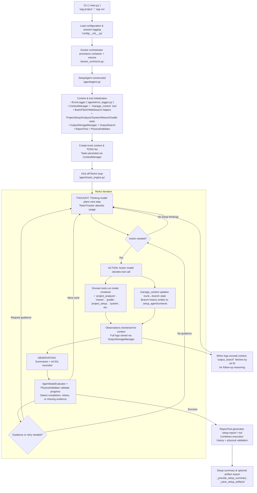

# SAG (Setup-Agent)
🤖 **An LLM-Powered Engine for Automated Project Setup & Configuration** 🤖

[](https://opensource.org/licenses/MIT)

> ICSE-NIER ’26 paper: [Setup AGent (SAG)](https://doi.org/10.1145/3786582.3786818) — Wei et al.

> [!IMPORTANT]
> The paper will be available soon this April.


**SAG (Setup-Agent)** is an advanced AI agent designed to fully automate the initial setup, configuration, and ongoing tasks for any software project. It operates within an isolated Docker environment, intelligently interacting with project files, shell commands, and web resources to transform hours—or even days—of manual setup into a process that takes just a few minutes.

## 🔦 Highlights
- **Container-native execution** powered by `docker_orch/`, ensuring each project is built inside an isolated Docker workspace with disposable volumes.
- **Dual-model ReAct loop** in `agent/react_engine.py` with live token telemetry from `agent/token_tracker.py` and agent-state evaluation for resilient planning.
- **Fact-based validation** through `agent/physical_validator.py`, combining build artifact inspection with the structured test catalog in `testcases/catalog.py` for accurate pass/fail reporting.
- **Rich automation toolkit** (`tools/`) spanning foundational helpers (`bash`, `file_io`, `context_tool`, `web_search`) and higher-level orchestrators like `project_analyzer`, `report_tool`, `output_search_tool`, and language-specific build runners that translate intent into reproducible actions.
- **Centralized diagnostics** via `agent/error_logger.py` and `agent/output_storage.py`, making every action, log, and generated report searchable across runs.

---

## 📖 Philosophy: Solving the "Getting Started" Problem

In software development, configuring a new project—especially a large open-source one—is often a tedious, time-consuming, and error-prone task. Developers must read extensive documentation, resolve dependency conflicts, and understand the project's structure before writing a single line of effective code.

**SAG's core mission is to solve this problem.** It aims to be an intelligent "Project Initialization Specialist" by adhering to these core principles:

- **Complete Isolation**: All operations occur within Docker containers, ensuring the host machine is never polluted. This guarantees a clean, reproducible setup every time.
- **Intelligent Planning & Execution**: SAG doesn't just execute commands; it analyzes, plans (by creating a TODO list), and systematically solves problems like a human expert.
- **Hierarchical Context Management**: With an innovative "Trunk/Branch" context system, SAG can handle complex task chains, from high-level goals to low-level operations, without getting lost in long-running processes.
- **Dual-Model Collaboration**: It leverages the strengths of different LLMs—one for deep thinking and planning (e.g., `o1-preview`) and another for fast action and tool use (e.g., `gpt-4o`)—to achieve a balance of efficiency and effectiveness.

## ✨ Core Concepts

### 1. Dual-Model ReAct Engine

The "brain" of SAG is an enhanced ReAct (Reasoning-Acting) engine. By separating the "thinking" and "acting" phases and using different models for each, it achieves more effective decision-making:

- **Thinking Model**: Responsible for analyzing complex problems, creating high-level plans, and learning from errors. It thinks deeper and sees further. Supports advanced reasoning features like OpenAI's `o1` models and Anthropic's Claude thinking capabilities.
- **Action Model**: Responsible for precisely executing the plan laid out by the thinking model, whether that's calling a tool, generating code, or running a command. It's focused on "doing."

This architecture allows SAG to be both thoughtful and agile when tackling unfamiliar projects.

### 2. Hierarchical Context Management (Trunk & Branch)

To solve the problem of context loss in complex tasks, SAG implements a hierarchical context management system:

- **Trunk Context**:
  - Stores the project's overall goal, the complete TODO list, and high-level progress.
  - Acts as the "command center" for the entire setup task.

- **Branch Context**:
  - Created for each specific task on the TODO list.
  - Contains all the details, logs, and the current focus for that sub-task.
  - The agent works within a branch context to solve one problem at a time before returning to the trunk.

This system enables SAG to switch between high-level planning and low-level execution seamlessly, ensuring stability and coherence throughout long-running tasks.

### 3. Hierarchical Tool-belt Design

At first glance, a single `bash` tool could handle all system interactions. However, relying solely on a low-level tool would force the AI agent to manage immense complexity, from remembering command syntax to parsing raw text output—a process that is both inefficient and error-prone.

SAG adopts a hierarchical tool-belt design to address this, creating layers of abstraction that empower the agent to work more intelligently:

-   **Low-Level Foundational Tools**: At the base is the `BashTool`. It provides unrestricted, granular control, much like an assembly language for system operations. It is the ultimate fallback for tasks that have no specialized tool.

-   **Mid-Level Specialized Tools**: These tools encapsulate domain-specific knowledge. For example:
    -   `SystemTool` understands system package management (`apt-get`), abstracting away the need to manually form `install` or `update` commands.
    -   `MavenTool` is an expert in Java's Maven build system. It knows about goals, profiles, and properties, and can intelligently parse Maven's verbose output to determine if a build succeeded, failed, or had test errors.

-   **High-Level Workflow Tools**: At the top layer, tools like `ProjectSetupTool` orchestrate complex, multi-step workflows. Its `clone` action doesn't just run `git clone`; it also automatically detects the project type (Maven, Node.js, Python), suggests the next appropriate actions, and can even trigger dependency installation, compressing a long chain of human-like reasoning into a single, intent-driven command.

This layered approach allows the agent to delegate complexity. Instead of figuring out *how* to do something with basic commands, it can focus on *what* it needs to achieve, leading to faster, more reliable, and more sophisticated automation.

## 🏗️ System Architecture

SAG is composed of several core components:

1. **CLI (`main.py`)**: Entry point for user commands such as `project`, `run`, and `list`, with optional artifact recording for post-run inspection.
2. **Configuration Layer (`config/`)**: Loads `.env` settings, provider credentials, and model presets, and wires logging streams used across the agent.
3. **Setup Agent & Contexts (`agent/agent.py`, `agent/context_manager.py`)**: Orchestrates the workflow, persists trunk/branch contexts inside the container workspace, and initializes the full tool-suite.
4. **ReAct Engine & State Evaluation (`agent/react_engine.py`, `agent/agent_state_evaluator.py`)**: Dual-model reasoning loop with completion sign detection, retry guards, and live token telemetry.
5. **Physical Validation & Diagnostics (`agent/physical_validator.py`, `agent/output_storage.py`, `agent/error_logger.py`, `agent/token_tracker.py`)**: Verifies build/test results from artifacts, snapshots execution outputs, and centralizes structured error logs.
6. **Automation Tool-belt (`tools/`)**: Intent-driven helpers including `project_analyzer`, `project_setup_tool`, `gradle_tool`, `maven_tool`, `system_tool`, and the cross-run `output_search_tool`.
7. **Reporting & Test Intelligence (`tools/report_tool.py`, `testcases/catalog.py`, `reporting/`)**: Generates markdown setup reports, merges runtime and static test metadata, and tracks annotation-level metrics.
8. **Docker Orchestrator (`docker_orch/orch.py`)**: Guarantees container lifecycle management, volume persistence, and shell connectivity for every project.
9. **Knowledge Base & Regression Suites (`docs/`, `examples/`, `tests/`, `student_tasks/`)**: Documentation and executable scenarios that codify best practices and guard against regressions.

## 🧠 Advanced Automation Tooling
- **Foundation Utilities** (`tools/bash.py`, `tools/file_io.py`, `tools/context_tool.py`, `tools/web_search.py`): Provide container-aware shell execution, safe file interactions, context updates, and web lookups for knowledge gaps.
- **Project Analyzer** (`tools/project_analyzer.py`): Performs static scanning to classify project types, detect build tools, and enumerate unit, integration, and parameterized tests before execution.
- **Report Tool** (`tools/report_tool.py`): Produces `setup-report-*.md` summaries that combine physical validator evidence, execution history, and actionable remediation guidance.
- **Output Search Tool** (`tools/output_search_tool.py`): Indexes prior observations and context files to let the agent recall log snippets or stack traces across iterations.
- **Build & Dependency Helpers** (`tools/maven_tool.py`, `tools/gradle_tool.py`, `tools/system_tool.py`): Provide domain-specific command wrappers with structured output parsing and retry logic.
- **Project Setup Tool** (`tools/project_setup_tool.py`): Encapsulates cloning, environment bootstrapping, and language-specific install steps into a single orchestrated action.

## ✅ Validation & Observability
- **Physical Validator** (`agent/physical_validator.py`): Inspects build artifacts, XML test reports, and compilation timestamps to ground decisions in physical evidence.
- **Test Case Catalog** (`testcases/catalog.py`): Normalizes runtime results, parameterized expansions, and Groovy/Kotlin discovery to keep counts consistent across tools.
- **Error Logger** (`agent/error_logger.py`): Aggregates issues from every tool call with canonical error codes, making retrospectives and reports actionable.
- **Output Storage Manager** (`agent/output_storage.py`): Persists observations, plan snapshots, and generated artifacts under `.setup_agent/` inside the container workspace.
- **Token Tracker** (`agent/token_tracker.py`): Captures prompt, completion, and reasoning token usage per ReAct step for cost and performance analysis.

## 🧭 End-to-End Flow



This flow illustrates how the CLI bootstraps an isolated Docker workspace, how `SetupAgent` wires every tool, and how the ReAct loop alternates thinking and action. `manage_context` safeguards trunk/branch transitions, OutputStorage captures verbose tool outputs (with `output_search` replaying them on demand), and `AgentStateEvaluator` works with `PhysicalValidator` to gate completion before `ReportTool` finalizes the run.

## 🚀 Quick Start

### 1. Prerequisites
- [Docker](https://www.docker.com/)
- [Python 3.10+](https://www.python.org/)
- [uv](https://github.com/astral-sh/uv) (The recommended Python package manager)

### 2. Installation & Configuration

```bash
# (Optional) Install uv globally if it is not already available
pip install uv

# 1. Clone the repository
git clone https://github.com/your-org/Setup-Agent.git
cd Setup-Agent

# 2. Install dependencies with uv (this will also create a virtual environment)
uv sync

# 3. Create and edit your configuration file
cp .env.example .env
nano .env  # Fill in your API keys and other settings
```

### 3. Basic Usage

```bash
# Start setting up a new project
uv run sag project https://github.com/fastapi/fastapi.git

# List all managed projects and their status
uv run sag list

# Run a new task on an existing project
uv run sag run sag-fastapi --task "add a new endpoint to handle /healthz"

# Access the project container's shell
uv run sag shell sag-fastapi

# Remove a project (including its container and volume)
uv run sag remove sag-fastapi
```

### 4. Debugging & Troubleshooting

When a setup fails or you want to understand what the agent did, SAG provides several debugging tools:

#### Enable Verbose Mode & Recording

```bash
# Run with verbose output for detailed logs
uv run sag --verbose project https://github.com/example/repo.git

# Save artifacts locally for post-run inspection
uv run sag project https://github.com/example/repo.git --record

# Combine both for maximum visibility
uv run sag --verbose project https://github.com/example/repo.git --record
```

#### Inspect Container Context Files

The agent stores execution context inside the container under `/workspace/.setup_agent/`:

```bash
# List all context files
docker exec sag-<project> ls -la /workspace/.setup_agent/contexts/

# Read the trunk context (main task list and overall status)
docker exec sag-<project> cat /workspace/.setup_agent/contexts/trunk_*.json | python3 -m json.tool

# Check specific task contexts for detailed execution history
docker exec sag-<project> cat /workspace/.setup_agent/contexts/task_*.json | python3 -m json.tool

# Search for errors across all context files
docker exec sag-<project> grep -r "error\|failed\|ERROR" /workspace/.setup_agent/contexts/
```

#### Review Setup Reports

```bash
# List generated reports
docker exec sag-<project> ls -la /workspace/setup-report-*.md

# Read the setup report
docker exec sag-<project> cat /workspace/setup-report-*.md
```

#### Check Session Logs (with --record)

When using `--record`, artifacts are saved to local session logs:

```bash
# Find the session log directory
ls -la logs/session_*/

# Review the main session log
cat logs/session_<timestamp>/main.log

# Check for specific error patterns
grep -r "BUILD FAILURE\|compilation error" logs/session_<timestamp>/
```

#### Common Debugging Scenarios

| Scenario | What to Check |
|---|---|
| Build failed | `grep "BUILD FAILURE" /workspace/.setup_agent/contexts/*.json` |
| Java version mismatch | `docker exec sag-<project> java -version` and check for `RequireJavaVersion` in logs |
| Missing dependencies | `docker exec sag-<project> which mvn npm gradle` |
| Empty tool outputs | Check if stderr is captured in context files |
| Agent stuck in loop | Review trunk context TODO list for repetitive patterns |

#### Interactive Debugging

```bash
# Connect to the container shell for manual investigation
uv run sag shell sag-<project>

# Inside the container, you can:
# - Run build commands manually
# - Check environment variables
# - Inspect project files
# - Review logs in /workspace/.setup_agent/
```

## 🛠️ CLI Command Reference

SAG provides a clean and powerful set of CLI commands.

### Commands

| Command | Description | Example |
|---|---|---|
| `sag project <url>` | Initializes the setup for a new project from a Git repository URL. | `sag project https://github.com/pallets/flask.git` |
| `sag list` | Lists all projects managed by SAG, showing their container name, status, and last comment. | `sag list` |
| `sag run <name>` | Runs a specified task on an existing project. | `sag run sag-flask --task "add unit tests for the application factory"` |
| `sag shell <name>` | Connects to an interactive shell inside the specified project's container. | `sag shell sag-flask` |
| `sag remove <name>` | Permanently deletes a project, including its container and data volume. | `sag remove sag-flask --force` |
| `sag version` | Displays SAG's version information. | `sag version` |
| `sag --help` | Shows the help message. | `sag --help` |

### Global Options

| Option | Description |
|---|---|
| `--log-level [DEBUG\|INFO\|WARNING\|ERROR]` | Overrides the log level set in the `.env` file. |
| `--log-file <path>` | Specifies a custom path for the log file. |
| `--verbose` | Enable verbose debugging output with detailed logs. |

### Command-Specific Options

#### `sag project <url>`

| Option | Description |
|---|---|
| `--name <name>` | Override the Docker container name (default: extracted from URL). **Note:** This only affects the Docker container/volume naming (`sag-<name>`), not the project directory name. The cloned repository will always use the directory name from the URL. |
| `--goal <goal>` | Custom setup goal (default: auto-generated based on project name). |
| `--record` | Save setup artifacts (contexts, reports) to local session logs for debugging and auditing. |

**Example with custom Docker name:**
```bash
# Clone commons-cli but name the Docker container "cli-test"
sag project https://github.com/apache/commons-cli.git --name cli-test

# Result:
# - Docker container: sag-cli-test
# - Project directory: /workspace/commons-cli (always matches git repo name)
# - To run tasks later: sag run sag-cli-test --task "..."
```

#### `sag run <name>`

| Option | Description |
|---|---|
| `--task <description>` | **(Required)** The task or requirement for the agent to execute. |
| `--max-iterations <n>` | Maximum number of agent iterations (overrides `SAG_MAX_ITERATIONS` from config). |
| `--record` | Save setup artifacts (contexts, reports) to local session logs for debugging and auditing. |

#### `sag shell <name>`

| Option | Description |
|---|---|
| `--shell <path>` | Shell to use in the container (default: `/bin/bash`). |

#### `sag remove <name>`

| Option | Description |
|---|---|
| `--force` | Force removal without confirmation prompt. |

## ✅ Running Tests Locally

```bash
# Run the full pytest suite (integration + smoke tests)
uv run pytest

# Or execute a focused scenario for faster feedback
uv run pytest test_report_format.py
```

## ⚙️ Configuration Explained

All configuration is managed through the `.env` file in the project's root directory.

**Key Configuration Options:**
- `SAG_THINKING_MODEL`: The "thinking model" for planning and analysis. A powerful model is recommended (e.g., `o1-preview`, `claude-sonnet-4-20250514`).
- `SAG_ACTION_MODEL`: The "action model" for task execution. A fast and cost-effective model is recommended (e.g., `gpt-4o`, `claude-3-5-sonnet-20240620`).
- `SAG_THINKING_PROVIDER`: The provider for the thinking model (`openai`, `anthropic`, etc.).
- `SAG_REASONING_EFFORT`: For thinking models, controls reasoning depth (`low`, `medium`, `high`).
- `SAG_THINKING_BUDGET_TOKENS`: For Claude models, controls thinking budget (1024, 2048, 4096).
- `OPENAI_API_KEY`, `ANTHROPIC_API_KEY`, etc.: API keys for the respective LLM providers.
- `SAG_LOG_LEVEL`: Sets the logging verbosity. `DEBUG` mode is highly detailed and includes LiteLLM's internal logs.
- `SAG_MAX_ITERATIONS`: The maximum number of iterations for a single `run` or `project` command to prevent infinite loops.

## 🔍 How It Works: A Look Under the Hood

When you run `sag project <url>`, a sophisticated sequence of events is triggered:

1.  **Environment Initialization**: SAG's Docker Orchestrator spins up an isolated Docker container and a persistent data volume.
2.  **Project Cloning**: The agent uses its `bash` tool inside the container to clone the specified Git repository.
3.  **Context Establishment**: A **Trunk Context** is created with the high-level goal (e.g., "Set up this project to be runnable").
4.  **Intelligent Analysis & Planning**: The **Thinking Model** is engaged to analyze the project structure (e.g., `README.md`, `package.json`, `pyproject.toml`) and generate a comprehensive TODO list, which is stored in the Trunk Context.
5.  **Task Loop Initiation**:
    a. The agent picks the first task from the Trunk Context's TODO list.
    b. A **Branch Context** is created to focus exclusively on this task (e.g., "Install project dependencies").
    c. The **Action Model** executes the necessary steps within the Branch Context (e.g., runs `npm install`).
    d. The result is observed. If an error occurs, the **Thinking Model** is re-engaged to analyze the cause and find a solution (e.g., using the `web_search` tool to look up the error message).
    e. Once the task is complete, the agent records a summary in the Trunk Context, marks the task as "completed," and destroys the Branch Context.
6.  **Rinse and Repeat**: Step 5 is repeated until all tasks in the TODO list are completed.
7.  **Completion**: The agent exits, leaving behind a fully configured and runnable project environment in the Docker container.

## 🎯 Use Cases

- **Rapid Prototyping**: Set up and run any open-source project in minutes to evaluate its suitability.
- **Standardized Dev Environments**: Create consistent, one-click development environments for team members.
- **CI/CD Automation**: Automate complex project setups and testing environments in your CI pipelines.
- **Learning New Technologies**: Quickly get hands-on with an unfamiliar framework or stack by letting SAG handle the setup.
- **Secure Experimentation**: Safely test unfamiliar or untrusted code in an isolated sandbox.

## 🤝 Contributing

We warmly welcome contributions of all kinds! Whether it's a bug report, a feature suggestion, or a pull request, your help is invaluable to the project.

## 📝 License

This project is licensed under the MIT License. See the [LICENSE](LICENSE) file for details.

## Cite this work

BibTeX:

```bibtex
@inproceedings{Wei2026SAG,
  author    = {Wei, Chenhao and Zhao, Gengwu and Ye, Billy and Xiao, Lu and Li, Xinyi},
  title     = {Setup AGent (SAG): A Dual-Model LLM Agent for Autonomous End-to-End Java Project Configuration},
  booktitle = {Proceedings of the 48th International Conference on Software Engineering: New Ideas and Emerging Results (ICSE-NIER '26)},
  year      = {2026},
  address   = {Rio de Janeiro, Brazil},
  publisher = {ACM},
  isbn      = {979-8-4007-2425-1},
  month     = apr,
  doi       = {10.1145/3786582.3786818}
}
```
