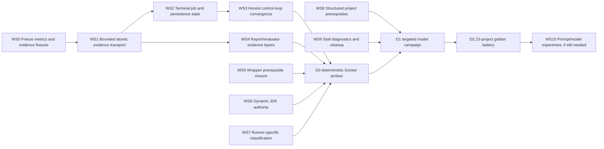

# SAG evidence/control repair implementation plan

**Date:** 2026-08-08  
**Status:** implementation in progress on `AA/sag-evidence-control-repair`  
**Planning base:** `main@f013324`; production-code baseline `eeb4ee0`  
**Source report:** `docs/superpowers/reports/2026-08-08-sag-performance-attribution-audit.md`

> **For implementation agents:** execute the stages in dependency order. Use
> TDD, `UV_CACHE_DIR=/tmp/setup-agent-uv-cache uv run pytest ...`, preserve an
> existing dirty worktree, and do not push without explicit instruction. Commit
> messages must not contain a Co-Authored-By trailer.

## Goal

Make SAG a trustworthy harness for weaker long-running models by ensuring that:

1. a completed runner action cannot disappear because internal evidence storage
   exceeded an operating-system transport limit;
2. terminal process state, evidence-persistence state, and verdict strength are
   represented separately;
3. every control loop has a bounded, honest terminal path;
4. runner prerequisites and newly observed runtime requirements are resolved
   mechanically instead of delegated to model inference;
5. metrics-v2 subjects, cases, executions, and observation dispositions remain
   distinct and visible; and
6. improvements are demonstrated in Docker under pre-registered, same-pin
   repetitions before prompt/model attribution is attempted.

## Non-goals

- Do not loosen the physical judge or promote quarantined, unattributed, or
  stale observations into claimed metrics.
- Do not restore analyzer-generated execution plans, recommendation prose,
  project briefs, project-specific actions, or other Category-3 prescriptions.
- Do not add project-name branches such as `if project == "lucene"`.
- Do not reintroduce the 50-report clamp or otherwise truncate ground truth to
  keep receipt payloads small.
- Do not ask for human approval after the initial task prompt. The agent must
  finish, fail, or clean up under policy fixed at run start.
- Complete analyzer-diet conformance cleanup before D0, then freeze the exact
  source-tree, prompt and control-bundle hashes in the campaign lock. Do not
  change any member after that lock is sealed or compare runs across different
  hash triples.
- Do not claim that a code-level fix improved the golden standard until its
  Docker acceptance gate has passed.

## Architectural invariants

### I1 — surveyor, runner, transport, and judge stay separate

The surveyor describes what exists before execution. The runner records what it
attempted and how it ended. Transport records whether that evidence reached
durable storage. The judge determines what can be claimed. A transport failure
may reduce certainty but may not rewrite a terminal run as “never ran” or
“still running.”

### I2 — newer physical facts have scoped temporal authority

Within the same target SHA, domain, and invocation family:

```text
runner-observed requirement
> persisted dynamic runtime requirement
> static survey requirement
```

This authority applies only to the build-tool runtime. A source/bytecode target
of Java 11 and a Maven-plugin runtime requirement of Java 17 are compatible
facts, not a conflict.

### I3 — evidence grains never collapse

- `claimed latest subjects`: module-qualified test definitions at their current
  case outcomes;
- `claimed latest cases`: parameter-aware current outcomes;
- `receipt executions`: attempt-sensitive physical rows on qualifying receipts;
- `quarantined`, `unattributed`, and `stale` observations: visible but not
  verdict-bearing.

No report, evaluator, or dashboard may add one layer to another.

### I4 — honesty and liveness are both controller duties

The judge remains independent and may reject unsupported green. A running job
is a controller-owned wait barrier; a terminal project blocker receives a real
model-owned action turn; a harness blocker receives bounded controller
recovery. Only repeated completion claims without material action are closed by
no-op convergence.

### I5 — authorization is frozen at startup

All package installation, bounded diagnostics, and job cleanup behavior must be
allowed or refused by the initial run policy. No mid-run human text may become
an executable claim or approval.

### I6 — analyzer-diet compatibility

New facts may be projected into typed invocation contracts and receipt/control
assessments. Policy may expose constraints and tool affordances, but not a
recommended project call. The model owns project repair ActionIntents;
controller ActionIntents are limited to mandatory mechanical lanes. The
analyzer itself must not choose a build command, module, retry, or remediation.

### I7 — live dispatch authority is explicit and append-only

Only an `InvocationContract` schema v2 bound to the current `run_id` may
authorize dispatch. The contract separates the public requested tool from the
registered effective executor and names one execution binding: `argv_v1` or
`python_facade_v1`. Its identity is bound to the run and complete executable
commitment, and publication is absent-or-byte-identical; a same-ID different
body fails closed. Historical v1 records are display-only. Evidence-store
bytes remain untrusted until strict schema, ID/hash, run/pin, root/domain and
contract/receipt validation succeeds.

## Dependency graph



WS5–WS9 may be developed in parallel after WS1's shared persistence API is
stable, but no model campaign begins until WS1–WS7 pass D0.

---

## WS0 — freeze the measurement contract and live-shaped fixtures

**Priority:** P0  
**Purpose:** prevent a repair from “passing” by changing the score grain or the
input evidence.

### Task 0.1 — correct and supersede the first-read report

**Files**

- Modify: `docs/superpowers/reports/2026-08-08-battery-rerun-report.md`
- Preserve: `docs/superpowers/reports/2026-08-08-sag-performance-attribution-audit.md`

Add a prominent supersession notice. Pin these audited values:

- verdicts: 2 success / 16 partial / 5 failed;
- 7/27 canonical unique: 44,983;
- 8/8 canonical unique: 15,322;
- 7/27 primary raw: 45,423;
- 8/8 primary raw: 18,080;
- 7/27 auxiliary: 13,507;
- 8/8 auxiliary: 65,776.

These values are a frozen **legacy-v1 forensic baseline**, not the future KPI
contract. They remain reproducible so the repair can explain the historical
failure, but v2 campaigns do not pretend that a renamed or re-keyed metric is
continuous with them.

The old model-course, flaky-HTTP, broker/YARN, and three-lane Polaris
explanations must be labeled withdrawn rather than silently edited into a new
historical narrative.

### Task 0.2 — archive minimal deterministic fixtures

**New fixture directory**

`tests/fixtures/battery_20260808/`

Store bounded, content-addressed fixtures derived from the existing sessions:

- Lucene large `report_delta` shape and terminal metadata;
- one settlement-shaped Camel payload;
- HTTP Maven Wrapper properties plus bootstrap output;
- Camel Quarkus Java-version failure text;
- Gradle success tail containing
  `checkKotlinGradlePluginConfigurationErrors`;
- a gate-refusal sequence whose model prose changes but evidence does not.

Do not copy multi-megabyte project logs into ordinary unit fixtures. Generate
large path arrays deterministically from a short seed and record the source
session/hash in a fixture manifest.

### Task 0.3 — define the new metrics-v2 vocabulary

**Decision (2026-08-08):** do not preserve the old canonical testcase KPI as
the forward authority. New runs emit metrics v2. Historical v1 artifacts remain
readable only through an explicitly labeled legacy adapter and are never
silently merged into a v2 time series.

Create `scripts/evaluate_golden_battery.py` and unit tests around these units:

1. **test subject** — one test definition, independent of parameter value and
   retry;
2. **test case** — one parameter-aware case of a subject;
3. **receipt execution** — one physical runner row in one qualifying
   invocation, including retries;
4. **report observation** — one row found on disk, whether claimable or not.

The versioned identity is ecosystem-neutral and module-qualified:

```text
subject_key =
  target_sha
  + domain_id
  + module_coordinate
  + framework
  + owner
  + test_name

case_key = subject_key + parameter_id
```

- `domain_id` identifies the mechanically discovered build island/root.
- `module_coordinate` is the stable runner-native module identity: Maven
  reactor coordinate or relative module root, Gradle project path, or the
  equivalent package/workspace coordinate in another ecosystem.
- `owner` is the normalized class, suite, or source-file owner.
- Report path, timestamp, and attempt number are provenance, not identity.
- The same named test in two reactor modules is therefore two subjects; a
  duplicate report for the same module/case is not.

For a subject-level outcome, fold its current cases by severity:
`error > failed > passed > skipped`. Retry history does not overwrite physical
history: the latest qualifying case outcome drives the current subject state,
while `retried_cases` and `flaky_cases` preserve transitions.

The project artifact has five independent decision surfaces:

```json
{
  "schema_version": 2,
  "identity_version": "module-qualified-v1",
  "run": {
    "target_sha": "...",
    "sag_sha": "...",
    "prompt_hash": "...",
    "control_bundle_hash": "...",
    "image_digest": "...",
    "model_pin": "...",
    "run_order_index": 0
  },
  "outcome": {
    "verdict": "success|partial|failed|unknown",
    "build_state": "...",
    "test_state": "...",
    "terminal_reason": "..."
  },
  "evidence": {
    "integrity": "complete|degraded|failed|unavailable",
    "receipts_expected": 0,
    "receipts_persisted": 0,
    "terminal_receipts_unpersisted": 0,
    "conflict_count": 0
  },
  "tests": {
    "claimed": {
      "latest_subjects": {},
      "latest_cases": {},
      "receipt_executions": {}
    },
    "quarantined_observations": {},
    "unattributed_observations": {},
    "stale_observations": {},
    "retried_cases": 0,
    "flaky_cases": 0
  },
  "coverage": {
    "domains_discovered": 0,
    "domains_attempted": 0,
    "domains_terminal": 0,
    "domains_with_claimed_tests": 0
  },
  "control": {
    "terminal_refusal_recurrences": 0,
    "unsettled_jobs": 0,
    "cleanup_escalations": 0,
    "midrun_human_approvals": 0
  }
}
```

Every count object uses the same explicit fields:
`executed`, `passed`, `failed`, `errors`, and `skipped`. Observation buckets
also carry report-file count and typed reason counts. An absent measurement is
`null`, never zero.

The golden-battery evaluator reports project-macro metrics first so Camel or
Lucene cannot numerically dominate small projects:

- project verdict distribution;
- evidence-complete project rate;
- projects with all discovered domains terminal;
- median project subject pass rate;
- projects with zero unsettled jobs and zero recurrence overflow;
- autonomy invariant: mid-run human approvals must equal zero.

Totals for claimed subjects, cases, executions, and observation buckets remain
separate diagnostic fields. There is no single blended “tests executed” KPI.
The evaluator must reject v1/v2 comparisons and any comparison whose identity,
disposition, or counting grain differs.

**Acceptance**

- A legacy mode recomputes the audited v1 totals above from preserved verdicts.
- A v2 fixture keeps same-name tests from different modules distinct while
  duplicate report files for one module/case deduplicate.
- Parameterized cases change case/execution counts without changing subject
  count.
- A retry changes receipt-execution history without double-counting the latest
  subject or case.
- A mutation that adds quarantined, unattributed, or stale observations to
  claimed metrics fails.
- A mutation that compares v1 with v2, subjects with cases, or cases with
  executions fails.
- Every project row retains target SHA, SAG SHA, prompt hash, image digest,
  model pin, run order, and evidence-status fields.

---

## WS1 — bounded, atomic evidence transport

**Priority:** P0; blocks every other live conclusion  
**Primary fault:** complete receipt JSON is embedded in one shell command in
`src/sag/agent/invocation_receipts.py::write_receipt`.

### Task 1.1 — introduce one atomic chunked writer

**Files**

- Modify: `src/sag/utils/container_io.py`
- Test: `tests/test_container_io.py`

Add an API usable from both an orchestrator object and the `execute` callback
owned by evidence modules. Suggested shape:

```python
@dataclass(frozen=True)
class ContainerWriteResult:
    persisted: bool
    code: str
    bytes_written: int = 0
    sha256: str = ""

def write_container_text_atomic(
    execute,
    path: str,
    content: str,
    *,
    max_cmd_chars: int = DEFAULT_MAX_CMD_CHARS,
    validate_json: bool = False,
) -> ContainerWriteResult: ...
```

Required behavior:

1. Serialize content once on the host.
2. Write base64 chunks to a unique `<final>.b64.<digest>.tmp` with every
   command under 60,200 characters.
3. Decode into `<final>.tmp`.
4. Validate byte count and SHA-256; for JSON objects also validate container
   parseability without returning the body through a truncated output path.
5. Publish with one atomic `mv -f`.
6. Clean temporary files on every failure.
7. Never replace an existing final with partial or hash-mismatched content.

Keep `write_container_text` backward-compatible for current callers. Do not
duplicate chunk logic inside receipt or obligation modules.

### Task 1.2 — migrate invocation receipts

**Files**

- Modify: `src/sag/agent/invocation_receipts.py`
- Test: `tests/test_invocation_receipts.py`
- Test: `tests/test_receipt_v2_and_assessments.py`

Replace the heredoc in `write_receipt` with the atomic writer. Preserve the
complete `report_delta`; `TESTCASE_OUTCOME_CAP` continues to bound testcase
detail only and must not become a report-path cap.

Return a typed persistence result internally. Keep a narrow compatibility
wrapper if existing callers require a boolean, but `record_invocation` must be
able to surface at least:

```json
{
  "receipt_persisted": false,
  "receipt_persistence_code": "transport_write_failed"
}
```

No persistence code may imply that the runner did not execute.

### Task 1.3 — migrate job obligations and every unbounded evidence writer

**Files**

- Modify: `src/sag/agent/job_obligations.py`
- Audit: `src/sag/agent/evidence_assessments.py`
- Audit: `src/sag/agent/repair_contexts.py`
- Test: `tests/test_job_obligations.py`

An obligation can itself contain a large `before` snapshot, so fixing only the
terminal receipt leaves the detached path vulnerable. Migrate obligations to
the same writer. Audit other append-only JSON writers; migrate any field whose
size is data-dependent and unbounded. Small bounded records may remain on the
fast heredoc path through the shared helper.

### Task 1.4 — live-shaped transport tests

Add tests for both synchronous receipt and detached settlement shapes:

- at least 2,000 report paths;
- at least 3 MiB canonical JSON;
- a fake executor that rejects every command over 128 KiB;
- byte-for-byte round trip and matching SHA;
- JSON parse success;
- no `.tmp`/`.b64` residue after success;
- injected chunk, decode, validation, and rename failures leave an existing
  final untouched;
- retry after an injected failure succeeds idempotently.

### Task 1.5 — make InvocationContract v2 the only live execution authority

**Files**

- Modify: `src/sag/agent/invocation_contracts.py`
- Modify: `src/sag/tools/build/build_tool.py`
- Modify: `src/sag/tools/internal/python_tool.py`
- Modify: `src/sag/agent/evidence_assessments.py`
- Modify: `src/sag/agent/physical_validator.py`
- Modify: claim-transition integration
- Test: `tests/test_invocation_contracts.py`
- Test: `tests/test_python_validator_read_only.py`
- Test: receipt/assessment/claim-transition suites

Live writers emit schema v2 with `run_id`, exact engine-owned intent identity,
`requested_call`, an allowlisted `effective_tool`, effective action, cwd, pins,
and one explicit execution binding. The initial registered set is
`maven | gradle | python | bash`; `bash` is required for authorized
controller-direct terminal, large-evidence and multi-job D0 jobs. This is a
versioned executor registry, not a permanently closed enum: any future
search/project executor must be registered with binding validation before live
use. `contract_id` is derived from the run and canonical executable commitment;
`contract_hash` covers the full canonical payload. Publish through the shared
compare-and-publish primitive: absence creates, identical bytes are idempotent
success, and an existing different body is an identity collision that is never
overwritten.

Complete the accepted `survey_fingerprint` v2 pin before D0. Do not emit or
treat the earlier design candidates `semantic_effects`,
`required_preconditions` or `supersedes_contract_id` as live schema-v2 fields;
the current writer does not produce them. Any future adoption requires a
separate schema revision and matching identity, writer/reader and negative-test
work. Live lineage uses only append-only, separately frozen contracts linked by
`predecessor_contract_id`.

`argv_v1` requires a non-empty frozen argv and recomputable
`exact | equivalent | deviated` compliance. `python_facade_v1` is allowed only
for the public `build` facade and forbids a guessed argv. It uses one shared
public-to-operation mapping:

```text
deps     -> setup_env
compile  -> compile
test     -> test
package  -> build
install  -> build
native   -> native
```

The facade, Python producer, read-only judge and assessor must all consume that
same mapping. Operation-specific predicates bind setup to dependency-install
and any package/import checks, build to a completed wheel role plus direct
content-hashed `dist/*.whl` outputs, compile to compileall plus compile metrics
from the same aggregate receipt, test to current-run scope-matching structured
results, and native to observations for every requested feature plus the
frozen definitions/toolchain/build fingerprint. Missing, duplicate,
contradictory, out-of-order, wrong-role or ignored-parameter shapes fail
closed. This iteration rejects every non-empty Python `deps` argument because
there is no mechanical pin-to-claim producer; a future exact-pin exception
requires a separately specified, strictly validated claim binding and cannot
be inferred from opaque supporting claim IDs.

`supporting_claim_ids` are authorization/provenance, not evidence predicates.
A generic success or failure assessment must not confirm or contradict them;
only a named operation-specific positive predicate or direct falsifier may
transition the claim it explicitly tests. This plan does not add a new
predicate-to-claim producer: until one is separately specified and mechanically
validated, the transition seam remains a fail-closed no-op and must not treat
supporting claim IDs as the missing binding.

Treat every file in the evidence store as untrusted input until a bounded,
exactly-one-object, duplicate-key-rejecting reader verifies its known schema,
recomputed ID/hash, current run and run pins, exact root/domain/action/cwd, and
contract/receipt binding. A schema-v1 contract may be rendered by a separate
historical viewer, but it cannot authorize live dispatch, assessment, repair,
claim transition or verdict closure. A future schema in current-run scope is
an integrity conflict; stale or foreign-run evidence stays historical.

**WS1 done-bar**

- No evidence writer sends a command over 60,200 characters.
- The preserved Lucene/Camel-shaped payloads round-trip without truncation.
- `argument list too long` is impossible under the test executor.
- Every live dispatch has a current-run schema-v2 contract with a recognized
  execution binding and exact public/effective-tool separation.
- Contract replay is byte-idempotent; identity collision, v1 live use and
  unvalidated evidence-store input fail closed without dispatch.
- Python typed observations satisfy only their matching operation predicates,
  and supporting claim IDs alone cause no claim transition.
- Full unit suite passes before WS2 begins.

---

## WS2 — split terminal process state from evidence persistence

**Priority:** P0  
**Primary fault:** an exit file plus a failed receipt write remains an “open”
obligation and is later reported as `job_unsettled`.

### Task 2.1 — define the obligation lifecycle

**Files**

- Modify: `src/sag/agent/job_obligations.py`
- Test: `tests/test_job_settlement.py`
- Test: `tests/test_job_obligations.py`

Use orthogonal state fields rather than one enum that collapses process and
storage truth:

```text
process_state:    running | terminal
settlement_state: none | pending | settled | unpersisted
control_mode:     controller_barrier | model_decision | controller_repair | closed
blocker_owner:    none | project | harness | unknown
```

`progress_state: active | quiet` is a time-bounded observation, never a process
terminal state. Multiple obligations use a set barrier: if any blocking job is
`running` or settlement is `pending`, the model remains suspended.

Persist a small `job_terminal_observed` fact before attempting the large
receipt. A crash or restart between those steps must resume settlement, not
revert the job to running. Replace the current `is_open == no settled receipt`
shortcut with explicit predicates for `process_is_live`, `settlement_pending`,
and `blocks_model`.

Distinguish exit-marker conditions:

- absent: still running;
- unreadable: evidence transport/control error;
- malformed: terminal-state corruption;
- valid integer: terminal.

### Task 2.2 — add typed control events and replay

**Files**

- Modify: `src/sag/agent/control_events.py`
- Modify: `src/sag/agent/react_engine.py`
- Modify: `src/sag/agent/replay.py`
- Test: `tests/test_settlement_triggers.py`
- Test: `tests/test_control_layer_replay.py`

Add `job_terminal_unpersisted` (name may change before implementation, but the
semantic state may not). Its payload includes:

- `job_id`;
- terminal `exit_code`;
- obligation and full-output evidence refs;
- attempted receipt ID when available;
- typed persistence failure code;
- lifecycle/termination reason.

Also add:

- `job_terminal_observed`, carrying exit code, marker ref, and observation
  timestamp before receipt persistence;
- `job_stall_observed`, carrying last stdout/artifact progress timestamps but
  no unsupported “hung” conclusion;
- `job_live_at_close`, used only if cleanup fails and no exit marker exists at
  final seal.

`job_unsettled` is legal only when no terminal exit exists. Replay must rebuild
the identical lifecycle/conflict state without consulting a live container.

### Task 2.3 — update wait, gate, and finalizer semantics

**Files**

- Modify: `src/sag/agent/react_engine.py::_await_open_obligations`
- Modify: `src/sag/agent/phase_gates.py`
- Modify: `src/sag/agent/verdict_finalizer.py`
- Test: `tests/test_pre_close_wait.py`
- Test: `tests/test_open_obligation_gate_cap.py`
- Test: `tests/test_settlement_cap_blast_radius.py`

Rules:

- A `running` job installs a controller-owned **job barrier**. While that
  barrier exists, the harness polls the registered job and does not invoke the
  model or dispatch unrelated work. A phase-level `done` attempt is not turned
  into model feedback or recurrence; the harness simply resumes waiting.
- Observable job progress keeps the barrier in `running` and refreshes the
  bounded stall clock. The agent spends no model tokens inventing work while
  the runner is still active.
- `terminal_receipt_pending` keeps the barrier but is settled mechanically and
  immediately; it waits for evidence persistence, not process progress.
- A no-progress stall crosses into WS9's bounded diagnostics and approved
  job-PGID cleanup policy. Only after the process is terminal and settlement or
  typed persistence failure is recorded may the model receive a new turn and
  plan a repair.
- `terminal_receipt_unpersisted` caps success and keeps metrics-v2 claimed
  subjects/cases conservative, but allows an honest partial/failed/unknown
  close.
- Quarantined physical observations may be shown, clearly
  non-verdict-bearing.
- The advisor must not suggest narrower project scope solely because internal
  receipt persistence failed.

### Task 2.4 — state-machine fault injection

Test:

- exit 0 + receipt write failure;
- exit 1 + receipt write failure;
- exit 137 + receipt write failure;
- restart from `terminal_receipt_pending`;
- malformed exit file;
- one successful retry after a transient write failure;
- repeated sweep emits at most one terminal control event;
- no terminal job is ever projected as running.
- a running job with changing output is polled without another model turn or
  unrelated tool dispatch;
- a model `done` call racing with an open job enters the same wait barrier and
  does not increment terminal-claim recurrence;
- a stalled job is diagnosed and cleaned up before the model can propose a
  retry.

**WS2 done-bar**

- `job_unsettled` iff the job lacks a terminal exit.
- A running or settlement-pending job blocks all model-directed phase work.
- Terminal-unpersisted closes honestly without spending remaining wall clock.
- Online and replayed verdict/conflicts match.

---

## WS3 — state-owned waiting, model-owned repair, and no-op convergence

**Priority:** P0  
**Primary fault:** current phase rejection conflates an active runner, a
repairable project failure, a harness-owned failure, and a model repeatedly
claiming completion without acting. Those states need different owners.

### Task 3.1 — classify judge feedback by owner

**Files**

- Modify: `src/sag/agent/phase_gates.py`
- Modify: `src/sag/tools/phase_tool.py`
- Modify: `src/sag/agent/react_engine.py`
- Test: `tests/test_phase_gates.py`
- Test: `tests/test_phase_tool.py`

Emit one typed disposition:

| Disposition | Ground state | Owner | Next behavior |
|---|---|---|---|
| `wait_required` | registered job is running or settling | harness | hold the job barrier and poll; do not invoke the model |
| `repair_required` | runner is terminal and assessment identifies a project-owned or unknown correctable blocker | model | expose assessment plus policy constraints/affordances; require a new action intent before another completion claim |
| `harness_recovery_required` | receipt, settlement, replay, or internal transport failed | controller | run the bounded mechanical recovery; never ask the model to “fix the project” |
| `terminal_claimable` | judge can support success/partial/failed | finalizer | accept the supported terminal claim |
| `terminal_blocked` | no safe corrective action exists or authorized repair budget is exhausted | finalizer | accept an honest typed blocked/unknown result |

An open job is therefore never a `done`-loop problem. `wait_required` bypasses
advisor/model turns and does not share a recurrence counter with terminal
claims.

Every assessment records `blocker_owner = none | project | harness | unknown`.
Harness evidence blockers take precedence over project/unknown diagnosis: a
model must not repair a project from evidence the controller already knows is
incomplete or corrupted.

### Task 3.2 — require a model-owned next action

For `repair_required`, the judge emits only a typed `ReceiptAssessment` or
`ControlAssessment`: observed facts, claim status, typed blocker code, and
provenance. A separate policy layer derives a non-prescriptive `ConstraintSet`
and available tool affordances from that assessment and startup authority.
Neither layer proposes a project command.

The model revises its reasoning/plan and emits one new `ActionIntent` containing
at least:

```text
blocking_fact_refs
+ repair_hypothesis
+ next_action_kind
+ expected_observation
+ stop_condition
```

The harness validates authority and contract shape, freezes the invocation,
and executes it normally. Do not persist a replacement execution-plan pipeline
or a harness-authored repair step list: the model may plan internally, while
the public executable product is one `ActionIntent`. This is compatible with
analyzer-diet: the surveyor does not generate a plan, the judge does not become
the engineer, and policy defines safety rather than a recommended call.

Controller-owned mandatory lanes remain legal for mechanical wait/poll,
settlement, transport recovery, and already-authorized phase-floor safeguards.
They use the same `ActionIntent(source=controller)` → `InvocationContract` →
receipt chain and cannot be repurposed into project-specific repair advice.

A materially executed inspection, repair, build, or test action creates a new
action/evidence epoch even when it fails, so the model may revise its hypothesis
again. Merely rewriting the plan text or completion rationale does not count as
progress.

### Task 3.3 — bound only no-op completion recurrence

Extend the existing authoritative `LoopMemory`; do not add a second recurrence
store. Count repeated `DoneIntent`/blocked claims only where:

- the judge disposition and mechanical evidence digest are unchanged;
- no differently fingerprinted executable `ActionIntent` passed freeze and
  dispatch between claims;
- no job progressed, settled, or produced a new evidence epoch; and
- no harness-owned recovery is pending.

Suggested key:

```text
phase_attempt_id
+ blocker_id
+ canonical_done_claim
+ assessment_set_hash
+ evidence_epoch
+ open_job_set_hash
+ target/config/fact fingerprints
+ last_material_action_epoch
```

Exclude model prose. Existing action LoopMemory continues to handle repeated
ineffective commands; this new memory handles only repeated completion claims
without action.

Schema-invalid intents, repeated identical normalized actions, reordered
evidence refs, rewritten reasons, and unchanged polls do not reset the no-op
count. A new receipt, assessment fingerprint, terminal/settlement transition,
material fact/config epoch, or truly different frozen-and-dispatched action
does reset it.

Approved cap (decision 2026-08-08): three no-op completion claims.
At the cap, record `agent_no_progress` and let the finalizer emit the strongest
honest failed/partial/unknown outcome already supported by the judge. Never
manufacture success, waive an open obligation, or convert a correctable project
failure into success. A real action or new evidence resets this no-op chain.

Use separate bounded decision budgets for schema-invalid intents and loops
among materially equivalent actions. `authority_unavailable` terminalizes
honestly under startup policy; it never waits for human approval. An honest
DoneIntent matching the judge-supported maximum outcome is accepted
immediately and consumes no recurrence budget.

### Task 3.4 — align advisor and phase transition output

**Files**

- Modify: advisor input projection only as needed
- Test: `tests/test_advisor_guarantees.py`
- Test: new `tests/test_terminal_claim_convergence.py`

The advisor must reflect ownership:

- say nothing to the model while `wait_required` is active;
- for `repair_required`, present the assessment and policy constraints, then
  ask the model for one new action intent rather than telling it to close;
- never turn a harness transport failure into narrower project-scope advice;
- offer blocked only when the judge says `terminal_blocked` is admissible.

Cover Cayenne-, Cassandra-, HTTP-, Freemarker-, RocketMQ-, and
Samza-Hello-shaped sequences. Required mutations:

- changing only prose does not reset no-op recurrence;
- a material repair action does reset it, even when the action fails;
- a running or settling job enters the wait barrier with zero model turns;
- alternating `done` and `blocked` does not evade the no-op key;
- a new receipt or job transition resets the relevant state;
- replay produces identical ownership, recurrence, and close events.

**WS3 done-bar**

- Every running job is waited on by the harness until terminal or WS9 cleanup;
  the model cannot start unrelated work behind the barrier.
- Every correctable terminal project failure gives the model a genuine repair
  turn and accepts materially new actions without premature convergence.
- Only no-op completion claims are bounded by the configured cap.
- No fixture closes success without success-grade evidence.
- No mid-run human approval path exists.

---

## WS4 — explicit evidence layers in report, CLI, web, and evaluator

**Priority:** P0/P1  
**Primary fault:** the sealed snapshot distinguishes evidence layers, but
downstream projections can show `2/2` while hiding thousands of auxiliary
failures/errors.

### Task 4.1 — emit metrics v2 as the sole forward writer contract

**Files**

- Modify: `src/sag/tools/report_metrics.py`
- Modify: `src/sag/tools/report_tool.py`
- Modify: `src/sag/agent/verdict_finalizer.py` only if sealed fields are absent
- Test: `tests/test_report_module_metrics.py`
- Test: new `tests/test_evidence_layer_projection.py`

Implement the exact subject/case/execution/observation schema from WS0. Writers
emit only v2 fields; do not duplicate them into ambiguous flat aliases such as
`total`, `unique_total`, or `raw_executions`. A separate legacy reader may load
historical v1 artifacts for forensic display, but must return a different typed
model and may not synthesize v2 identity or campaign deltas from v1.

### Task 4.2 — make degradation visible without inflating the KPI

**Files**

- Modify: `src/sag/main.py`
- Modify: `src/sag/agent/agent.py`
- Modify: `src/sag/web/models.py`
- Test the CLI summary and web serialization.

Examples:

```text
Claimed latest subjects: 2/2 passed
Claimed latest cases: 2/2 passed
Receipt executions: 2/2 passed
Quarantined observations (not verdict-bearing): 267/2,887 passed,
28 failed, 2,481 errors, 111 skipped
Evidence transport: terminal receipt unpersisted
```

Ignite-shaped evidence must never render as an unqualified green `2/2`.

### Task 4.3 — campaign evaluator hard gates

The evaluator from WS0 must fail the campaign if:

- any terminal-unpersisted state is omitted from the project row;
- claimed and observation dispositions are added;
- subject, case, and receipt-execution grains are mixed;
- v1 and v2 artifacts are compared as one series;
- old/new metric grains differ;
- target SHA, prompt hash, model, image, or run order drifts without an explicit
  invalidation;
- a verdict says success while evidence transport is degraded.

**WS4 done-bar**

- Project-macro outcome, integrity, coverage, convergence, and autonomy metrics
  are the golden-battery scorecard.
- Claimed subjects/cases/executions and quarantined/unattributed/stale
  observations are visible and separately labeled everywhere.
- Legacy mode reproduces the audited old totals; v2 never claims continuity
  with them.

---

## WS5 — Maven Wrapper prerequisite and integrity closure

**Priority:** P1  
**Primary fault:** wrapper preference selects a `.zip` distribution without
ensuring `unzip`; Maven Wrapper changes archive format but retains the ZIP
checksum.

### Task 5.1 — inspect archive requirements before runner selection

**Files**

- Modify: `src/sag/tools/internal/maven_tool.py`
- Modify: base image package construction in `src/sag/docker_orch/orch.py`
- Test: `tests/test_project_wrapper_preference.py`
- New or extend: Maven wrapper prerequisite tests

Parse `distributionUrl` and its checksum domain. A `.zip` distribution requires
an allowlisted ZIP extractor; `.tar.gz` requires tar. The runner-choice record
must include archive type, prerequisite result, and fallback reason.

### Task 5.2 — provision once or make a typed fallback

Approved policy (decision 2026-08-08):

1. Include `unzip` in the standard SAG Java image.
2. On custom/minimal images, perform one mechanical allowlisted installation
   before the first wrapper dispatch.
3. If provisioning fails, fall back once to a registered Maven only when it
   satisfies a mechanically provable project version constraint and no wrapper
   build has begun. Proof means an exact wrapper version match or an explicit
   project-declared version range; “both are Maven 3” is not proof.
4. Otherwise return `prerequisite_executable_missing:unzip` with zero runner
   dispatch.

The system must never suggest editing `distributionSha256Sum`, changing the
repository URL, or accepting a checksum mismatch.

### Task 5.3 — HTTP single-variable Docker proof

In the same clean image and checkout:

- control: no `unzip`, current wrapper path reproduces the failure;
- treatment: add only `unzip`, keep URL/checksum/target SHA unchanged;
- wrapper starts and validates the original ZIP checksum;
- three treatment repetitions reach Maven proper;
- no advisor/control message calls the checksum stale.

**WS5 done-bar**

- Wrapper readiness is known before dispatch.
- Fallback is bounded to one and fully recorded.
- A genuine Maven build failure never triggers runner fallback.

---

## WS6 — dynamic Java runtime authority

**Priority:** P1  
**Primary fault:** a runner-observed Java 17 requirement can be repaired for one
call and then overwritten by static Java 11 survey preflight.

### Task 6.1 — parse the real failure vocabulary

**Files**

- Modify: `src/sag/tools/internal/build_preflight.py`
- Test: `tests/test_java_version_repair.py`
- Test: `tests/test_build_tool_preflight_integration.py`

Add the observed Maven wording:

```text
Required Java version 17 is not met by current version
```

Keep existing enforcer, javac, class-file, and Gradle patterns. Do not infer a
version from generic compilation failure.

### Task 6.2 — persist scoped observed requirements

**Files**

- Modify: `src/sag/runtime/env_overlay.py`
- Modify: `src/sag/tools/build/build_tool.py`
- Modify: `src/sag/agent/invocation_contracts.py`
- Modify Maven/Gradle runner metadata as needed
- Test: `tests/test_env_overlay.py`
- Test: `tests/test_toolchain_activation.py`

Persist:

- target SHA;
- domain/root;
- required runtime major;
- source receipt/output ref;
- observed-at sequence/time;
- active tool/runtime after provisioning.

Contract freeze resolves the authority order in I2 and writes the effective JDK
plus provenance to the contract and receipt. Static survey stays unchanged.

### Task 6.3 — prevent oscillation and false provisioning success

- Provision succeeds only if a postcondition probe sees the requested Java on
  the exact dispatch environment.
- Same-scope conflicting runner requirements become a typed conflict unless
  domain separation resolves them; never use unqualified latest-wins.
- Sibling domains do not inherit a requirement without matching scope.
- One physical failure may cause at most one automatic runtime retry.

### Task 6.4 — Camel Quarkus Docker proof

Pre-register the state sequence:

```text
survey runtime 11
-> runner requires 17
-> provision and verify 17
-> retry under 17
-> next invocation remains 17
```

Run three repetitions on the same target and pins. Source target 11 remains
visible; it must not trigger a runtime downgrade.

**WS6 done-bar**

- No 11↔17 oscillation.
- Every effective JDK has a scoped provenance source.
- Provision cannot report success while the dispatch still sees the old Java.

---

## WS7 — runner-specific terminal classification

**Priority:** P1  
**Primary fault:** detached output is passed through Maven, Gradle, npm, pytest,
and make analyzers; any one lexical false positive can fail the result.

### Task 7.1 — carry runner identity through detached state

**Files**

- Modify: `src/sag/tools/internal/build_utils.py`
- Modify: `src/sag/agent/job_obligations.py`
- Modify Maven/Gradle callers
- Test: `tests/test_dispatch_and_poll.py`
- Test: `tests/test_job_settlement.py`

`classify_detached_completion` must receive the runner that actually executed.
Settlement reads that runner from the obligation and invokes only its native
analyzer.

### Task 7.2 — establish precedence

1. Authentic process exit status.
2. Runner-native terminal failure/success markers.
3. High-confidence generic fatal markers only when runner identity is unknown
   or exit status is missing.

An exit-0 Gradle result with `BUILD SUCCESSFUL` cannot be downgraded by make's
vocabulary. Tighten make failure to native shapes such as
`make: *** ... Error N`; arbitrary capitalized `Error` is not sufficient.

### Task 7.3 — saved-output replay

Replay the identical p9 output through old and new classifiers:

- old multi-analyzer path demonstrates the false failure;
- new Gradle path returns success;
- real Gradle, Maven, and make failures remain failures;
- synchronous and detached interpretation agree.

**WS7 done-bar**

- No output is classified by an ecosystem that did not run.
- Exit/native markers and tool result cannot contradict each other silently.

---

## WS8 — structured executable and service prerequisites

**Priority:** P1/P2  
**Primary fault:** weak models receive raw integration errors where the harness
could mechanically separate a missing executable from an unavailable service.

### Task 8.1 — add typed observations

**Files**

- Modify: `src/sag/agent/evidence_assessments.py`
- Modify: `src/sag/agent/repair_contexts.py`
- Modify: phase/final report projection
- Test: `tests/test_receipt_assessor.py`
- Test: `tests/test_repair_contexts.py`

Add general forms:

```text
prerequisite_executable_missing(name, scope, evidence_ref)
prerequisite_service_unavailable(endpoint, service_hint, scope, evidence_ref)
```

Detection and authorization remain separate. A typed missing prerequisite may
route bounded document retrieval whose claims become provenance-backed
constraints and affordances in a `RepairContext`. It never generates a project
call. The model must choose a normal `ActionIntent` within those constraints;
otherwise the honest answer is a blocked prerequisite, not a guessed install.

### Task 8.2 — Cassandra-shaped tests

- `ccm: command not found` becomes executable-missing `ccm`.
- connection refusal at `localhost:9042` becomes service unavailable.
- Both facts can coexist on one receipt.
- Stacktrace wording changes do not change the typed recurrence key.
- No safe claim means no automatic install/start and a bounded honest close.
- An applicable project document contributes bounded, provenance-backed
  constraints; it never selects a public call.

### Task 8.3 — keep project defects visible

After transport is fixed, Geode's three failing tests and Cassandra's physical
failures/errors remain red/partial. Structured prerequisites explain the
environment boundary; they do not waive test failures or convert them to
success.

**WS8 done-bar**

- The model never has to infer “missing executable versus unavailable service”
  from raw logs.
- Repair contexts remain evidence-triggered, scoped, bounded, and
  non-prescriptive; project actions remain model-owned.

---

## WS9 — reason-aware stall diagnosis and startup-authorized cleanup

**Priority:** P2; cleanup policy approved  
**Primary fault:** the stall window detects liveness loss, then can spend nearly
all remaining wall clock waiting and preserve an actually hung process without
diagnostic state.

### Task 9.1 — isolate each detached job

**Files**

- Modify: `src/sag/docker_orch/orch.py`
- Modify: obligation schema
- Modify: `docs/superpowers/specs/2026-08-06-dispatch-stall-window-design.md`
- Test: `tests/test_dispatch_stall_window.py`

Launch each job in its own session/process group and record PID plus PGID. Do
not reuse broad `pkill java/mvn` behavior; cleanup must target only the
registered job group.

### Task 9.2 — collect one bounded diagnostic bundle on first stall

Write under `.setup_agent/job_diagnostics/<job_id>/`:

- process tree, elapsed time, CPU, and wait channel;
- bounded file-descriptor/socket summary;
- report-directory delta;
- for JVMs, one bounded `jcmd Thread.print` or `jstack` attempt;
- log tail and diagnostic content hashes.

Emit typed observations such as `cpu_active`, `io_wait`,
`thread_join_wait`, `deadlock_signature`, or `unknown`. Do not infer “missing
broker” merely from project identity or a long wait.

### Task 9.3 — reason-aware close budget

- Log growth, report/file deltas, child-process transitions, or sustained CPU
  activity all count as progress. A CPU-active compile/test is still running
  even when it is quiet; keep waiting behind the job barrier.
- Only a repeated no-progress signature after bounded diagnostics becomes a
  stalled handoff. It gets a short confirmation grace because the same
  no-progress condition has already been established.
- A terminal-unpersisted job gets no process wait.
- Report delivery reserve remains protected.

### Task 9.4 — cleanup policy after evidence seal

Approved policy (decision 2026-08-08):

1. Stall handoff itself does not kill the job.
2. After diagnostics and evidence seal, send `TERM` to the registered negative
   PGID.
3. Wait 120 seconds.
4. If the same PGID still exists, send `KILL`.
5. Keep the container and all evidence for inspection.

This is startup-authorized autonomous behavior; it never pauses for human
approval during the run.

### Task 9.5 — Samza reproduction

Run the two implicated `StreamAppender` tests separately under a pre-registered
timeout, collect thread diagnostics, and determine whether the teardown stall
reproduces. Do not generalize one current stack to every historical Samza slow
task.

**WS9 done-bar**

- One stall produces one diagnostic bundle.
- No progressing job is diagnosed or killed.
- Cleanup cannot affect another process group.
- No orphan job survives close under the selected policy.
- Report generation is not starved by a known-stalled job.

---

## WS10 — prompt/model evaluation only after the harness is trustworthy

**Priority:** deferred experiment  
**Trigger:** D2 still shows failures that are not explained by mechanical,
environment, or project blockers.

Do not start with a longer up-front plan. Compare:

- control: current static prompt;
- treatment: the same prompt plus a compact typed fact/action projection that
  exposes one current blocker and one available public action.

Keep runtime gate/advisor messages versioned as part of the treatment; the
static prompt hash alone is not enough. Run at least three same-pin repetitions
per target and pre-register:

- broad-root dispatch rate;
- scope changes after a terminal fact;
- repeated transition count;
- action/token cost;
- canonical result and evidence consistency.

A prompt treatment loses if it increases unsupported actions, narrows healthy
root runs, or hides blockers even when headline counts rise.

---

## Docker acceptance campaign

Every run archives its pin, control stream, full outputs, receipts, obligation
ledger, evaluator row, and container diagnostics before cleanup. No campaign
may be hot-patched; a failed acceptance stops the campaign, lands a fix, and
starts a newly pinned campaign.

Before the first D0 container starts, freeze one campaign lock containing the
exact source-tree hash, static prompt hash and runtime control-bundle hash.
Every D0, D1 and D2 row must carry that same triple. D0 is no-model but still
records the prompt hash to keep one configuration boundary. Any source, prompt
or control change invalidates the lock and starts a new campaign; results from
different triples are never compared as one treatment or series.

### D0 — deterministic, no-model probes

All ten must pass in fresh containers:

1. 3 MiB synchronous receipt and large obligation write.
2. 3 MiB detached settlement receipt.
3. Terminal exit plus injected receipt failure produces
   `terminal_receipt_unpersisted`, never `job_unsettled`.
4. HTTP wrapper control/treatment changes only `unzip`.
5. Static Java 11 → observed Java 17 → later dispatch remains Java 17.
6. Gradle exit 0/`BUILD SUCCESSFUL` containing `Errors` remains success.
7. A live job with progress holds a multi-job barrier with zero intervening
   model turns; terminal settlement releases it exactly once.
8. Schema-v2 contract identity changes across runs and executable commitments;
   byte-identical replay succeeds, a forced same-ID/different-body collision is
   refused, and schema v1 cannot become live authority.
9. `argv_v1` and `python_facade_v1` both prove their own compliance semantics,
   preserve public/effective-tool separation, accept registered `bash` for the
   controller-direct D0 jobs, and reject unregistered, cross-ecosystem,
   absent-marker, forged-mapping and incomplete Python-role shapes.
10. A supporting claim that merely authorizes an invocation does not transition
    on generic success, generic failure or a falsifier. With no separately
    specified predicate-to-claim producer in this plan, the transition seam is
    a replay-stable fail-closed no-op; malformed, future-schema, stale-pin and
    foreign-run evidence-store records remain non-authoritative. A
    container-only forgery, deletion of a host-published failure, restoration
    of an older mutable body and a mirror-only publication event likewise
    cannot enter live evidence or release a controller barrier.

D0 failure blocks all model runs.

### D1 — targeted weak-model campaign

| Project | Repetitions | Pre-registered anchor |
|---|---:|---|
| lucene | 1 | Broad terminal receipt persists; any later narrow test has an evidence-based cause |
| geode | 1 | Broad receipt persists; three real reds remain visible |
| cayenne | 1 | Green root receipt persists; terminal claim converges |
| cassandra-java-driver | 1 | Broad evidence persists; CCM and service blockers are typed separately |
| camel | 1 | Exit 0/137 is terminal and never reported as running |
| httpcomponents-client | 3 | Wrapper starts; checksum is unchanged; no stale-checksum advice |
| camel-quarkus | 3 | Observed Java 17 persists across calls |
| samza | 1 | Stall gets diagnostic bundle and bounded close behavior |
| commons-cli | 3 | Stable success/control, no regression |
| tomcat-jakartaee-migration | 3 | Stable success/control, no regression |

Total: 18 runs. Pin target SHA, SAG SHA, image digest, prompt/control bundle,
model, temperatures, wall-clock settings, lane count, dependency-cache policy,
and run order.

### D2 — golden standard

**Authorized next gate (decision 2026-08-08):**

1. 23 projects × 1 under a pre-registered order.
2. Stop, preserve all evidence, publish the scorecard, and review the result
   before authorizing repetitions or further repairs.

Possible later publication-grade gate, not yet authorized:

- 23 projects × 3 = 69 runs, with pre-registered balanced/randomized order and
  identical pins apart from order index.

Compare only identical v2 schema, identity version, disposition, and grain.
Observation buckets are diagnostic and never additive to claimed metrics.

### Campaign stop conditions

Stop immediately, preserve evidence, and issue a cause report if any occurs:

- an exit marker exists but the job is emitted as `job_unsettled`;
- a receipt/obligation command exceeds 60,200 characters;
- `argument list too long` appears;
- byte/hash/JSON validation differs or a temporary file survives;
- a contract final is overwritten, a same-ID different body is accepted, or a
  v1/foreign-run contract reaches live dispatch or assessment;
- an absent/unknown execution binding is treated as compliance, Python public
  action maps to the wrong internal operation/effective tool, or supporting
  claim IDs transition without a named satisfied predicate;
- the first no-op DoneIntent beyond the pre-registered no-op cap is reached;
- wrapper guidance proposes checksum mutation;
- a runner-observed JDK is overwritten by older survey state;
- one runner's success is failed by another ecosystem's analyzer;
- the same root/job is dispatched twice without new authority;
- prompt, model, image, revision, or campaign pins drift;
- claimed metrics and any quarantined/unattributed/stale observations are
  combined;
- a stable control project develops an unregistered red.

## Test and commit sequence

Recommended atomic sequence:

1. `test: add live-shaped evidence transport failures`
2. `fix: make evidence writes bounded and atomic`
3. `test: reject ambiguous or mutable invocation authority`
4. `fix: make InvocationContract v2 run/content-bound and append-only`
5. `test: model terminal jobs independently from receipt storage`
6. `fix: preserve terminal state when receipt persistence fails`
7. `test: bound repeated terminal claim rejection`
8. `fix: make phase closure mechanically convergent`
9. `feat: emit metrics v2 evidence coverage and control scorecard`
10. `fix: close Maven wrapper prerequisites before dispatch`
11. `fix: preserve runner-observed Java runtime authority`
12. `fix: classify detached output with the actual runner`
13. `feat: type executable and service prerequisites`
14. `feat: capture and clean up stalled job groups` (under policy frozen at
    run start; no mid-run approval)
15. `test: add deterministic Docker acceptance probes`
16. `docs: publish targeted and golden campaign grading`

Before each commit:

```bash
UV_CACHE_DIR=/tmp/setup-agent-uv-cache uv run pytest <focused tests> -q
```

Before each stage merge:

```bash
UV_CACHE_DIR=/tmp/setup-agent-uv-cache uv run pytest -q
```

No commit may combine a metric-definition change with a behavior change unless
the metric change is a required compatibility projection and has its own
mutation fence.

## Decision ledger

1. **ADOPTED — post-seal process cleanup:** use job-PGID-only
   `TERM → 120s → KILL`, preserving the container, sealed evidence, and
   diagnostics. This explicitly replaces the existing “never kill after
   handoff” policy at the evidence-sealed boundary.
2. **ADOPTED — new metric identity and scorecard:** metrics v2 starts a new
   series with module-qualified subject/case identity. Do not preserve the old
   canonical KPI as the writer contract; retain v1 only as labeled forensic
   history.
3. **ADOPTED — state-owned completion handling:**
   running jobs are harness-owned wait barriers; terminal project failures get
   model-owned next ActionIntents after replanning; harness failures get
   controller recovery. Only repeated completion claims with no intervening
   material action are recurrence. Three such no-op claims trigger
   `agent_no_progress` and the strongest judge-supported honest close.
4. **ADOPTED — next campaign strength:** run exactly 23×1, publish the result,
   then stop for review. No 23×3 campaign is currently authorized.
5. **ADOPTED — wrapper fallback policy:** wrapper-preferred; provision its
   allowlisted prerequisite once; use a registered Maven only when an exact
   version match or explicit project version range proves compatibility and no
   wrapper build has begun. Otherwise return a typed blocked result. Never edit
   wrapper URL or checksum.
6. **ADOPTED — pre-D0 prompt conformance boundary:** removing legacy
   analyzer/harness prescriptions before the first D0 lock is implementation
   conformance work, not a campaign treatment. The resulting source tree,
   prompt and runtime control bundle become the sole baseline when the D0 lock
   is sealed; every D0/D1/D2 row must carry that exact hash triple, and any
   later change starts a new campaign rather than mutating the current one.
7. **ADOPTED — InvocationContract v2 live authority:** every live contract is
   bound to `run_id` and canonical executable content, separates requested tool
   from a registered `effective_tool`, and names `argv_v1` or
   `python_facade_v1`. The initial registry contains `maven`, `gradle`, `python`
   and `bash`. Publication is absent-or-identical; v1 is forensic-only;
   evidence-store bytes have no authority before strict current-run validation.
   Python uses one frozen public-to-operation mapping and operation-specific
   predicates.
   `supporting_claim_ids` authorize but never transition without an explicitly
   satisfied claim predicate.
8. **ADOPTED — host publication authority for live evidence:** container
   evidence files are mirrors, not an authority root. An immutable record is
   live only when its strict filename/schema/current binding and exact raw
   bytes match the host `evidence_publication` ledger, and a complete ledger
   read must match the host's expected current-run ID set. Mutable artifacts
   share a cross-writer logical ID, advance a predecessor-bound host revision,
   and authorize only the latest head; quarantine/deletion publishes a
   tombstone. Missing, extra, forged, tampered or rolled-back mirror bytes fail
   closed and cannot improve a verdict or release a controller barrier.
   One evidence run binds one container store. D0 assigns every fresh
   container — including the HTTP control and treatment arms — a distinct
   evidence run/control stream and aggregates them only at the campaign layer.

All product-policy decisions required by this plan are now resolved. Remaining
questions in the attribution report are research questions, not implementation
authorization blockers.
