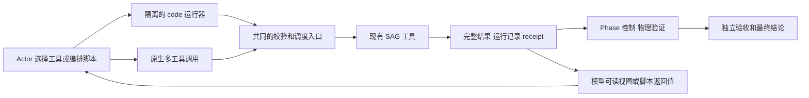

# SAG 工具修复和十项目消融计划

日期：2026-10-02。执行更新：2026-10-03。状态：**按用户最新要求，撤回两项目 H0 采用决定，暂停后续四组，先跑完整十项目 H0/H1 对照。** 本地旧八次结果与原采用记录保留。新的比较为十项目 × 两方案 × 两次重复，共 40 次，两组 Advisor/code mode 都关闭。数量、运行顺序、选择依据和验证集口径以 [十项目修订](2026-10-03-handoff-ten-project-amendment.md) 为准。

本计划接续 [9 月 28 日计划](2026-09-28-sag-context-advisor-remote-plan.md)和 [10 月 2 日六次运行归因](../../../output/context-handoff-ablation-20261002/analysis/attribution-report.md)。后续执行以本文件为准；旧计划和六次原始结果保留。

我们要回答两个问题：修复信息交付之后，Advisor 还有多少帮助？让 Actor 用代码编排工具，能否在保持 build/test 可靠性的同时减少模型输入和往返？SAG 仍是一套面向 setup 的 harness。Phase、执行记录、物理验证和独立验收器继续保留。

建议按以下顺序执行：

1. 修复分页、搜索、receipt 阅读视图和阶段计量。
2. 用固定十项目完成 H0/H1 各两次对照，再讨论共同基础；旧两项目结果只作开发数据。
3. 实现一个范围有限的 code mode，复用 SAG 的工具调度和证据记录。
4. 先做两项目试运行，再跑固定十项目的四组对照。
5. 给出逐项目数值、行为归因和采用决定。没有证据支持的优化保留为可选。

**现行顺序：40 次十项目交接对照，复核后再安排 8 次四组试运行和 80 次正式对照。** 先前八次本地开发运行和一次已开始的四组运行另计，远端记录也单列；不并入新主比较。原先 96 次的总量口径已被修订取代。 每一步通过后才进入下一步；这不是一次性启动 96 次运行。确定性测试和归档分析不调用模型。工程缺陷导致的新增修订批次不包含在这个数中，必须另记版本和预算。

## 1 已完成的工作和需要改变的顺序

| 项目 | 当前状态 | 本轮处理 |
|---|---|---|
| 旧 M0 版本封存和请求采集 | 已完成六次 E1 的封存、用量对账和归因 | 继续使用；修复 journal 的阶段归属 |
| 旧 M1 retained 交接 | 已实现实验开关；CSV、Net 各一次未显示净 token 优势 | 不扩大原实现；先修优先级，再做组件对照 |
| 旧 M4 Maven 插件身份匹配 | 已实现并离线复算 | 所有组共用同一评估器，旧评分另存 |
| 旧 E1 | 六次全部完成规定任务 | 保留为发现问题的数据，不并入新版本重复次数 |
| 旧 E2、E3 | 尚未继续 | 由本计划的交接开发对照和四组正式实验取代 |
| 旧 M2、M3 | off 接口与工具输出仍待完善 | 提前成为共同基础 |
| 旧 M5、M6 | 按需咨询、触发和失败诊断仍有研究问题 | 本轮冻结触发；失败案例先归因，不同时调策略 |
| 旧 M7 | prompt、自动阶段复用、I/O 等候选 | 暂不叠加；code mode 是本轮新增的独立因素 |

本轮不能继续沿用“token 多主要是 Advisor 触发太频繁”的解释。E1 的四次咨询全部发生在 Build/Test 入口，没有 problem-trigger，也没有 off 组反复请求被禁 Advisor 的循环。Net 的 Advisor 组相对基线减少的 token 中，94.5% 在首次咨询前就已经形成。

另一个已核实的事实是：SAG 已支持一次响应发出多个工具调用。E1 的 72 次 Actor 请求中，56 次发出一个调用，4 次发出两个，8 次发出三个，4 次发出四个。因此，本轮基线保留原有批量调用能力。[可复算数据](../../../output/code-mode-plan-20261002/cohort-and-schedule.draft.json)

## 2 先修复共同基础

这些修复服务于正确执行和测量，不以 token 下降作为通过条件。各项分开提交、留差异和测试记录；正式四组使用相同版本。

| 顺序 | 修改 | 实现位置 | 必须通过的验证 |
|---|---|---|---|
| F1 | 分页正文、可见范围、下一页游标使用同一预算；取消不知游标的二次裁切 | `tools/output_paging.py`、文件读取、`agent/native_messages.py` | 连续按 Next 读取，在最终 provider payload 中无遗漏、无错位；覆盖单行 JSON、Unicode 和省略标记 |
| F2 | 搜索优先交付实际命中片段，并保留完整输出入口 | `tools/search_tool.py`、`agent/tool_orchestration.py`、最终 formatter | Net skipped 查询的两个案例确实出现在模型收到的文本中；未匹配仍如实返回零 |
| F3 | 给 receipt 增加确定性的紧凑阅读视图 | `agent/invocation_receipts.py`、现有读取入口和 phase 事实投影 | 原命令、cwd、终态、实测 JVM/构建工具、范围、测试总数、失败入口均与原 receipt 对账 |
| F4 | 分开记录本次请求阶段和下一阶段 | `agent/context_journal.py`、请求与 phase 事件绑定 | 转阶段、最后一轮、Advisor 插入、多工具响应均能与 provider 请求 ID 对齐 |
| F5 | Advisor off 不注册咨询入口，不注入咨询指导，不触发咨询 gate | `agent.py`、prompt builder、咨询入口 | off 组无 schema 残留、无模型咨询、无拒绝循环；旧 off 仅作历史标签 |

F3 不调用模型压缩，也不删原始逐用例记录。它是由实际记录生成的阅读视图，每个值附来源；不输出新的成功结论。完整 receipt 继续供 verifier 和离线复算使用。模型仍可按 ref 搜索、读行或读范围。原始路径和分页入口必须到达 Actor 所在容器可访问的位置。

紧凑视图和完整输出的目录放在 session 目录，避免在受 RAT 检查的项目工作树内留下陌生文件。错误建议按现有工具参数重新审查，不直接恢复旧版 suggestions。

**第一道门槛：**真实归档夹具在最终模型输入层通过验证；负例不能变绿。F1/F2 是已证实的交付错误，没有必要在十项目上反复运行损坏版本。若以后量化它们的成本收益，要另做同版本配对；本轮不把四组全部变好归因于某一项基础修复。

## 3 交接只比较两个候选

在 F1–F5 相同、Advisor off、code mode off 的条件下，比较：

| 候选 | 交给下一阶段的内容 | 要验证的问题 |
|---|---|---|
| H0 | 当前任务事实、未完成要求、最新适用 receipt、必要的完整阶段决策及未决假设；其他材料给可读引用 | 更少的重复输入能否保持正确行动？ |
| H1 | H0，加与下一阶段未决问题有关的已读原文 | 原文是否减少重读，且收益能抵消重复输入？ |

H0/H1 都取消“原文先占预算、完整决策最后挤掉”的顺序。任务约束与实测事实分开，Actor 的结论标为 claim。H1 在成功后的 Test/Report 降低普通 POM 和 CI 配置片段的优先级。总预算覆盖整个 intro，不能只限制 handoff 的一部分。

使用已有 `phase.done(key_results=...)` 交接，不增加强制写摘要的模型回合。Actor 与 Advisor 的基础事实来自同一投影。咨询内容超出可用窗口时沿用有审计的排序、截取及压缩路径；不能因装不下就静默跳过。若发生模型压缩，其 token、时间和失真检查全部计入。

新的主比较用全部十项目，各跑 H0/H1 两次，共 `10 × 2 × 2 = 40` 次。两组只改变交接策略。先检查完成结果和事实保留，再看二十个配对的成本、重读和范围；按项目等权汇总。完整结果复核前不采用任一方案，细则见十项目修订。

全部十项目现在参与交接方式的选择，不能再将其中八项称为这项决定的留出验证集。后续四组属于同一 benchmark 内的机制比较，披露选择暴露；跨项目泛化另用未参与选择的项目集验证。

## 4 Code mode 候选

### 4.1 从 Pi 借鉴什么

本次读取了 Pi 官方仓库的固定提交 `a276dabe57911253350bffb93cb7d7aff6a73261`。原 `badlogic/pi-mono` 链接当前转到 `earendil-works/pi`。文档和源码已按文件 hash 保存于[来源目录](../../../output/code-mode-plan-20261002/pi-source/provenance.json)。

Pi 的实现可直接参考三个部分：

- [Code mode 协议](https://github.com/earendil-works/pi/blob/a276dabe57911253350bffb93cb7d7aff6a73261/packages/coding-agent/docs/codemode.md)：模型写 JavaScript，工具返回可在脚本内处理，选出的输出再交回模型。
- [独立执行包](https://github.com/earendil-works/pi/blob/a276dabe57911253350bffb93cb7d7aff6a73261/packages/codemode/README.md)：QuickJS 沙箱只访问注入的工具，没有普通 Node 文件、网络和进程接口。
- [调用适配层](https://github.com/earendil-works/pi/blob/a276dabe57911253350bffb93cb7d7aff6a73261/packages/coding-agent/src/extensions/codemode/execute.ts)：嵌套调用通过正常工具入口，保留调用状态；脚本失败保留已产生的部分结果。

这些是实现依据，不是 Pi 已证明 SAG token 会下降的证据。SAG 的 phase、job barrier、执行来源和验收链比一般工具编排更严格，需要在接入层保留。

### 4.2 首版采用的范围

增加一个可选 `code` 工具。Actor 写短 JavaScript，调用已有 action function，按返回值组合下一步或选取需要显示的字段。普通工具仍可直接调用，工具参数说明保持完整。首版不做 code-only、不做大规模动态隐藏 schema，也不移植 Pi 的整个 harness。

收益假设是：某些“读取 → 提取字段 → 按字段继续读取 → 汇总”的链可在一次模型响应后完成；中间的大结果不用全部送回模型。独立调用的批量化，原生路径已经支持，不能重复计为新能力。



落地方式优先试用 Pi 的独立 QuickJS 执行包，通过一个小的 Node worker 与 Python 调度器通信。固定包版本、依赖锁及许可证。worker 只收代码、工具契约和本轮调用能力；不传 provider 凭证，也不把普通宿主 API 暴露给脚本。先验证这个桥接在当前 Docker 镜像中的开销和部署要求，再决定依赖；本计划不要求为它重写 SAG。

若桥接无法可靠传递取消、barrier 和完整证据，则 code 候选不进入主实验。不能用宿主 `eval`/`exec` 临时替代。运行器和依赖在所有正式组的镜像中一致，off 组不启用入口，避免同时改变基础环境。

下面是**拟议接口示意，尚不存在这些新增字段和 helper**：

```javascript
const r = await tools.file_io({action: "read", path: receiptPath});
text({source: r.source_ref, terminal: r.receipt_view.terminal});
if (r.receipt_view.tests.failed > 0) {
  const detail = await tools.file_io({
    action: "read", path: r.receipt_view.failure_detail_ref
  });
  text(detail);
}
```

`receiptPath` 必须来自本轮真实工具返回，不能由 harness 注入隐藏评测答案。没有结构化字段时应明确缺失，不能让脚本猜“缺失等于零”。最后显示的统计仍来自原 receipt；Actor 自行计算的摘要属于 claim。

### 4.3 调度和证据约束

| 方面 | 首版约定 |
|---|---|
| 子调用 | 每个调用经过与原生调用相同的参数校验、权限、phase 检查、执行与持久化路径；不能只调用底层工具绕过 `_execute_action_step()` 的记录与控制 |
| 执行来源 | `parent_program_id → child_call_id → execution_id → receipt/output_ref` 可追踪；子调用仍是 Actor 编写的行为，不能伪装成 harness 自动补做 |
| 模型输入 | 子结果完整归档，脚本选出的内容进入下一轮；harness 另外附固定的执行状态、失败/pending/取消和完整读取入口，不能被脚本过滤掉 |
| 验收 | 原始物理证据决定成功。脚本退出 0、`text("success")`、只打印通过项均不认证任务 |
| Phase | `phase`、`report`、`advisor` 保留为外层控制入口；首版不能从脚本内切阶段、封存或递归咨询 |
| 长任务 | 遇到现有 job barrier，停止派发后续子调用，向外层交回 pending/job ID；继续沿用当前 job 生命周期，不在脚本里自造轮询或后台重跑 |
| 失败 | 保留已完成子调用；普通错误可显式捕获。取消、阶段关闭和 barrier 由调度器强制生效，不能被 `catch` 绕过 |
| 重试 | 不自动重跑整个有副作用的脚本；先交付已完成、失败和未执行的调用清单。续跑必须明确选择剩余动作 |
| 并发 | 首版子调用按共同调度队列顺序执行。先测减少模型往返，不同时加入工具并发这一因素 |
| 持久状态 | 首版脚本结束即释放局部变量，后续通过现有 ref 读证据；不新增通用跨 phase store，避免和交接实验混淆 |
| 工具发现 | 沿用已有完整参数说明；code 的说明补调用/错误/barrier 语义，不复制一遍全部 schema，不删除必要参数说明 |
| 范围 | 只封装 SAG 已有 build/test 相关工具；不加入图像、通用浏览器、额外模型或通用规划服务 |

每个子调用都运行现有无进展和状态检查。脚本的 CPU、内存、输出和总时间另有上限，总时间不超本次剩余任务预算。建议初始 VM 内存上限沿用 Pi 的 256 MiB，作为容器内的工程保护值；worker 总内存另计入 8 GiB 容器预算。CPU 死循环由运行器 deadline 中止，工具等待沿用现有工具与 job 时限。

保留每次 150 个 Actor 请求的上限，并为原生调用与 code 子调用共同设置 150 次逻辑工具调用上限，防止编排隐藏无限动作。这个数沿用旧协议的工程预算量级；封存前先核对旧二十项目轨迹是否会截断正常完成过程。若会，先修订两组共同预算并说明依据，再运行；不能事后只给 code 组增加预算。

### 4.4 接入测试与机制检查

先从 `_execute_action_step()` 提取最小的共同派发和记录部分，让原生与嵌套入口共用。保留现有控制顺序，不新造通用工作流引擎。新增 code adapter、受限 worker 和对应工具契约；配置默认 off。

至少覆盖以下场景：

1. 两次读取、依赖读取和条件分支可在一个外层调用内完成；原始结果与 ref 均可回放。
2. 第二个子调用失败时，第一个的证据保留，后续状态明确；成功重试不重复登记旧结果。
3. 构建返回 pending 时，后续动作未执行，公共验收器没有替 Agent 等待或补做任务。
4. 脚本试图忽略失败、伪造成功、修改禁止的 tracked 文件或使用错误 JVM，任务不能 complete。
5. 中断、死循环、超时、worker 崩溃、未等待 Promise 均不遗留无主构建；状态可追查。
6. 子结果和父结果均超长时，仍可按最终 provider payload 的有效游标恢复；不再制造第二个分页缺口。
7. provider usage 只按真实请求记一次，工具数按子调用记；父工具与子工具不重复计费。

另以归档夹具对照原生批量调用与 code 编排，分别测试“独立读取”“需要中间结果的读取”“大 receipt 的筛选”。记录减少了哪些模型回合、哪些字节没有进入上下文、增加了哪些代码和错误修复成本。这是机制检查，不代替完整 setup 实验。

## 5 十个项目及选择依据

选自既有二十项目，不扩大组织或另换最新源码。保留 CSV、Net 两个开发项目；其余八项覆盖不同验收要求。选择依据是任务特征、已有证据与可承受的运行成本，不按本轮成功率筛选。

| 项目 | 冻结任务的特征 | 声明模块数 | 归档 Java 物理行数及规模 | 旧 SAG 时长，仅供排程 |
|---|---|---:|---|---:|
| Commons CSV | defaultGoal，测试、打包、Javadoc 与质量检查；开发项目 | 1 | 18,007，小 | 9.2 分钟 |
| Commons Net | clean install；开发项目 | 1 | 57,638，中 | 8.2 分钟 |
| Commons DbUtils | clean test，不要求主 JAR | 1 | 16,584，小 | 6.0 分钟 |
| Tomcat Jakarta EE Migration | test；核对 Analyze 提前执行的证据复用 | 1 | 8,170，小 | 5.5 分钟 |
| Sling Commons MIME | bundle、install 和文档；已声明的非发布变体 | 1 | 1,104，小 | 5.8 分钟 |
| Creadur Whisker | Maven wrapper、reactor、install；已声明的非发布变体 | 8 | 10,656，小 | 8.9 分钟 |
| Commons DBCP | defaultGoal、多项质量检查和较多测试 | 1 | 49,990，中 | 10.4 分钟 |
| Gson | Java 21、verify javadoc:jar、空测试选择的严格判定 | 8 | 57,118，中 | 10.2 分钟 |
| HttpComponents Core | profiles、多模块、verify install | 6 | 175,733，中 | 12.1 分钟 |
| FreeMarker | Gradle --continue、多步骤、Java 17/21、nativeCompile 与执行 | 2 | 152,111，中 | 16.8 分钟 |

“模块数”来自冻结 requirements，包括声明的聚合模块；不等于应产生 class 或 JAR 的模块数。每个指标仍使用自己的适用模块分母。尤其 Gson 不能从模块名字推断本 cell 激活了 native profile。

规模沿用已有数据集的描述性阈值：80 个已核验仓库的 Java 物理行数，Q1=27,580.75、Q3=225,897.25，采用 inclusive quartile。小为不超过 Q1，中为 Q1 到 Q3，大为超过 Q3。物理行数包括测试、示例和夹具，不是可执行 SLOC，也不是运行时间上限。十项已按各自任务的固定提交重新下载官方源码归档并计数；七项已有归档的文件内容也已逐一核对。结果为五个小项目、五个中项目，无大项目。[源码和规模复核记录](../../../output/sag-ten-code-mode-20261002/input-audit.json)。旧数据集中 Net、HttpCore 的另一个 SHA 的规模没有借用。

**本轮是以小、中项目为主的机制验证，不代表百项目数据集，也不代表大型项目效果。** FreeMarker 是本轮构建路径较复杂的一项，其源码规模仍为“中”。Commons CLI 的旧 smoke 是缩减变体，本轮由两个正式 test 生命周期任务覆盖短任务。Curator、Cayenne、Jackrabbit 的旧运行较长；RocketMQ 的已有失败还需要专门控制复现条件，留作后续压力与诊断确认。其他相似短 Maven 项目本轮不重复抽入。排除不表示失败或永久移出数据集。

完整 commit、原命令、JDK、已规定的 Maven 版本、输入文件 hash、来源和顺序保存在[清单草案](../../../output/code-mode-plan-20261002/cohort-and-schedule.draft.json)。执行前从现有定义生成新 protocol，并冻结有效 requirements；不修改任何规定命令来让 code mode 更易成功。

### CI 能支持的比较

不能用旧报表的一个 `verified` 字段判断全部 CI 指标可用。本次重新读取了各项目的 `ci_alignment` 和 `test_count_semantics`：

| 对照能力 | 当前项目 | 报告规则 |
|---|---|---|
| 已准入同范围 CI 测试计数 | Net、DbUtils、HttpCore | 可报告 ran/passed 比及分子分母；仍不等于逐用例一致 |
| 已准入计数，但有非发布变体 | Whisker、Sling MIME | 单列变体；build/test 范围与外部 deploy 的差别必须披露 |
| 有官方绑定及测试总数，当前 typed importer 未准入计数 | Gson | 可以披露官方记录，数值 score 仍 unavailable；不能偷用 legacy 分母 |
| 冻结任务未准入 CI 计数 | CSV、DBCP、Tomcat Migration、FreeMarker | 如实报告本地任务结果；CI 数量比 unavailable |

五个可计数项目的归档逐条记录审计不等于跨运行 case identity 已对齐。正式报告先列能力矩阵；只有 identity 正规化、重复次数和范围对齐均通过才发布 identity score。缺证据不记零，也不退回“构建成功就给 1/1”。本轮先比较各组在同一任务上的表现，不能声称十项全部达到完整 CI parity。

## 6 正式四组设计

F1–F5、选定交接、执行器/评估器版本、资源和任务在四组中相同，只改变下表两项。

| 组 | 工具调用方式 | Advisor | 主要用途 |
|---|---|---|---|
| A | 原生调用，保留一轮多工具能力 | off，接口干净 | 同期基础对照 |
| B | 同 A | mini high，Build/Test 入口 brief | 修复基础后 Advisor 的增量 |
| C | 同 A，并允许 Actor 使用 code mode | off，接口干净 | code mode 的整体增量 |
| D | 同 C | 与 B 完全相同 | code mode 与 Advisor 是否互相替代或互补 |

Actor 均为 `gpt-5.4-mini`，沿用 E1 的实际参数：temperature=0、输出上限 10,000、请求不显式发送 reasoning_effort。不能把它写成“Actor medium”。Advisor 也用 mini，high，输出上限 8,192。记录实际 resolved model、API 和 provider 参数；暂不加入 Terra。

B/D 每次到达 Build/Test 入口各咨询一次，冻结相同内容选择和预算。关闭额外 problem-trigger、定期检查和 Actor 主动咨询；Actor 在咨询前的指导保持一致。这样测的是这个明确的 brief 策略，不是“所有 Advisor 设计”。阶段未到达就没有咨询；每次失败请求和重试的成本照记。Advisor 只能读本轮已有证据，不能执行 build/test 或替 verifier 下结论。

Code 组保留直接工具作为回退。主要分析按“提供 code 能力”的分组统计，不能事后只选成功使用 code 的运行。另列实际使用次数、子调用数、分支次数、回退与脚本错误。若 Actor 从未使用 code，结论是当前工具接口/提示未建立采用，不能伪称已经验证其节省效果。

### 数量和运行顺序

1. **工程试运行：**CSV、Net × A/B/C/D 各一次，共 8 次。检查采集、取消、版本和 false success；不用于选最低 token 的方案，也不并入正式重复次数。修复过代码则重新封存。
2. **正式对照：**10 项目 × 4 组 × 2 次，共 80 次。每个项目内四组相邻运行；第二次用相反顺序。总计每组 20 次尝试。

顺序使用两对预先给定的排列：`ABDC/CDBA` 和 `BCAD/DACB`，各分配给五个项目。两轮中，每组在四个位置上各出现五次；整体相邻组次序也平衡。第二轮反转项目顺序。完整 80 行调度表已经写入清单并离线检查。

两次重复用于得到最基本的项目内波动和顺序对照，**不是证明统计功效充分的样本量**。十项目数来自本轮的工程范围要求；项目特征覆盖决定清单。正式期间不因 token 结果好看提前结束，也不为取得显著性追加有利样本。若区间很宽，结论就是证据不足，下一阶段重新做样本量和预算设计。

## 7 结果如何计算和解释

先报告完成情况，再报告成本。四组都跑相同原命令和要求；公共验收器只读 Agent-origin 证据，不安装工具、不替 Agent 完成遗漏步骤。

| 指标 | 定义或要求 |
|---|---|
| 全任务完成 | 全部适用要求通过，且源码/工作树/运行时等前置条件通过；状态为 complete/incomplete/unavailable |
| Build 与 Test 成功 | 各自全部适用要求通过；同时报告 passed/required 和 unknown 数，不把未运行、缺证据当成功 |
| 模块和产物 | build/test 适用模块数及完成数；主/测试 class；主 JAR、辅助 JAR、其他要求产物的数量与 hash；不推断每个 Java 源文件都一对一生成 class |
| 测试量 | reported、ran、passed、failed、errors、skipped；声明执行次数或 unique identity 粒度；空选择、重试、重复执行单列 |
| CI 指标 | 仅在已准入同范围分母上计算；聚合数量比与逐用例覆盖分开；越界或冲突如实报告 |
| 总 token | 所有 Actor、Advisor、压缩及已计费重试请求的 input+output；按 provider request ID 去重 |
| 缓存与费用 | input 分为 cached 与 uncached；reasoning 是 output 子集。费用按运行时核实的费率或账单单列，无可靠价格则 unavailable |
| 时间 | 无人反馈 Agent 墙钟、模型等待、工具执行、构建、自身控制/I/O、准备与归档分别保存；重叠区间不重复相加 |
| 自主性 | 执行窗口内 human_interventions 明确记录 0 或实际事件；事后工程修复另列 |
| 资源 | 容器与 worker 峰值 RAM、CPU、磁盘变化、OOM、超时、取消 |
| 编排行为 | provider 请求数、原生/子调用数、同轮多工具数、程序长度、实际分支、重复读取/执行、编排失败恢复成本 |

每组正式成功率的分母为 20 次预定尝试；未开始项先单列，全部运行结束才给完整分母。已启动的失败、超时、OOM 和 unavailable 不删除。逐项目展示 0/2、1/2、2/2 完成，而不是将一次最好结果当项目成功率。

对 token/time，先在项目内配对，再给十项目等权汇总；可单列原八个非开发项目的结果，但它们已参与交接选择，不能称为留出验证集。整体花费保留全部尝试。两组均成功的子集可作为次级“相同完成情况下的成本”分析，但必须列出被排除的失败，不能用该子集替换主表。失败的低 token 不视为效率优势。

需要回答的对比为：

- `C−A`：无 Advisor 时，提供 code mode 的差异。
- `D−B`：有 Advisor 时，提供 code mode 的差异。
- `B−A`、`D−C`：分别在两种调用方式下，Advisor 的差异。
- `(D−C)−(B−A)`：二者交互；用于检查它们是否在解决同类多余往返。

对每项同时给绝对数、配对差和注明分母的百分比。总 token 的主对比不把 cached input 剔除。若 code 只减少缓存命中输入，却增加未缓存输入或输出，应直接披露；不能据总 token 下降推导 API 更便宜或本地模型更快。

区间分析以项目为抽样单位，保留项目内全部组和重复；不能把 80 次运行、所有工具调用或数千测试当 80 个以上独立项目。十项目的区间和每项目差值均展示，不只报 p 值。四组差异是机制层面的证据；大规模非劣效或生产 CI 可靠性仍需后续验证。

## 8 执行环境和停止规则

2026-10-03 起，按用户要求迁回本地 `/Users/chenhao/Documents/github/Setup-Agent`。本地主机 arm64、64 GiB，Docker 约 15.7 GiB、18 CPU；实验镜像仍为 linux/amd64。远端历史环境为 arm64、24 GiB，Docker 约 12 GB。两台主机记录分别保留，不混合配对。历史二十项目还使用旧策略，本次时间也不能直接与旧 Claude/OpenCode 时间相减。

沿用每次 4 CPU、8 GiB、无额外 swap、7200 秒；**容器并发为 1**。即使部分项目很小，这台主机也先保持相同竞争条件。每 15 秒采样，宿主与 Docker 保留线为 32 GiB；启动条件还包括覆盖预计归档增长。资源阈值来自既有协议，不作为项目质量筛选阈值。

只有本次运行归档、hash 检查和离线复算通过，才删除它拥有的停止容器。不执行全局 prune，不删除旧证据。自由磁盘不足先停发新任务；运行中 OOM/超时如实记录，不能事后移出分母。

开跑前封存：

- 源码快照及 dirty 文件 hash、镜像内容/manifest、锁文件、worker、工具 schema、prompt 和评估器。
- 十项目任务、requirements、CI 来源及 pinned source；前三项待补规模必须完成，外部服务和镜像适用性复核。
- 两种模型角色的请求参数、并发与缓存规则、资源预算、完整顺序、全部输入/输出采集和人类介入 ledger。
- 正式命令始终传入 `--acceptance-task-file` 和 `--ci-target-file`；有效配置在启动后再次验证。

每次新建冷容器和项目依赖缓存。没有项目专属答案、旧 Agent 轨迹或评测结果挂载给 Agent。公共 CI 任务要求是输入，独立验收答案不是输入。Provider 缓存状态不可完全控制，记录 cached/uncached 并平衡顺序，不暗中预热某组。

出现源/输入 hash 漂移、usage 丢失、子调用未归档、错绑 receipt、false success、barrier 被越过或资源越界，停止后续批次并修复。普通项目失败继续保留并运行其他预定尝试。基础设施事故和模型/项目失败使用预先定义的分类；任何重跑都保留原尝试，不拿重跑覆盖失败。

用户已批准执行本计划，并在 2026-10-03 明确批准后续 OpenAI API 调用。计划内的 build/test 实验继续执行，不重复索取同一许可；若新增目的地或材料超出已授权范围，再说明具体增量。

### 预算披露

旧二十项目 SAG 数据套用本次清单和八次/项目，只作算术量级参考：正式 80 次约 **12.4 个 Agent 小时、1,312 万总 token**。这来自另一主机、旧 Advisor 策略，不是预测、费用报价或承诺。两项开发和试运行阶段另计；在本地四组试运行后，按实际时间、用量和已核实费率更新预算表，再进入 80 次正式批次。不得通过删掉慢项目来伪造节省。

## 9 采用决定和后续范围

任何新 false success、缺失证据、范围放宽或后台任务失控，都阻止成为默认。无可靠性问题后，再看完整任务效果与包括 Advisor 在内的总成本。

- Code mode 若降低往返和重复输入，且没有用更多失败或早停换取低 token，可继续扩大验证；只有局部便利则保留可选。十项目不能证明普遍非劣效。
- Advisor 若只在原有信息缺口上有帮助，基础修复后增量消失，则保留主动求助/故障诊断方向，不把固定入口咨询设为必需。若 D 优于 C，逐轨迹核对建议、行动和结果，不能只看回复质量。
- 若 H1 重读减少但总输入更大，回到 H0，不通过继续增大窗口掩盖问题。
- 若 code 的主要收益来自隐藏中间结果，而非依赖编排，下一轮再拆“结构化阅读视图”和“程序控制流”；本轮不把一个组合改动归功于单独子机制。

暂不同时更换 prompt 风格、Actor reasoning、自动跳过 Test、工具并发、Advisor 按需读取或定期触发。`compact_setup_prompt`、`reuse_verified_test_phase`、`export_runtime_handoff` 保持此前关闭状态，除非先另写修订。旧 M5/M6 的失败诊断与 RocketMQ 复现继续排队，先用本轮实际失败证据选择可检验假设。

本轮不重跑 Claude/OpenCode。已有数据作为历史背景保留；如果下一步主张 SAG 比其他 harness 更省时间/资源，再安排同主机、同任务、同模型契约的同期对照。正式结果不混用旧二十项目或 E1 六次作为新组重复。

## 10 论文 RQ 和交付

**RQ1 自主完成能力。** 在固定 CI 任务及明确要求下，SAG 的设计能否帮助较弱模型自主完成 build 和 test？分别报告阶段完成、全任务完成和错误成功判定；后续以同期其他 harness 为对照。

**RQ2 设计贡献。** 在相同执行能力和验收条件下，交接、code mode 与 Advisor 如何改变模型的读取、执行、诊断和收尾行为？哪些机制减少重复工作，哪些只转移了成本？本轮四组重点回答 code mode、Advisor 及二者交互。

**RQ3 成本与 CI 适用性。** 在完成情况可比较且证据可信时，SAG 消耗多少总 token、费用、无人反馈时间和资源？这些取舍在哪些要求类别与规模上成立？API mini 的结果不等于已经证明本地模型优势，真正本地弱模型是后续独立验证。

执行分为五个可验收交付：

| 交付 | 内容 | 进入下一步的条件 |
|---|---|---|
| P0 | F1–F5、确定性正负例、真实 provider 文本回放、规模和输入复核 | 数据完整、来源绑定、无新误报成功 |
| P1 | 40 次十项目交接对照、逐项目 H0/H1 差值和不确定性；旧八次单列 | 全部十项目复核后讨论共同上下文方案 |
| P2 | code adapter/worker、子调用证据与 barrier 测试、8 次四组试运行 | 模型采集、预算和执行语义均核验 |
| P3 | 四组正式 80 次、完整 ledger、按项目离线复算 | 所有预定尝试有结局或明确未开始原因 |
| P4 | 逐项目表、总体差值、选择暴露说明、行为归因、设计决定 | 每个结论可回到源码版本与原始请求 |

最终报告第一页列每项目、每组的 build/test/whole-task，模块、主 class、主 JAR、tests ran、token 和无人反馈时间。第二部分拆 cached/uncached、Actor/Advisor、阶段和成功命令前后成本。第三部分给行为链：**Actor 看见什么 → 做了什么 → 工具实际执行什么 → 证据如何判定**。不要求读者先理解全部 harness 内部术语。

本计划说明研究顺序，实际运行仍需独立封存协议。P0 本地 702 项测试、真实归档分页和搜索回放已通过。远端最初因宿主缺少 `rg` 有一项测试失败；补齐后 414 项关联测试全部通过。十项目任务、requirements 和 CI target 的原字节保持不变，旧目录遗漏的 101 项嵌套来源已按声明 hash 恢复，[输入复核](../../../output/sag-ten-code-mode-20261002/input-bundle-audit.json)通过。按最新修订，先完成 40 次十项目交接对照并复核，才讨论共同交接方案并恢复 P2；本段工程验证不代表 live run 已成功。

P1 v1 首次运行暴露镜像 observer 与任务要求不一致，保留为测量配置失败；不计入八次有效配对，116,732 token 照记。修订见 [P1 amendment](../../../output/sag-ten-code-mode-20261002/p1-amendment-1.md)。P1 v2 改用逐字匹配所有十项要求的 observer 镜像。远端 [配对读数](../../../output/sag-ten-code-mode-20261002/p1-v2/analysis/readout.md)仍为断线前的中途结果；本地 [八次结果](../../../output/sag-ten-code-mode-20261002/p1-local/analysis/readout.md)和 [原 H0 采用记录](../../../output/sag-ten-code-mode-20261002/p1-local/analysis/adoption.md)已保留；该采用决定现已撤回，等待完整十项目对照。

Code mode 的 [隔离原型](../../../output/sag-ten-code-mode-20261002/code-runtime-feasibility/README.md)已通过 30 项无模型检查。固定 Pi 源码中的输出上限修复；不直接采用缺少此修复的 npm 1.0.0。远端不可达期间，仅在 `output/sag-ten-code-mode-20261002/p2-candidate` 中准备接入和测试，不改变正在运行的 P1，也不据中途结果选择交接方案或启动 P2。

[候选接入与恢复步骤](../../../output/sag-ten-code-mode-20261002/p2-candidate/README.md)已保存。最新选定回归集合 **566 项全部通过**，包括 20 个 code 接入测试；另有 9 项 Docker 运行器检查和真实 SAG/Docker 分页链检查通过。扩展检查曾有 14 项基线失败，已逐项确认旧夹具缺少配置、orchestrator、报告绑定或仍期待旧停止规则；夹具修订后通过，原记录保留。三个测试文件的 106 项检查包含在 566 项中，不重复相加；这不代表运行了整个测试库。本地 P1 完成并复核后，已按清单接入 8 个修改文件和 19 个新文件；默认 code mode 仍为 off。接入后的同一回归集合再次通过 566 项。原文件已单独备份，未覆盖其他改动。此前的组件容器已在归档核验后清理；P2 将使用本地新建的共同镜像并复核执行链，不依赖远端恢复。远端未知结局继续单列。
