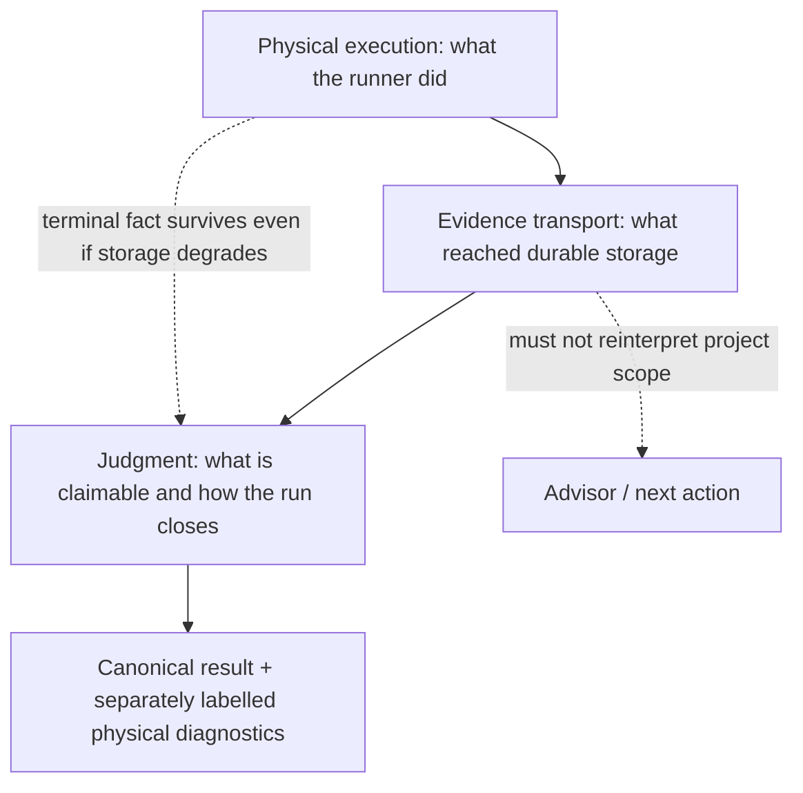

# SAG 2026-08-08 23-project battery deep attribution report

**Date:** 2026-08-08  
**Scope:** the 23 Java-project battery under `logs/battery-20260808/`, its 23
session directories, the matching 7/27 campaign sessions, the two p9 anchors,
and live read-only inspection of the retained Docker containers.  
**Decision status:** the earlier battery report is **not decision-ready**. Its
central attribution — that the large count loss came mainly from model course
variance rather than harness loss — is contradicted by terminal runner output,
receipt metadata, report files, and live process evidence.

**Supersedes:** the causal interpretation and totals in
`2026-08-08-battery-rerun-report.md`. That file remains a record of the first
read, but its 2/15/6 verdict split, mixed-grain total, “model course” diagnosis,
HTTP retry recommendation, Samza broker/YARN explanation, and Polaris
concurrency claim must not be used for engineering decisions.

## Technical summary

The recent structure has real value, but the current system is not yet a
reliable end-to-end harness for the 23-project golden standard.

- It **really solved** report attribution for Jackrabbit and Tapestry, removed
  the 50-report snapshot cliff for Kafka, improved Java/toolchain recovery for
  Polaris, and detected Samza's natural stall without duplicating or painting
  over the open job.
- It **introduced or exposed severe harness failures** on large evidence sets.
  Lucene, Geode, Cayenne, and Cassandra all ran broad root suites before their
  terminal receipts failed with `argument list too long`. The gate then treated
  the executions as absent and the advisor steered the model toward narrower
  runs. Camel settlement fails through the same transport path.
- HTTPComponents is a deterministic environment regression, not a flaky run:
  the image lacks `unzip`, so the Maven wrapper silently switches from ZIP to
  tar.gz but validates the tarball with the repository's correct ZIP checksum.
- Samza's stall is a real project/test-lifecycle hang in `StreamAppender`
  cleanup, not a missing broker or YARN service. The stall detector worked, but
  evidence close then waited another 5,554 seconds and left the process alive.
- The static prompt bundle was unchanged between the compared campaigns, so
  there was no static-prompt intervention to credit or blame. Runtime gate,
  advisor, tool-result, and control messages did change with the harness and
  remain important amplifiers. Weak-model limits are visible, but mostly as an
  inability to independently discover `unzip`, `ccm`, JVM thread state, and
  Java runtime/source-target distinctions after misleading feedback.

The correct overall verdict distribution is **2 success / 16 partial / 5
failed**, not 2/15/6. Canonical primary executions fell from **44,983 to 15,322
(-65.9%)** and raw primary rows from **45,423 to 18,080**. Auxiliary discovery
rose from **13,507 to 65,776 rows**. Auxiliary rows are not claimable KPI and
may overlap across attempts, but project-level terminal evidence shows that
several suites were driven before their attribution path failed.

These counts are now frozen as a **legacy-v1 forensic baseline**. The next SAG
campaign starts a metrics-v2 series with module-qualified test subjects,
parameter-aware cases, receipt executions, and separately disposed report
observations. No future chart may present v1 and v2 as one continuous KPI.

### Decision-grade causal register

The table below separates a **cause** from a condition that merely co-occurred.
“Necessary” means removing that mechanism would have prevented the recorded
failure path. “Amplifier” means the run could still have failed, but with less
damage or a reachable honest close.

| Claim | Role in this battery | Falsifier / counterfactual | Confidence |
|---|---|---|---|
| Multi-megabyte receipt JSON crossed the container exec argv limit | Necessary cause of lost canonical evidence on Lucene, Geode, Cayenne, Cassandra, and Camel settlement | Persist the same receipt through the existing chunked writer; if canonical evidence still disappears, this diagnosis is wrong | Very high |
| The weak model chose only tiny scopes on the four large synchronous projects | Rejected as primary cause | Root suites visibly ran before their receipts failed; Lucene did so twice | Very high |
| Gate/advisor feedback amplified receipt loss into narrowing and closure loops | Amplifier | Preserve a typed terminal-unpersisted fact and suppress scope advice caused only by internal storage failure | High |
| Wrapper preference activated a latent missing-`unzip` image defect on HTTPComponents | Necessary cause of this run's pre-build failure | Add `unzip` or mark the wrapper unavailable before dispatch; the repository ZIP checksum must then pass unchanged | Very high |
| Static Java survey authority overrode a newer runner requirement on Camel Quarkus | Necessary cause of the Java-17-to-11 rollback | Pin the runner-observed requirement into the retry contract; a later preflight must keep Java 17 | High |
| Samza lacked broker/YARN services | Rejected for the observed hang | Live stacks show `TestStreamAppender` shutdown joins and a `MockSystemProducer`, not a network wait | High |
| Three-lane concurrency explains the p9-to-battery Polaris drop | Not identifiable | p9 and battery used different target SHAs, so revision and concurrency changed together | Very high |
| Model nondeterminism exists | Background variance, not quantified here | Needs same-SHA, same-image, same-code repetitions after deterministic harness defects are removed | Medium |

The intervention priority follows this register: repair necessary mechanical
causes first; only then measure model variance or tune prompt guidance.

## Key finding: the dominant regression is an evidence-transport failure

The most important failure path is mechanical, deterministic, and reusable
across ecosystems:

```mermaid
flowchart LR
    A["Model chooses a broad root test"] --> B["Runner executes and writes many XML reports"]
    B --> C["Harness snapshots every report path and hash"]
    C --> D["Receipt JSON grows beyond Linux argv limits"]
    D --> E["Single heredoc exec fails: argument list too long"]
    E --> F["receipt_persisted = false"]
    F --> G["Gate says no terminal test execution exists"]
    G --> H["Advisor asks for a narrower module run"]
    H --> I["Small receipt persists; final canonical count collapses"]
```

The repository already contains a chunked writer designed for this exact
kernel limit in `src/sag/utils/container_io.py`, but
`src/sag/agent/invocation_receipts.py::write_receipt` embeds the complete JSON
body in one shell command. `report_delta` is intentionally unbounded after the
50-line snapshot clamp was removed. The bounded 50-node `testcase_outcomes`
field therefore does not bound the receipt itself.

As an orientation check, the five projects the old report called model-course
regressions have this aggregate shape:

| Projects | 7/27 canonical | 8/8 canonical | 8/8 auxiliary report rows |
|---|---:|---:|---:|
| Lucene + Geode + Cayenne + Cassandra + Samza | 40,741 | 358 | 40,738 |

This near conservation is **not** a causal test: auxiliary can contain retries,
cache materialization, stale observations, and different identity grain. It is
useful only as a prompt to inspect each project. The causal evidence comes from
each project's terminal command, exit state, report paths, receipt metadata,
and subsequent control decisions. Those traces establish broad physical
execution on Lucene, Geode, Cayenne, and Cassandra; Samza is the separate
genuine non-terminal stall case.

### Project-level causal reconstruction

| Project | What physically happened | What SAG finally reported | Primary attribution | Confidence |
|---|---|---|---|---|
| Lucene | Root Gradle test ran twice; first run completed successfully with about 18.8k tests | Partial, 6 canonical tests | Harness receipt transport; advisor then narrowed | Very high |
| Geode | Root test produced 10,448 results: 10,419 pass, 3 fail, 26 skip | Partial, 0 canonical | Harness receipt transport and unreachable closure; 3 real project reds remain | Very high |
| Cayenne | Root `mvn verify` exited 0 with 4,586 results, 0 fail/error | Partial, 0 canonical | Harness receipt transport plus post-execution coordinate rejection | Very high |
| Cassandra driver | Two root verifies ran; 4,458 auxiliary results remained; later narrow integration receipt counted 352 | Failed, 352 canonical | Receipt loss and bad narrowing; real missing `ccm`/Cassandra fixture errors | High |
| Camel | Battery job reached exit 137 with 22,151 auxiliary rows; p9 job had `BUILD SUCCESS`, exit 0, 11,930 goals | Partial, 0 canonical and `job_unsettled` | Settlement receipt transport misclassifies terminal jobs | Very high |
| HTTP client | Wrapper failed before compilation because the image lacks `unzip` | Failed, 0 | Deterministic harness image/wrapper prerequisite regression | Very high |
| Camel Quarkus | Model provisioned valid arm64 Java 17; preflight restored Java 11 and recreated the plugin failure | Partial, 0 | Static survey fact incorrectly outranks runner-observed runtime requirement | High |
| Samza | Root tests reached roughly 2.4k reports; two executor threads remain stuck in `StreamAppender` close/stop joins | Partial, 0 canonical, 2,415 auxiliary | Real project/test hang; stall diagnostics and close policy incomplete | High |

### What the model actually did, and why the later course changed

This distinction matters because a weak-model harness must be judged on the
state it presents to the model, not only on the model's final action.

| Project | Before the decisive fault | Harness observation shown afterward | Model's subsequent move | Attribution |
|---|---|---|---|---|
| Lucene | Chose root `build(action='test')` twice; both broad runs completed | Receipt persistence failed, so the controller stated that no qualifying terminal execution existed and later refreshed coordinates as unsafe | Followed advisor toward `core.tests`; that six-test receipt persisted | The narrowing is downstream of corrupted controller state, not evidence that the model preferred six tests initially |
| Geode | Drove a root suite that produced 10,448 rows | The root receipt disappeared; canonical test state stayed 0/0 while physical reds remained outside the claimable set | Repeated close/reconnaissance instead of finding a new productive action | Weak recovery from a state the harness made internally inconsistent; 3 project failures are still real |
| Cayenne | Drove root `mvn verify`; Maven exited 0 and produced 4,586 rows | Receipt loss plus post-execution coordinate checks said the completed action was not usable terminal evidence | Repeated `done`/`blocked` attempts; 59 phase-tool calls failed before one close was accepted | Controller liveness defect dominates; the model correctly recognized there was nothing useful left to rerun |
| Cassandra | Ran two broad root verifies | Both large receipts failed; advisor treated the missing canonical receipt as a scope problem | Narrowed to `integration-tests`, where the only persisted receipt exposed 85 errors | Receipt loss caused narrowing; missing `ccm` and a live Cassandra fixture explain the remaining narrow-suite failures |
| HTTPComponents | Used the harness-selected Maven wrapper | Wrapper emitted a checksum error caused by archive-format fallback | Accepted “stale checksum” framing and repeatedly tried to close | The model failed to reverse-engineer the wrapper, but the harness selected an unready runner and supplied a wrong diagnosis |
| Camel Quarkus | Installed and registered the Java 17 the failed plugin explicitly required | A later static preflight reasserted Java 11 | Could not escape a harness-created authority cycle | The model performed the correct repair; contract/preflight ordering undid it |
| Samza | Launched the root tests, then polled the same detached job | Stall handoff truthfully said no observable progress and “not killed” | Did not launch a duplicate suite | Correct behavior under the available contract; the missing capability is bounded diagnosis and autonomous cleanup |
| Camel | Launched the reactor verify job; p9 physically ended green and battery ended 137 | Settlement could not persist the large receipt, and both terminal jobs were represented as unsettled | No model action could repair evidence storage after the fact | Pure control-plane failure at settlement; asking the model to reason harder is irrelevant |

There is still a genuine model-capability ceiling: the model did not
independently discover the `unzip` archive-domain mismatch, obtain a useful JVM
thread dump, distinguish plugin runtime Java from source target Java, or
provision Cassandra's integration fixture. Those are precisely the recurring,
machine-observable facts the harness should turn into typed state and one safe
next action. They are poor candidates for additional free-form prompt prose.

### Lucene is the decisive counterexample to “the model only ran six tests”

The model's first test action was a root `build(action='test',
working_directory='/workspace/lucene')`. The root run ended `BUILD SUCCESSFUL`
and wrote 1,683 XML files. Writing `inv-gradle-1-0002.json` then failed with
`exec /bin/bash: argument list too long`, and control sequence 41 recorded
`receipt_persisted:false`. The second root run failed identically. Only after
the gate denied terminal evidence did the advisor request a concrete narrow
module; the six-test `core.tests` receipt was small enough to persist.

Adding stronger prompt text such as “do not finish after six tests” would treat
the symptom at the wrong layer. The model already did the desired thing.

## What the new structure genuinely solved

### 1. Receipt-scoped claiming and dedup work when the receipt can be stored

- **Tapestry is the cleanest proof.** Old primary plus old auxiliary raw totals
  equal the new raw totals exactly: 2,483 executed, 2,103 passed, 14 failed,
  366 skipped. The old receipt had exactly 50 report files; the new receipt had
  370. Its failed-to-partial flip is an accounting repair, not a broader run or
  a more generous judge.
- **Jackrabbit is also a direct accounting repair.** Both runs produced 6,667
  physical testcase rows and 4,230 classes. The new root receipt claims 168 XML
  files and exposes 4,722 canonical identities. The 1,945 raw-to-canonical gap
  is not duplicate report-path counting: most comes from the same Java test
  identity executing in both `jackrabbit-core` and `jackrabbit-spi2jcr`, while
  the canonical key omits the reactor module. The honest wording is “6,667
  physical executions attributed, represented as 4,722 canonical cases.”
- **Kafka proves the 50-file clamp is gone.** The old receipt claimed exactly 50
  files; the new one claimed 174 and raised canonical attribution from 546 to
  2,516. Its new physical raw total of 2,980 is lower than the old combined
  physical total of 5,284, so the 4.6x number is an attribution improvement, not
  a physical-reach improvement.

### 2. The judge is more honest about non-terminal and conflicting evidence

The finalizer no longer turns an open job or a partial build into green merely
because some XML exists. It preserved Samza as non-terminal, retained failed
and skipped test outcomes, and corrected Polaris model-written counts. This is
an important property and should not be removed to make the headline numbers
look better.

### 3. Some recovery mechanics increased real physical reach

Polaris made real progress: after a Gradle daemon disappearance, the model
shifted to a non-daemon/low-worker run, produced thousands of results, settled
a receipt small enough to store, and let the finalizer correct inconsistent
counts. This demonstrates that the new evidence chain can preserve a
recovering run, but one battery sample cannot allocate the gain between model
course, toolchain propagation, resource conditions, and controller support.

The p9 Polaris count cannot be used to explain the battery count as a
three-lane load effect: p9 ran project SHA `2ee7342a`, while the battery ran tag
SHA `da952338`. Project version and concurrency changed together.

### 4. The stall window detects liveness loss without starting duplicate work

Samza naturally triggered the new test-tier stall window after 863 seconds,
with 600 seconds of unchanged build-tree state. The model polled the existing
job rather than launching another root test, and the terminal judge refused an
unsupported success claim. The detection and obligation semantics worked.

What it did not solve is throughput or diagnosis: evidence close then consumed
almost all remaining wall-clock budget, and the retained process still exists.

## What became worse or remains structurally unsafe

### 1. Snapshot completeness moved the cliff instead of removing it

Removing truncated report discovery was correct, but the unbounded path list
now crosses Linux `ARG_MAX` in the receipt writer. This is a composition defect:
two individually sensible components — complete snapshots and atomic receipt
writes — were never tested together at live-project scale.

Evidence strength is not identical across sessions:

- **Direct error-text anchors:** Lucene's two root receipts and p9 Camel's
  roughly 2.75 MiB settlement receipt record `argument list too long` after a
  terminal run.
- **High-confidence same-path inference:** Geode, Cayenne, Cassandra, and
  battery Camel record terminal physical output, large report sets, and
  `receipt_persisted:false` through the same single-argv writer. Their durable
  logs do not all preserve the kernel error text, so the fix plan requires a
  replay of the archived payload shape rather than treating inference as a
  completed post-fix proof.

The current `job_unsettled` event therefore conflates “the process is still
running” with “the process is terminal but its receipt could not be stored.”

### 2. Control-layer terminal states are often unreachable

The gate correctly prevents false green, but it repeatedly rejects both
`done` and `blocked` after the model has no remaining productive action.
The machine-readable event stream records 59 failed phase-tool results in
Cayenne, 54 in Cassandra, and 31 in HTTPComponents. Freemarker made 37 gate
decisions, 32 of which rejected the claim, despite a stable 870-test count.
These are different event grains, so they are not added; each independently
shows a controller that kept asking for another state transition after the
physical state stopped changing.

For a long-running weak-model agent, this is a harness liveness bug. Recurrence
must converge mechanically to an honest partial/failed/blocked terminal state;
the model should not be expected to invent a new move after the controller has
made every legal close signal unreachable.

### 3. Environment and runner preference are not closed under prerequisites

Wrapper preference is useful only when wrapper prerequisites are provisioned
or the runner can make a safe fallback. In HTTPComponents, the repository's ZIP
checksum is correct. Because `unzip` is absent, Maven Wrapper 3.3.2 silently
downloads the tarball while retaining the ZIP checksum domain. The advisor's
“stale checksum” diagnosis is both wrong and dangerous.

The harness should either provision `unzip` before invoking the wrapper, or
classify the wrapper as unavailable and fall back to a registered Maven that
satisfies the project constraint. It must not suggest editing the checksum.

### 4. Static survey facts can overrule newer physical execution facts

Camel Quarkus demonstrates an authority inversion. The runner observes that a
build plugin needs Java 17; the model installs and activates a valid arm64 Java
17; the next preflight reasserts a static Java 11 requirement and recreates the
same failure. Source/bytecode target 11 and build-plugin runtime 17 are not
contradictory. The invocation contract must pin the runner-observed runtime
requirement for the retry.

### 5. Projection still hides material physical truth

Ignite's headline shows two green canonical tests while 2,887 auxiliary rows
contain 28 failures and 2,481 errors after a root run exited 137. Auxiliary
cannot silently become primary, but a final summary that omits this scale and
severity is misleading. Similar 0/0 projections appear after receipt failures
in Geode, Cayenne, Camel, and Lucene.

### 6. Generic output analyzers can feed false facts back to the model

The generic make branch treats any capitalized `Error` in output as failure.
Gradle's valid task name `checkKotlinGradlePluginConfigurationErrors` therefore
can turn an underlying `BUILD SUCCESSFUL`, exit-0 result into a failed tool
result. The p9 anchor proves this latent classifier defect; the battery does
not prove that it was Polaris's primary failure, whose terminal run also
contained real failures. Runner-specific exit status and terminal markers must
outweigh unrelated lexical analyzers, and the same saved output should be
replayed through old and corrected classifiers before assigning campaign
impact.

## Net effect of the new structure: which complexity paid for itself

Between `20f5633` and `eeb4ee0`, the implementation added 16,659 lines and
removed 243 across 79 files. Production `src/sag` grew by a net 4,444 lines;
tests grew by a net 8,837. Line count is not a quality metric, but it makes the
burden of proof concrete: each mechanism must change an observed failure mode,
not merely add a new representation of it.

| Mechanism | Intended guarantee | Live result | Net judgment |
|---|---|---|---|
| Receipt-scoped claiming | Attribute reports to the invocation that produced or vouched for them | Works on Tapestry, Jackrabbit, and Kafka; collapses on large payload transport | **Keep, repair transport immediately.** The semantic model is valuable; the write path is not production-safe |
| Complete report snapshots | Remove the 50-file discovery clamp | Correctly reveals hundreds/thousands of reports | **Keep.** Do not reintroduce truncation to hide the transport bug |
| Job obligations and settlement | Preserve evidence after detached handoff | Represents open work and can settle small receipts; large terminal receipts become `job_unsettled` | **Keep, split terminal state from receipt persistence and bound close waiting** |
| Honest phase gates | Prevent false green from partial/open evidence | Successfully caps unsupported success | **Keep the judge.** Add a controller-owned convergence path so honesty cannot become infinite refusal |
| Advisor/repair channel | Offer one evidence-triggered next action | Compatible with Polaris's recovery; misdirected Lucene/Cassandra after receipt loss and HTTP after checksum misclassification | **Keep only behind typed, trustworthy causes.** Internal evidence failures must never generate project-scope advice |
| Wrapper preference | Use the project's pinned Maven runtime | Correct principle, but activated a missing-extractor failure | **Keep with prerequisite/integrity preflight** |
| Java preflight and repair | Align the active runtime to requirements | Helped Polaris; authority inversion rolls Camel Quarkus back | **Keep with temporal provenance and frozen retry pins** |
| Stall window | Stop blocking the agent on a non-progressing test | Fired naturally and prevented duplicate work | **Keep detection; repair diagnosis, close budget, and cleanup** |
| Auxiliary evidence projection | Avoid claiming unreceipted rows | Prevents false KPI inflation | **Keep separation, but surface scale/severity so 0/0 is not the whole story** |

The architectural lesson is not “delete the control layer.” It is that the
control layer has three different duties and must not let one erase another:

Physical execution, storage, and judgment may each fail independently. Today a
storage failure is projected as “no execution,” which is why a correct runner
action turns into bad advisor guidance.

## Prompt, advisor, model, harness, and project attribution

These categories are not mutually exclusive; the table names the primary cause
of the observed outcome and the main secondary amplifier.

| Layer | What this battery demonstrates | Attribution |
|---|---|---|
| Static prompt | The canonical prompt bundle SHA is identical across the compared campaigns. Lucene and Cayenne followed the intended broad root-test direction before mechanical failure. | No static-prompt intervention occurred. This does not isolate runtime gate/advisor/tool messages or prove the old prompt optimal. |
| Dynamic control guidance | Gate, advisor, and tool observations changed with controller state; after receipt loss they described missing execution, unsafe coordinates, or a stale checksum. | Major amplifier. Fix typed state and message derivation before adding more free-form prose. |
| Advisor | Helped Polaris choose a stable low-concurrency Gradle path. After receipt loss, it incorrectly told Lucene/Cassandra to narrow; on HTTP it suggested a stale checksum. | Useful but trusts corrupted/incomplete harness state too readily. |
| Model | Often obeyed the requested build/test path and described physical evidence correctly. It did not independently find missing `unzip`, `ccm`, Samza thread state, or dual Java constraints, and sometimes overclaimed from partial XML. | Real secondary weakness; exactly the facts a weak-model harness should expose mechanically. |
| Harness | Lost large terminal receipts, conflated terminal-unpersisted with running, made close states unreachable, triggered wrapper checksum failure, hid auxiliary severity, and reverted Java 17. | Dominant cause of the headline regressions. |
| Project/environment | Geode has 3 real signal-test reds; Cassandra integration tests need CCM/Cassandra; Samza has a real appender-thread hang; OFBiz plugins lack the parent framework; Samza Hello needs its external runtime. | Genuine blockers remain and must not be “fixed” by looser judging. |

The appropriate design principle for a weaker model is not a longer up-front
plan. It is **mechanical fact extraction plus one typed next action**. A model
should not need to infer a kernel transport limit, reverse-engineer Maven
Wrapper archive fallback, discover a missing binary from a checksum error, or
obtain a JVM thread dump through ad hoc shell exploration.

### Counterfactual analysis

Four counterfactuals bound what each intervention can plausibly fix:

1. **A stronger prompt with the current harness** would not cross `ARG_MAX`,
   make `unzip` appear, preserve Java 17 against preflight, or settle a terminal
   job. It may only make the model spend more actions arguing with false state.
2. **A stronger model with the current harness** could diagnose HTTP and Samza
   manually and resist some advisor suggestions. It still cannot cause a
   multi-megabyte receipt embedded in `exec` argv to persist. This improves
   recovery cost, not the dominant evidence failure.
3. **Transport/state repairs with the same weak model** would have made the
   already-run Lucene, Geode, Cayenne, and broad Cassandra evidence available
   to the judge. It would not make Geode's 3 failures pass, provision CCM, or
   unstick Samza's appender threads; those remain honest partial/blocker facts.
4. **Loosening the judge** could raise headline counts immediately, but it
   would merge unbound auxiliary observations into the KPI and recreate the
   false-green failure the evidence architecture was built to prevent. That is
   not an acceptable fix.

The repair sequence is therefore constrained: transport and terminal state,
then deterministic environment/authority defects, then project prerequisites,
then prompt/model experiments under fixed mechanical pins.

## Scope, data, and definitions

Evidence reviewed:

- all 23 battery console logs and progress entries;
- all 23 canonical `.setup_agent/verdict.json` files;
- `control_events.jsonl`, phase contexts, full output archives, and obligation
  ledgers for the regression and recovery projects;
- all available rotated `main.*.log.gz` segments, not only the tail `main.log`;
- matching 7/27 campaign sessions;
- p9 Polaris and Camel anchors;
- read-only live inspection of retained containers, including XML counts,
  wrapper prerequisites, job exit files, and Samza JVM stacks;
- current receipt writer, container writer, pre-close wait, build analyzers,
  wrapper/toolchain preflight, and relevant tests.

Definitions:

- **Raw physical rows:** testcase records observed in XML reports. Repeated
  attempts and the same test executed in multiple reactor modules may both be
  present.
- **Canonical primary:** identities attributed to a qualifying terminal receipt
  after canonicalization and conflict rules. This is the current score KPI.
- **Auxiliary:** physical report observations that were not claimable by a
  qualifying receipt. They are diagnostic evidence, not a score and not safely
  additive to primary.
- **Evidence quality:** whether runner output, receipt/control state, and
  physical report state agree. It does not grade project quality.

### Audited 8/8 result ledger

This is the complete battery at the two evidence grains that matter. `P/E`
means passed/executed. Auxiliary failure detail is shown only when non-zero.

| Project | Verdict | Canonical P/E | Auxiliary P/E | Audit classification |
|---|---|---:|---:|---|
| camel | partial | 0/0 | 20,128/22,151; 1 failed, 1 error, 2,021 skipped | Terminal settlement receipt lost; battery job itself ended 137 |
| camel-quarkus | partial | 0/0 | 0/0 | Java runtime authority inversion |
| cassandra-java-driver | failed | 252/352 | 4,344/4,458; 2 failed, 4 errors, 108 skipped | Broad receipts lost; narrow integration fixture genuinely unavailable |
| cayenne | partial | 0/0 | 4,562/4,586; 24 skipped | Green root run lost at receipt transport |
| commons-dbcp | success | 1,596/1,605 | 0/0 | Stable success control |
| freemarker | partial | 870/870 | 0/0 | Stable execution; closure churn over partial build |
| geode | partial | 0/0 | 10,419/10,448; 3 failed, 26 skipped | Root receipt lost; three project reds remain |
| gora | partial | 10/10 | 0/0 | Small claimable result; no causal improvement claim |
| httpcomponents-client | failed | 0/0 | 0/0 | Wrapper prerequisite/integrity-domain failure before build |
| ignite | partial | 2/2 | 267/2,887; 28 failed, 2,481 errors, 111 skipped | Projection hazard after killed root execution |
| jackrabbit | partial | 4,722/4,722 | 0/0 | Receipt attribution repaired; 6,667 physical module executions canonicalize to 4,722 identities |
| kafka | partial | 2,516/2,516 | 0/0 | 50-file clamp removed; attribution improved, physical reach not proven higher |
| kogito-examples | partial | 1/1 | 0/0 | Example repository; no causal improvement claim |
| lucene | partial | 6/6 | 17,375/18,831; 1,456 skipped | Two broad root receipts lost; later narrow receipt persisted |
| ofbiz-plugins | failed | 0/0 | 0/0 | Plugins checkout lacks the parent OFBiz framework |
| polaris | partial | 2,513/2,571 | 0/0 | Genuine recovery; 47 failures and 11 skips retained |
| rocketmq-externals | failed | 0/0 | 0/0 | Static test-count readiness gate remains blocking |
| samza | partial | 0/0 | 2,385/2,415; 30 skipped | Real appender-shutdown stall; no duplicate dispatch |
| samza-hello-samza | failed | 0/0 | 0/0 | External runtime/YARN-dependent example |
| seatunnel-web | partial | 19/23 | 0/0 | Small physical progress; no broad causal claim |
| spark-kubernetes-operator | partial | 175/175 | 0/0 | Stable execution |
| tapestry-5 | partial | 2,037/2,417; 14 failed, 366 skipped | 0/0 | Exact accounting repair across the old/new raw totals |
| tomcat-jakartaee-migration | success | 52/52 | 0/0 | Stable success control |

Totals: canonical 14,771/15,322 and auxiliary 59,480/65,776, with 34
auxiliary failures, 2,486 errors, and 3,776 skips. These totals remain separate
by construction.

## Methodology

1. Recomputed verdict counts and primary/auxiliary totals from canonical verdict
   files rather than copying console summaries.
2. Compared old and new values at the same grain (`executed` to `executed`,
   `passed` to `passed`).
3. Reconstructed each disputed project's action → runner → receipt → gate →
   advisor sequence from control events and full outputs.
4. Checked physical report files and terminal job state in the retained
   containers when the canonical result conflicted with the run log.
5. Traced each repeated failure to its current production code path and checked
   whether a regression test covers the live payload shape.
6. Assigned primary attribution only where an intervention or deterministic
   mechanism was observable. Differences with changed project SHAs or one run
   per arm were left non-causal.

The 7/27 and 8/8 battery target SHAs, static prompt bundle, model pins, and
container image digest match for the 23 project pairs; SAG code differs. The p9
anchors are excluded from score comparison when their project SHA differs and
are used only to establish a mechanism.

## Limitations and robustness

- Most projects have one run per campaign. This is enough to establish
  deterministic receipt and wrapper failures, but not to estimate ordinary
  model or resource variance.
- The static prompt hash does not include dynamic gate/advisor/tool-result
  messages. “Same prompt” therefore means no static prompt intervention, not
  identical model-visible trajectories.
- Auxiliary rows can include overlapping attempts, cache materialization, or
  stale-but-observed reports. They demonstrate physical evidence scale; they do
  not become canonical counts by addition.
- p9 Polaris and Camel use different target SHAs from their battery projects,
  so their counts are mechanism anchors, not controlled performance baselines.
- Live containers are valuable post-run evidence but are mutable. The durable
  control events, exit files, output references, and archived checksums should
  remain the authoritative audit trail.
- A code-level root cause does not prove the post-fix score. Every fix below
  still needs the specified Docker rerun.

## Recommended next steps

The implementation-ready ordering, code/test touchpoints, Docker campaign, and
stop gates are specified in
`docs/superpowers/plans/2026-08-08-sag-evidence-control-repair-plan.md`; the
summary below is the decision layer, not a substitute for that plan.

### P0 — restore trustworthy execution accounting

1. **Replace single-command receipt writes with chunked atomic transport.**
   Reuse the existing container text writer or an equivalent stdin/file API;
   preserve the complete report path set. Add synchronous and settlement tests
   with at least 2,000 report paths and multi-megabyte JSON.
2. **Make receipt persistence failure a typed terminal control fact.** Emit
   `terminal_receipt_unpersisted` with the runner exit and output reference. Do
   not tell the model that no test ran, and do not ask it to rerun solely because
   internal evidence storage failed.
3. **Add a recurrence breaker.** After a small bounded number of identical gate
   reasons with no new evidence, the controller must close to the strongest
   honest partial/failed/blocked verdict. Both `done` and `blocked` must never be
   permanently unreachable.
4. **Correct the 8/8 battery report and evaluator presentation.** Show canonical
   primary, raw physical, and auxiliary diagnostic counts in separate labeled
   fields; fix 2/16/5 and same-grain comparisons; remove the false model-course,
   broker, flaky-HTTP, and three-lane Polaris claims.

### P1 — remove deterministic guidance and environment defects

5. **Provision wrapper prerequisites before wrapper selection.** Include
   `unzip`, or use a typed unavailable-wrapper fallback to registered Maven.
   Explicitly forbid checksum mutation when archive format changed underneath
   the configured URL.
6. **Give runner-observed requirements temporal authority.** Recognize actual
   Maven plugin Java-version wording, persist it as an execution fact, and pin
   it in the retry contract so static survey facts cannot roll it back.
7. **Select analyzers by the runner that actually executed.** Exit status and
   native success markers must outrank generic substring detectors. Remove the
   cross-tool make `Error` path from Gradle/Maven interpretation.
8. **Expose structured prerequisites.** Turn missing `ccm`, local services,
   archive tools, and test fixtures into typed facts with a precise document or
   provision action. Do not convert them into generic “try a narrower test”
   guidance.
9. **Make stall close reason-aware.** Preserve the validated no-progress
   handoff, but collect bounded PID/task/thread diagnostics. A stalled handoff
   gets a short settlement grace; a progress handoff may spend remaining
   budget. After evidence is sealed, apply the startup-authorized autonomous
   orphan cleanup policy rather than asking for mid-run human approval.

### P2 — controlled confirmation campaign

First rerun the eight mechanism-sensitive projects in Docker:

`lucene`, `geode`, `cayenne`, `cassandra-java-driver`,
`httpcomponents-client`, `camel-quarkus`, `camel`, and `samza`.

Use the plan's targeted matrix: one run for deterministic large-receipt/state
anchors, three runs for wrapper/JDK behavior and stable controls, followed by
the 23-project gate. Keep target SHA, image digest, concurrency, order policy,
model configuration, and prompt/control bundle pinned. Pre-register:

- terminal runner exit and native success/failure marker;
- receipt persistence rate and receipt payload bytes/path count;
- raw physical rows, canonical primary, and auxiliary rows;
- gate reason recurrences and advisor-triggered scope changes;
- detached wait seconds, final job classification, and surviving process count;
- final verdict and evidence consistency.

Only after receipt persistence is 100%, terminal job classification is correct,
and gate recurrence is bounded should the full 23-project golden standard run
again. Prompt work should then be a separate A/B variable; until that point,
changing it would confound controller repair with model guidance.

## Evidence index

The table names the durable session roots used for the highest-impact causal
claims. Within each root, inspect `control_events.jsonl`,
`.setup_agent/verdict.json`, `.setup_agent/contexts/full_outputs.jsonl`, and all
rotated `main.*.log.gz` segments before the `main.log` tail.

| Mechanism / project | Evidence root |
|---|---|
| Lucene root execution and receipt loss | `logs/session_20260808_010612_72534/` |
| Geode physical failures and unclaimable root reports | `logs/session_20260808_011524_72729/` |
| Cassandra root-to-integration narrowing | `logs/session_20260808_014125_73325/` |
| Cayenne green root verify and closure loop | `logs/session_20260808_015458_73657/` |
| Battery Camel terminal 137 / settlement state | `logs/session_20260808_005754_72276/` |
| HTTP Maven Wrapper checksum-domain failure | `logs/session_20260808_030801_75194/` |
| Camel Quarkus Java authority inversion | `logs/session_20260808_014058_73255/` |
| Samza natural stall and retained process | `logs/session_20260808_020454_73859/` |
| p9 Camel terminal-green large-settlement anchor | `logs/session_20260807_192604_65621/` |
| p9 Polaris stall/classifier mechanism anchor | `logs/session_20260807_190333_64639/` |
| Campaign chronology and console summaries | `logs/battery-20260808/` |

Code-level transport anchors are
`src/sag/agent/invocation_receipts.py::write_receipt` and
`src/sag/utils/container_io.py::write_container_text`; terminal state is in
`src/sag/agent/job_obligations.py` and
`src/sag/agent/react_engine.py::_await_open_obligations`.

## Decisions recorded after review

On 2026-08-08 the following product-policy decisions were made:

1. after evidence seal, clean up only the registered job process group with
   `TERM`, a 120-second grace period, and then `KILL`; preserve the container and
   all evidence;
2. replace the old canonical KPI with the metrics-v2 identity and scorecard
   defined in the repair plan; this begins a new series rather than rewriting
   history;
3. run the next golden battery as 23×1 and stop for review before authorizing
   repetitions;
4. prefer Maven Wrapper, provision its allowlisted extractor once, and permit
   system-Maven fallback only when compatibility is mechanically proven;
5. treat a running job as a harness-owned wait barrier, a terminal project
   blocker as a model-owned repair problem, and an internal transport blocker
   as a controller-owned recovery problem. Only completion claims with no
   intervening material action count as no-op recurrence;
6. after three such no-op completion claims, record `agent_no_progress` and
   close with the strongest outcome the judge already supports.

## Remaining questions

1. When terminal output exists but receipt storage fails, should the verdict use
   a degraded signed summary, or always cap while exposing quarantined physical
   facts?
2. After the mechanical faults are removed, what minimum root/module coverage
   objective actually improves weak-model reach without reintroducing the
   deleted prescription layer?
