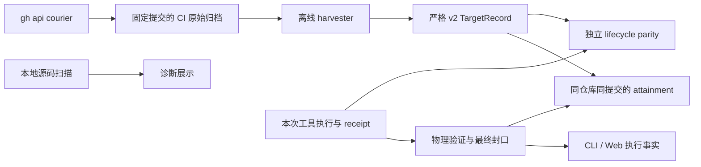

# CI-defined build scope：架构复核与实施记录

本次重构以同一仓库、同一提交的 CI 证据定义比较范围。本地执行是否完成、与 CI 的范围差距、命令生命周期是否一致，分别作答。新增逻辑集中在纯函数和现有运行边界，没有引入新任务框架、通用插件层或第二套 verdict 存储。

## 责任边界

- **采集与判断分开。** Courier 只获取归档；模块解析、命令比较和评分可离线运行。源码缓存携带仓库、完整 SHA、路径和内容摘要，缺来源或摘要不符的缓存不能证明范围。
- **本地完成与外部覆盖分开。** JVM 不再由磁盘扫描比例决定成功。工具退出、物理产物、receipt 和测试结果仍须一致。Python 保留其原有完整性约束。
- **同一事实只有一个结果。** CLI、report、严格 snapshot reader 和 Web 采用一致的执行判断；测试红色结果如实展示，但不再替代“是否执行”的状态。
- **命令就是一个运行边界。** 每次命令重新装配 context、tools、engine 和 validator；修复事件带运行身份，不能从共享会话中认领上次运行的修复权限。
- **控制面不猜成功。** Web 重启后继续监管存活进程；无法恢复退出码时明确表示不可确认。并发入队在 SQLite 事务中去重，Docker 连接异常不再显示为空的正常连接。

## 计划中明确落实的取舍

1. **全局证据约束优先于 A7 的 1/1 fallback。** CI 未给出模块范围时，保留 `build_form=conclusion` 和本地构建事实，但 `alpha_build` 与综合 `alpha` 不可用。测试范围未测量时同理：保留可测单轴，不生成综合分数，不升级为 met/exceeded。已有新红色测试仍保持 not_met。这个调整防止删除 CI 范围反而提高结论。
2. **先满足两轴，再判断超过。** 多一个模块不能补偿测试执行不足；模块名齐全也不能覆盖本地构建失败。
3. **Gradle 的 log 范围表示完成构建任务的参与项目。** 按设计保留 NO-SOURCE / UP-TO-DATE 及空聚合项目；这不是“产生了新字节码”的物理声明。嵌套 include 的隐式父项目也纳入声明范围。
4. **不完整命令保守披露。** 多行脚本保留完整文本；无法解析的前置操作、动态 working-directory、属性和作用域选项不被简化成可比较的命令。无法证明时 parity 为 unknown。
5. **冻结数据不能被重新背书。** 重建前检查原有 SHA256SUMS、v1 摘要、仓库和提交；matched cell 不移动。v2 在检查通过后原子替换，原 v1 文件保留。

## Review 找到并推动修复的问题

| 问题 | 后果 | 修复边界 |
| --- | --- | --- |
| Maven `Building jar:` 被当成项目头 | 单模块 log 范围丢失 | 日志语法及真实 commons-cli 回归 |
| 忽略 workflow working-directory | 把根 reactor 套到子项目 | 保留有效目录来源，验证归档路径 |
| 多行命令只保存第一条 | 遗漏 verify 却声称 equivalent | 保存完整脚本，未知作用域不作等价声明 |
| 无来源源码缓存跨 SHA 复用 | CI 分母被旧源码污染 | API 验证与内容摘要绑定 |
| 重建只重新计算 v1 摘要 | 冻结数据变更被误当正常迁移 | 先核原始摘要，再生成新版本 |
| 恢复初次读取 SQLite 失败后不重试 | 旧 running 行永久占用容量 | 恢复成功前重试并暂停新入队任务的启动 |
| 新 engine 恢复旧会话的 repair | 新命令继承旧项目权限和阻塞 | ControlEvent 的运行身份与过滤 |
| legacy JVM CLI 仍检查 build_complete | 同份证据在 CLI/report 上不同结论 | 复用统一物理判断 |

## 验证与实际限制

最终源码完整回归：**6828 passed、22 skipped、41 warnings**（110.17 秒）；前端 **46 个文件、346 passed**，TypeScript/Vite 构建通过；66 个修改过的 Python 文件通过 Black/isort。wheel 测试实际构建、安装到新虚拟环境并启动 CLI；使用本机已缓存依赖的离线 wheelhouse，没有放宽依赖或跳过打包测试。

全项目 mypy 仍有 **980 个历史错误、64 个文件**，与实施前按文件和错误信息归一化后的集合完全相同；新增范围内核的 6 个文件无类型错误。前端现有大 bundle 提示仍保留。新增 GitHub Actions 配置运行完整 Python 测试（包含 wheel 安装）、范围内核类型检查、前端测试与构建；本地已执行相应命令，未推送触发远程 CI。

23 个冻结 seat 全部完成 v2 重建且原 v1 摘要和 matched cell 不变。22/23 个记录至少一个 cell 有模块证据；固定匹配 cell 中 8/23 有范围（7 个 log，1 个 test_bearing）。不可用值不转换成零范围。详见[冻结数据报告](d3-build-scope-20260907.md)。

真实固定提交实验：commons-cli 正常封口 success，移除 receipt 后 partial，移除实际产物后 failed；gson 的 JPMS fork 错误令正常封口保持 partial，移除 receipt 后仍 partial，移除产物后 failed。Gson 的 CI 模块轴 8/8，但无权威测试分母，所以综合分数不可用。详见[实验报告](ci-scope-small-projects-20260907.md)。

验证命令、原始输出与摘要保存在 `logs/ci-defined-build-scope-20260907/verification.json` 及同目录日志。实现提交：`feb3b78`（外部范围与评分）、`7609736`（本地执行、运行隔离与 Web）。

- CI 比较仍为离线测量层，没有宣称切换 live validator 的判定权威。真实实验使用 commons-cli、gson 的固定提交，Kafka 仅使用已有归档验收。
- Web terminal 增加同源 bootstrap、实际 Host allowlist、进程随机 token 和 WebSocket subprotocol。REST 写接口仍采用项目现有本地信任模型，本次不把它称为完整用户认证。
- 删除唯一失败物理证据后，系统可能从 failed 变为 unknown/partial；不会因此成为 success。保持历史失败结论需要进一步持久化负面证据，这次没有扩大到该架构改动。因此不宣称满足“所有标签严格排序”的完整 P4，只证明本次记录的成功防护及可比范围消融性质。
- 现有全项目 mypy 历史债务单独记录；CI 对此次纯范围内核执行类型检查，同时运行完整 Python 测试、wheel 安装验证及 Web 测试和构建。
