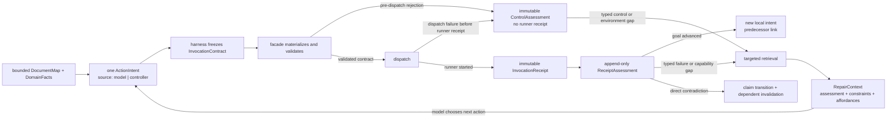

# Build Contract Loop — SAG v2 Plan 6 Design

**Date:** 2026-07-26
**Status:** revised after design and implementation review; InvocationContract
v2 authority amendment adopted
**Author:** Chenhao (design), formalized against the Plan 5 codebase
**Compatibility:** preserves the executed Category-3 facts-only boundary in
`2026-07-19-analyzer-diet.md`; it does not restore an analyzer-authored plan,
recommended action, project brief, prescriptive objective, or pre-hoc native
guidance.
**Absorbs:** P1-C (policy survey with provenance), the deferred P0-D typed
native affordance, and the minimum P1-A/P1-B/P1-D evidence machinery required
by the loop. The remaining backlog is separated in §10.

## 1. Problem

Two extremes both fail a weak model:

- **On-demand-only reading:** the model does not know what to look for, nor
  which document a failure relates to.
- **Read-everything-then-plan:** early misreadings anchor a long natural-
  language plan; the run keeps patching a wrong plan instead of retracting
  it (the exact Gen-1 failure mode, one layer up).

## 2. Principle

> **广泛发现、有限阅读；模型只提当前动作，框架在执行前冻结合同；用物理
> receipt 驱动有因果边界的纠错。**
>
> The harness discovers broadly and retrieves narrowly. The model proposes one
> local action at a time. The harness freezes that action before dispatch.
> Immutable invocation receipts plus append-only assessments — not model
> self-reflection — drive correction.



The initial survey produces a map and neutral facts, **not an action**. If a
step is mechanically mandatory (for example, satisfying a declared tool
version before dispatch), the controller may perform it through the same
contract/receipt path without asking the action model to serialize it.

## 3. Components

### Role boundary

The loop has five independent roles. Combining them would recreate the
anchoring problem:

| Role | Owns | Must not do |
|---|---|---|
| surveyor | document/config discovery and neutral domain facts | choose a build action or verdict |
| action model | propose one local structured intent | author backend shell/argv or mutate evidence |
| facade/controller | validate, materialize and dispatch an intent | claim that execution succeeded |
| runner/receipt writer | record what physically ran and changed | interpret a capability or verdict |
| assessor | classify receipt evidence and update claims | rewrite the receipt or trust prose over ground truth |

The physical validator remains an independent judge. A document claim may
motivate a bounded action; it never proves the action worked.

### C1 — Bounded DocumentMap and typed PolicyClaims

At survey time the harness **discovers broadly** without putting repository
prose into the model prompt:

- README / INSTALL / BUILDING / CONTRIBUTING;
- module documents attached to each build domain;
- CI workflows and their reusable-job call chains;
- Docker and installation scripts;
- Maven / Gradle / CMake / Python metadata;
- target SHA, source hashes and a document-map fingerprint.

Discovery is bounded and checkout-contained. The implementation constants
for maximum files, bytes, per-file bytes and depth are part of the run pin.
Real paths must remain under the verified checkout. Symlink escapes, binary
files, generated/build/vendor trees, over-budget content and unreadable
sources are excluded with a recorded `partial_map` conflict, never silently
treated as a complete map.

The map and the claims extracted from it are different objects:

```text
DocumentMapEntry:
  entry_id
  target_sha
  path
  realpath
  source_hash
  kind                 # markdown | yaml | xml | toml | cmake | shell | ...
  section_index        # headings, YAML/XML/TOML keys, command-block ranges
  parser_version
  discovery_status

ClaimRecord:
  claim_id
  kind                 # tool constraint, lifecycle, dependency, env, capability...
  typed_value
  source_class         # repository_doc | config | physical | receipt | inferred
  applicability        # domain, OS, arch, source/wheel, workflow job, goal
  support_claim_ids
  source_status        # current | stale | superseded | conflicted
  evidence_status      # untested | unknown | confirmed | blocked | contradicted...

PolicyClaim(ClaimRecord):
  source_class         # repository_doc | config
  source_ref           # entry_id + source_hash + source_range
  extraction_method

PhysicalClaim(ClaimRecord):
  source_class         # physical
  source_ref           # probe id + snapshot/content hash + observed scope

ReceiptClaim(ClaimRecord):
  source_class         # receipt
  source_ref           # receipt id + assessment id + satisfied predicate id

InferredClaim(ClaimRecord):
  source_class         # inferred
  source_ref           # deterministic rule id + complete support set

CapabilityClaim:
  ClaimRecord where kind=capability
  source_class         # physical | receipt | inferred; never documentation alone
```

Deterministic extractors cover supported YAML, XML, TOML, CMake, Gradle,
shell assignments/commands and Markdown fenced commands. Headings alone are
not an extractor. An opaque prose excerpt may be shown to the model only as
bounded untrusted evidence. A model interpretation is an
`UntrustedDocInterpretation`, not a `ClaimRecord`: it cannot support an
`InvocationContract`, enter the `ClaimGraph`, or become executable policy
without a deterministic adapter. Human review may cause a source or
configuration change followed by a new survey, but that is a new external
task/run boundary. The long-running loop receives human authority only from
its initial task prompt; no mid-run human text can become a `ClaimRecord`,
mutate the current `ClaimGraph`, or authorize an invocation.

`ClaimRecord` is a discriminated union on `source_class`; each variant must
carry the matching typed `source_ref`. A receipt ID in a prose/document field,
or a document range on a physical claim, is schema-invalid rather than
silently coerced.

Repository content is untrusted. A source hash proves where text came from,
not that it is safe. Raw documentation never directly authorizes shell,
privileged/package-manager operations, publishing, secret access, destructive
paths, compiler launchers, toolchain files or arbitrary CMake definitions.
All executable material passes the typed facade policy in C3.

Project-owned sources can disagree. Applicability is matched against the
current domain, target SHA, operating system, architecture, build goal and
source-vs-wheel environment. Equal-applicability conflicts remain explicit;
the harness never picks the source that happens to make an anchor green.

### C2 — DomainFacts and dependency-edge law

The survey projects neutral, per-domain facts:

```text
DomainFacts:
  domain_id
  root
  system
  languages
  role                 # required | optional | example | integration | unknown
  environment
  produces             # coordinates + declared versions
  requires             # coordinates + version constraints
  documented_actions   # PolicyClaim ids, not recommendations
  capability_state     # present | absent | unknown | not_applicable
  open_conflicts
  fact_epoch
```

`DomainFacts` contains no goal, chosen order, recommended action, probe
sequence or prose plan. The initial analyze result, phase intro and handoff
may render coordinates, constraints and open conflicts only.

Dependency edges have an execution law, not just a data shape:

- `compatible`: a required consumer unlocks only after the matching producer
  has a current successful production receipt;
- `version_incompatible`: the consumer is sealed blocked with the mismatched
  coordinates and receives no runner invocation;
- `unverified`: build/test dispatch is locked while a bounded metadata or
  document-resolution probe runs;
- `not_applicable` or an explicitly out-of-scope optional domain may be
  disposed without upgrading a required-domain verdict.

Every edge has a stable `edge_id` and support claims. Revising an edge
invalidates every not-yet-executed or cached contract that depends on its old
revision. Directory separation never implies independence.

### C3 — ActionIntent and pre-dispatch InvocationContract

The model submits **one canonical public tool call**, never backend argv:

```text
ActionIntent:
  intent_id
  source               # model | controller
  trigger_assessment_id # optional; set for an evidence-triggered model action
  repair_context_id     # optional; identifies facts/constraints, not a proposal
  domain_id
  tool
  canonical_params
  predecessor_contract_id
```

The facade then performs the atomic pre-dispatch sequence:

1. freeze `run_id`, `fact_epoch`, target/config/document-map fingerprints and
   active conflicts;
2. validate the intent against domain edges, phase gates, containment and
   the tool's semantic contract;
3. materialize requested call → effective tool/action → exact cwd and an
   explicit execution binding without dispatching;
4. build and content-hash an immutable schema-v2 `InvocationContract`;
5. compare-publish it append-only: create when absent, accept byte-identical
   replay, and refuse an existing different body;
6. place its ID and hash on the action envelope;
7. dispatch only if the persisted contract and envelope agree.

```text
InvocationContract:
  schema_version        # 2 for live authority
  run_id
  contract_id
  contract_hash
  envelope_id
  target_sha
  survey_fingerprint    # required v2 pin before D0; writer work pending
  config_fingerprint
  document_map_fingerprint
  fact_epoch
  domain_id
  intent_id
  intent_domain_id
  intent_source
  action_fingerprint
  requested_call
  effective_tool        # registered executor; currently maven|gradle|python|bash
  effective_action
  expected_cwd
  execution_binding     # argv_v1 | python_facade_v1
  expected_argv         # required only for argv_v1
  expected_observations
  direct_falsifiers
  supporting_claim_ids
  blocking_conflict_ids
  predecessor_contract_id
```

The earlier design candidates `semantic_effects`, `required_preconditions` and
`supersedes_contract_id` are not fields in the live schema-v2 writer and grant
no dispatch authority. They remain future/reserved concepts outside the live
contract block; adopting any of them requires an explicit schema revision,
identity projection, strict writer/reader support and negative controls. The
`survey_fingerprint` pin above is different: it is an accepted v2 requirement
whose writer plumbing must be complete before D0.

`contract_id` is schema-v2 run/content identity. Its canonical identity
projection includes `run_id`, envelope and intent/domain identity, the exact
public call, effective tool/action, cwd, execution binding, and every
binding-specific execution commitment (including argv or effective runtime).
Changing the run or any execution-relevant content therefore changes the ID;
`contract_hash` covers the complete canonical contract payload. Reusing one ID
for different bytes is an integrity failure, not an update. Contract
publication is absent-or-identical under one compare-and-publish operation;
no live path may overwrite a previously published final.

The execution binding is explicit rather than inferred from a missing field:

- `argv_v1` requires a non-empty frozen argv. The receipt must recompute
  `exact | equivalent | deviated` against that argv.
- `python_facade_v1` is restricted to the public `build` facade and deliberately
  has no `expected_argv`: a Python operation is a bounded multi-command
  transaction. The explicit marker, exact public params, effective tool/action
  and typed producer observations are its authority; absent argv by itself is
  never authority.

The only Python public-to-operation mapping is frozen and shared by the
facade, producer, read-only judge and assessor:

```text
deps     -> setup_env
compile  -> compile
test     -> test
package  -> build
install  -> build
native   -> native
```

`effective_tool` is selected from a versioned registered-executor allowlist,
not a closed three-value ecosystem enum and not an arbitrary string. The
current live set is `maven | gradle | python | bash`; `bash` covers authorized
controller-owned direct jobs such as deterministic terminal, large-evidence
and multi-job probes. A future executor (for example, search/project plumbing)
must be registered with its own binding validation before it gains live
authority.

For either binding, the receipt's `effective_tool` must strictly equal the
contract's effective ecosystem tool before assessment; the public
`requested_call.tool` is intent provenance and cannot substitute for that
internal cross-ecosystem check.

Each operation has its own typed positive and negative predicates. In
particular, setup evidence binds dependency installation and any recorded
package/import checks. The current live binding rejects every non-empty Python
`deps` argument: no mechanical pin-to-claim producer exists yet, so accepting
an opaque claim ID would be false authority. A future exact-pin exception must
first specify and validate that binding. Build evidence binds a completed
wheel-build role to content-hashed direct `dist/*.whl` outputs. Compile evidence binds compileall
and compile-metrics roles from the same aggregate receipt and cannot reuse
metrics after compileall failed. Test evidence must be current-run and match
the requested test scope. Native evidence must cover every requested feature
and bind the frozen definitions, toolchain and build fingerprint. Missing,
duplicate, contradictory or out-of-order typed roles fail closed. Public
parameters the selected operation does not consume are rejected before
dispatch instead of being silently ignored.

`predecessor_contract_id` is the only live schema-v2 contract-lineage field.
Every correction is a separately frozen ActionIntent/contract linked through
the supported predecessor chain; no live contract mutates or supersedes an
earlier contract. A successful compile followed by a test is likewise a new
predecessor-linked commitment, not a revision of the compile.

A documented command retains its original cwd and argv. If the facade
normalizes a repository-root `-f module/pom.xml` command to module cwd, the
contract records the original call, normalized call and proven semantic
equivalence. Public params, effective action and actual argv remain separate.

There is no post-hoc "deviation by stated reason." After a typed assessment,
the model may submit a new ActionIntent linked to its `RepairContext`; the
harness does not pre-fill a public call for the model to accept. The facade
validates and freezes that intent as a separate `InvocationContract` before
dispatch. A prose reason is evidence for review, not authorization. Critical
safety, scope and capability fields are not model-deviatable.

### C4 — Immutable InvocationReceipt versus evidence claims

Every physical Maven, Gradle, pytest or native runner call produces an
`InvocationReceipt`, including nonzero exits and all-skipped runs. A
pre-dispatch rejection or dispatch failure produces a tool/control event,
not a runner receipt.

Its typed interpretation is also append-only:

```text
ControlAssessment:
  schema_version
  assessment_id
  intent_id
  contract_id           # optional: absent if validation failed before freeze
  action_hash
  target/survey/config/document_map/fact fingerprints
  stage                 # precondition | materialization | envelope | dispatch
  typed_control_code
  observed_preconditions
  environment_delta
  event_id
  created_at
```

A `ControlAssessment` is immutable, persisted atomically and keyed
idempotently by the control event plus action/fact fingerprints. Replay must
reconstruct the same assessment and must not mint a runner receipt. It can
establish that an environment/control precondition is blocked or unknown, but
cannot contradict a project-owned claim.

Receipt schema v2 is a prerequisite of the loop:

```text
InvocationReceipt:
  schema_version
  run_id
  receipt_id
  contract_id
  contract_hash
  envelope_id
  execution_id
  target_sha
  survey/config/document_map/build fingerprints
  domain_id
  requested_call
  effective_tool
  effective_action
  execution_binding
  actual_cwd
  actual_argv
  compliance           # argv binding; Python uses typed semantic predicates
  environment/toolchain/user-permission fingerprints
  started_at / finished_at
  exit_status
  output_content_hash
  artifact_delta + content hashes
  report_delta + content hashes
  structured_test_stats
  testcase outcomes    # node id, status, reason
  capability_observations
```

The receipt is finalized once and then immutable. Semantic classification is
an append-only `ReceiptAssessment`; it must not rewrite the receipt as the
current `mark_semantic_failure` path does. Receipt persistence is atomic.
Persistence failure is an evidence-closure failure and cannot close the
phase.

An all-skipped invocation therefore still has a physical receipt, but it
cannot mint positive correctness or capability evidence merely because it
ran. `InvocationReceipt`, `CapabilityClaim` and final verdict are distinct
objects.

#### Evidence-store trust boundary

The evidence directory is the durable handoff boundary, not a source of
implicit trust. A filename, directory listing, producer prose or JSON object
that merely exists grants no live authority. Every live reader applies a
bounded read, requires exactly one RFC-valid object, rejects duplicate keys and
unknown/future schemas, and recomputes the contract ID/hash and receipt binding.
It also checks current `run_id`, run-pin target, manifest target/config, exact
root/domain, requested/effective action, cwd and binding-specific compliance
before evidence can affect the current run. A producer may report observations;
it may not declare that its own contract was satisfied.

The container copy is only an evidence mirror. After an atomic container write
succeeds, the controller synchronously seals the exact raw bytes in the
host-owned control stream with an `evidence_publication` event; a host event
without the file or a file without that event is unavailable live evidence.
Immutable ledgers require the complete set of current-run filenames to equal
the host publication set, so deleting a later failure cannot refine a verdict
or release a job barrier. Mutable artifacts use one cross-writer logical ID and
a host-ordered revision/predecessor chain. Only the latest head is live; an old
previously published body, a missing head, an extra body, or a body restored
after a tombstone fails closed. Writers that update the same physical file
share that logical ID even when their semantic producer differs.
One evidence epoch binds one container store. A deterministic campaign that
compares multiple fresh containers assigns each container its own run ID and
host control stream, then aggregates them under the campaign lock; it never
shares one publication expected-set across stores.

Schema-v1 contracts remain readable only through a forensic/display path.
Their historical envelope-plus-argv identity lacks the schema-v2 run/content
boundary, so they can never authorize live dispatch, assessment, repair,
claim transition or verdict closure. A future schema in current-run scope is
an integrity conflict; a stale or foreign-run record remains labeled history.

### C5 — Causal ReceiptAssessment and ClaimGraph

The assessor compares a fresh, contract-bound receipt with the contract's
typed expectations:

```text
contract preconditions
  → execution-binding compliance (argv or typed Python operation)
  → dispatch/exit state
  → report/artifact/capability deltas
  → direct falsifier predicates
```

Every claim keeps its source class, source currency and evidence state as
independent dimensions:

```text
source_class:
  repository_doc | config | physical | receipt | inferred
source_status:
  current | stale | superseded | conflicted
evidence_status:
  untested | unknown | confirmed | blocked | contradicted | not_applicable
```

A mismatch is **not automatically a contradiction**:

- no dispatch, network failure, timeout, permission failure or an unmet
  environment precondition leaves the expected claim `unknown` or `blocked`
  according to its typed assessment code;
- a stale fingerprint changes `source_status` to `stale`;
- a deviated receipt may add an observation or conflict but cannot falsify
  the original contract;
- only a binding-compliant, fresh, scope-complete receipt satisfying all
  required preconditions and a typed direct-falsifier predicate may mark a
  claim `contradicted`;
- success confirms only the claims named by satisfied positive predicates.

`supporting_claim_ids` record provenance and pre-dispatch authorization only.
They are not a list of claims tested by the invocation, and neither
`expectation_met` nor a generic failure may transition them automatically. A
claim changes only when an operation-specific positive predicate or direct
falsifier explicitly names that claim and the fresh receipt satisfies the
predicate's complete scope.

This design does not invent that predicate-to-claim producer as part of the
contract-v2 migration. Until a separately specified mechanical producer can
name and validate such a binding, the live transition seam remains a
fail-closed no-op for both generic positive assessments and falsifiers. In
particular, `supporting_claim_ids` must never be reused as a substitute binding.

Claim dependencies use stable IDs, explicit AND/OR support sets, target and
fact epochs. Cycles are rejected. Contradicting a claim or staling its source
invalidates only conclusions whose complete support is lost; another valid
support path keeps the conclusion alive.

Receipt ingestion, the append-only assessment, claim transitions and
dependent invalidations are committed as one idempotent event group. Replay
reconstructs the same state. A late receipt from an older fact epoch remains
historical evidence but cannot mutate the current graph unless its
fingerprints still match.

The weak model is never required to notice that an earlier assumption was
wrong. The assessor performs bounded, causal retraction.

### C6 — Typed targeted retrieval and model-owned reactive action

Targeted retrieval begins only after a current evidence assessment emits a
typed error or capability code. For a dispatched runner this is a
`ReceiptAssessment`; a failed mechanical precondition may instead produce a
typed `ControlAssessment`. A control assessment can trigger environment
repair but cannot contradict a project claim. Raw failure-signature strings
are retained for diagnostics but are not the routing authority.

The retriever:

1. selects a bounded set of map entries tagged for the current ecosystem,
   domain, typed code and applicability;
2. reads only the indexed sections or structured keys;
3. runs the deterministic extractors from C1;
4. records new `PolicyClaim`s and all equal-applicability conflicts;
5. emits `unknown` when no safe, applicable claim supports a repair.

It does not re-read the whole repository unless the document-map fingerprint
changed. A changed map triggers a bounded incremental re-index, not a stale
repair.

Only now may the policy layer assemble one bounded, non-prescriptive repair
context:

```text
RepairContext:
  repair_context_id
  trigger_assessment_id
  trigger_receipt_id    # required for ReceiptAssessment; absent for any
                        # receiptless ControlAssessment, including dispatch
  target/domain/fact fingerprints
  typed_failure_or_capability
  observed_fact_refs
  constraint_set
  allowed_tool_affordances
  admissible_observation_types
  supporting_claim_ids
  open_conflicts
```

The context is reactive and source-backed, but contains no recommended command,
argv, ordered steps or `proposed_public_call`. The model uses it to revise its
own reasoning and submit one new `ActionIntent(source=model,
repair_context_id=...)`, or an honest DoneIntent consistent with the judge's
maximum supported outcome. Only the normal C3 pre-dispatch sequence may freeze
an ActionIntent into an `InvocationContract`. Provenance is looked up by stored
claim ID; the model cannot self-attest it.

Controller-owned mandatory lanes remain separate: wait/poll, settlement,
transport recovery and already-authorized phase-floor safeguards may create
`ActionIntent(source=controller)`. They use the same contract/receipt chain and
cannot become project-specific repair recommendations.

### C7 — Material-progress retry law

Retry identity is scoped by:

```text
target SHA + domain + normalized action hash + typed failure
+ relevant-state vector + environment fingerprint
```

- deterministic failures require a material delta that can affect the typed
  cause: changed argv, relevant environment/toolchain state, input/config, or
  a repair whose preconditions/action changed;
- bumping a revision, changing prose or changing expectations alone is not a
  material delta;
- typed transient network/service failures and declared flaky tests may use
  a separately budgeted number of identical retries;
- poll/resume, detached-job completion and crash recovery are lifecycle
  events, not retries.

The controller, using the authoritative `LoopMemory`, signs a pre-dispatch
retry authorization. The facade validates that token; it does not maintain a
second unsynchronized recurrence state.

### C8 — Native repair rides the model-owned reactive path

The typed native affordance is available only through a validated
`InvocationContract`. Before failure it is a neutral tool capability, not a
native-first prompt block. After a receipt proves a named capability absent,
the RepairContext may expose the native affordance and its constraints. The
model may then choose the following public call as its ActionIntent; the
harness does not propose it, and the intent must pass the normal
contract-freeze path before it can run:

```text
build(
  action="native",
  features=["llvm"],
  definitions={"USE_LLVM": "ON", "BUILD_TESTING": "OFF"},
)
```

Project provenance and harness policy remain separate:

- repository docs/CI may establish "LLVM >= 15" and applicable CMake
  definitions;
- a platform resolver may map that requirement to an allowlisted package and
  executable;
- physical probes such as `llvm-config --version` verify the resolved
  capability;
- the contract stores claim IDs; `provenance` is not accepted from model
  parameters.

Native definitions and packages pass allowlists. Executable compiler
launchers, arbitrary toolchain files, escaped paths, privilege escalation,
publishing and secret-dependent commands are rejected. `features` and
definitions must be consistent. Changing a safety- or capability-critical
field requires a new validated intent/contract.

A positive native smoke unlocks only the bounded scope supported by that
selector and capability. It never globally authorizes an unbounded test
collection.

## 4. Anti-lock-in invariants

1. **The initial survey persists maps and facts, never an action.** The first
   prompt/analyze result cannot contain a recommended call, probe sequence or
   project brief.
2. **Every execution is frozen before dispatch.** An envelope without a
   matching persisted contract ID/hash is rejected.
3. **Physical receipts are immutable; interpretation is append-only.**
   Reclassification creates an assessment event, never a receipt rewrite.
4. **Retraction is causal, not global.** A claim changes only through a typed
   positive predicate, direct falsifier, staleness rule or explicit
   supersession.
5. **Live lineage is append-only.** `predecessor_contract_id` links separate
   commitments; no live field mutates or supersedes an earlier contract.
6. **Handoffs carry stable facts and open conflicts only.** Contracts,
   RepairContexts and old plan conclusions do not ride phase handoffs.
7. **All state is fingerprint-bound and replayable.** Stale maps, contracts
   and late receipts remain history and cannot silently become current truth.
8. **Project text is untrusted.** Provenance is necessary for a repair but is
   never sufficient to bypass facade safety or user authority.
9. **Live contracts are schema-v2 and run/content-bound.** Historical v1
   remains display-only and cannot be promoted into dispatch authority.
10. **Contract publication is append-only.** Absent creates, identical replay
    succeeds, and a same-ID different body fails closed without overwrite.
11. **Authorization is not evidence.** Supporting claim IDs may permit a call,
    but only named, satisfied predicates may change claim state.
12. **Container evidence is a host-published mirror.** Live readers require
    strict semantics, exact host-sealed bytes and complete current-run set/head
    agreement; deletion, rollback, tampering and mirror-only records fail
    closed.

## 5. Expected anchor state machines

The anchors verify the generic mechanism. They are not runtime name-based
branches.

### commons-cli

1. Survey records the Maven/JDK constraints and neutral Maven domain facts.
2. If the active Maven does not satisfy `[3.9,)`, the controller-owned
   toolchain precondition resolves and physically verifies a supported
   compatible runtime through the normal contract/receipt path. On the
   locked image this selects Maven 3.9.9.
3. The model proposes local compile/test intents; each produces a separate
   contract linked by the live `predecessor_contract_id` chain.
4. No further document retrieval occurs once the relevant constraints are
   satisfied.

Same-pin regression evidence remains:

- Maven version satisfies `[3.9,)`;
- `982 total / 921 passed / 61 skipped / 0 failed / 0 errors`;
- expected project JAR artifacts remain present;
- the model is not asked to parse XML or recover counts itself.

### Bigtop

The document extractor records the repository-root lifecycle claim without
losing cwd or arguments:

```text
cwd: /workspace/bigtop
argv:
  mvn clean install -DskipTests -DskipITs -DperformRelease
  -f ./bigtop-test-framework/pom.xml
```

The domain graph records coordinate versions, not names alone:

```text
producer: bigpetstore-data-generator 3.7.0-SNAPSHOT
consumer transaction queue requires 3.5.0-SNAPSHOT
consumer Spark requires 3.6.0-SNAPSHOT
```

Both consumer edges become `version_incompatible`. They receive no runner
receipt and the harness creates no diagnostic alias that pretends 3.7 is
3.5/3.6. The compatible required domains remain executable. The
test-framework lifecycle produces its four JARs, and the primary
data-generators receipt remains exactly `50/50`, isolated from auxiliary
XML. The honest global result remains partial rather than being upgraded by
auxiliary domains.

### TVM

TVM deliberately requires two evidence-triggered repairs across three
assessed evidence states. They are separate local intents linked by normal
progress, not repeated revisions of one action. The state machine must
preserve that causal sequence instead of using hindsight:

1. **S0 — initial facts/action:** survey records a CMake native core, Python
   binding, native artifact roots and bounded smoke coordinates, but renders
   no native-first call. A local build intent uses the normal PEP 517/native
   path.
2. **S1 — initial assessed evidence:** native libraries exist. The bounded
   probe's receipt plus `ReceiptAssessment` establishes `llvm=absent` from the
   required LLVM testcase's structured outcome and project predicate (or a
   direct runtime probe). Aggregate `all skipped` or absence of any positive
   test alone is not enough; the other smoke nodes are classified separately.
3. **RC1 → I1 → IC1 — LLVM repair chain:** targeted retrieval creates LLVM
   `RepairContext RC1`. The model chooses `ActionIntent I1`; normal
   pre-dispatch validation freezes `InvocationContract IC1`. Project
   claims establish the LLVM version/definitions; the platform resolver
   separately selects and verifies the allowlisted LLVM runtime. IC1's native
   rebuild receipt binds the exact definitions, toolchain and build
   fingerprint.
4. **S2 — IC1 assessed evidence:** LLVM execution is real, and only now the
   NumPy 2.x dtype failure emits its distinct typed failure. It was not
   repaired during RC1.
5. **RC2 → I2 → IC2 — NumPy repair chain:** targeted retrieval creates NumPy
   `RepairContext RC2` from the applicable project-owned Ubuntu/source-test
   dependency policy. The model chooses I2, which reaches IC2 through the same
   pre-dispatch sequence. The claims record why NumPy 1.26 is more
   applicable than unconstrained generic metadata; any equal-applicability
   conflict remains open.
6. **S3 — IC2 assessed capability proof:** the required
   `test_llvm_add_pipeline` node passes, zero failed/error/collection errors
   remain, and the other two nodes were classified as not applicable before
   verdict folding with project provenance.

`1 passed / 2 not-applicable skips` is a same-pin regression value, not the
definition of LLVM capability. The LLVM claim is selector- and
build-fingerprint-scoped. It does not unlock TVM's unbounded full collection.
The separate tvm-ffi metadata conflict remains visible unless independently
resolved.

## 6. Acceptance additions

Acceptance is machine-asserted and negative-controlled before anchor runs.
Before D0 begins, the exact source-tree hash, static prompt hash and runtime
control-bundle hash are frozen together. Every D0/D1/D2 row carries that same
triple; a change starts a new campaign and no result is compared across hash
boundaries. D0 remains no-model, but its prompt pin is still recorded so the
campaign has one predeclared configuration boundary.

### Architecture and causal safety

| Case | Required assertion |
|---|---|
| Category-3 boundary | first analyze output, phase intro, metadata and handoff contain no goal, recommended call, failure-probe sequence or project-brief reference |
| Claim union | each source class validates only with its typed source-ref variant; untrusted prose interpretation cannot enter ClaimGraph |
| Pre-dispatch ordering | contract is atomically persisted before dispatch; envelope and receipt carry the same contract ID/hash |
| Contract v2 identity | `run_id` and complete execution commitment determine identity; changing run, public call, effective tool/action, cwd, binding, argv/runtime or exact params changes the ID |
| Contract append-only | absent publish and byte-identical replay succeed; same-ID/different-body races and retries fail closed without replacing the winner |
| Binding taxonomy | `argv_v1` requires argv compliance; `python_facade_v1` requires the exact public→operation mapping and operation-specific typed predicates; an absent argv never implies semantic authority |
| Effective-tool registry | current `maven`, `gradle`, `python` and controller-direct `bash` contracts validate; unregistered executors and contract/receipt cross-ecosystem mismatches fail closed |
| Evidence-store boundary | malformed, duplicate-key, future-schema, foreign-run, stale-pin or contract/receipt-mismatched records cannot influence live truth; v1 is forensic-display only |
| Lineage | every next action or correction is a separately frozen contract linked through `predecessor_contract_id`; no unimplemented supersession field can authorize or rewrite a live contract |
| Repair ownership | RepairContext contains facts, constraints and affordances but no proposed call; only a new model ActionIntent or a mandatory controller ActionIntent can reach InvocationContract freeze |
| Deviation | a materially different intent has its own validated contract before dispatch; post-hoc prose cannot authorize it |
| Receipt immutability | finalized receipt bytes never change; semantic downgrade is an append-only assessment |
| Receipt taxonomy | an all-skipped runner creates an invocation receipt but no positive capability claim |
| Control assessment | pre-dispatch/dispatch failure creates one immutable idempotent typed assessment, replays identically, creates no runner receipt and cannot contradict a project claim |
| Missing receipt | dispatch without a persisted receipt, or receipt persistence failure, prevents evidence closure |
| Causal contradiction | non-dispatch, network, timeout, permission and unmet-precondition cases cannot contradict doc/config claims |
| Direct falsifier | a fresh, binding-compliant, scope-complete receipt can contradict only claims named by satisfied falsifier predicates |
| Supporting claims | authorization-only `supporting_claim_ids` never transition merely because the generic assessment is success/failure |
| Claim graph | AND/OR support, cycle rejection, cross-domain invalidation and alternate surviving support replay deterministically |
| Staleness | target/config/document-map/fact-epoch mismatch prevents stale contracts or late receipts from mutating current truth |
| Targeted retrieval | typed code selects bounded applicable sections; no match yields unknown; a changed map uses bounded incremental re-index |
| Source conflict | equally applicable README/CI/Docker/metadata claims remain an open conflict rather than silently choosing a green path |
| Retry | bounded transient identical retry is allowed; deterministic no-op revision/prose changes cannot bypass recurrence |
| Polling | poll/resume and detached completion never consume retry allowance |

### Untrusted-input and resource negative controls

- symlink escape, oversized/binary/generated/vendor input and exhausted
  discovery budgets produce a visible partial-map conflict;
- malicious README/CI text cannot execute arbitrary shell, publishing,
  privilege escalation, secret access or destructive paths;
- model-supplied provenance IDs, arbitrary system packages, unsafe CMake
  definitions, compiler launchers and escaped toolchain files are rejected;
- Markdown without headings, CI YAML, POM/XML, TOML, CMake, Gradle and shell
  fixtures exercise their typed extractor or remain explicitly unknown.

### Anchor and generalization controls

| Case | Required assertion |
|---|---|
| commons-cli | Maven satisfies `[3.9,)`; same-pin `982/921/61/0/0`; artifact evidence present; model performs zero XML counting |
| Bigtop command | contract preserves the documented repository-root cwd and all three lifecycle flags, or records a proven equivalent normalization |
| Bigtop graph | exact 3.7→3.5/3.6 mismatches; both consumers receive zero runner calls and no alias |
| Bigtop evidence | test-framework artifacts present; primary receipt alone is `50/50`; auxiliary reports remain separate |
| TVM sequence | LLVM and NumPy have distinct typed failures and distinct RC1/RC2 repair contexts; no ahead-of-evidence NumPy pin |
| TVM capability | required LLVM node passes with bound build/definition/toolchain fingerprints; two skips are pre-classified not-applicable; no failed/error/collection error |
| Scope unlock | positive capability evidence unlocks only its declared bounded successor scope, never a repository-wide collect |
| Metamorphic names | renamed project roots, modules, GAVs and versions produce equivalent contracts/edge behavior |
| No project branches | production runtime contains no `commons-cli`, `bigtop`, `bigpetstore` or `tvm` name-conditioned policy |
| Held-out regressions | pyyaml, httpcomponents-client and all locked Plan-5 anchors retain their accepted behavior |

## 7. Category-3 compatibility proof

This design does not restore a pre-hoc prescription:

- `DocumentMap`, `PolicyClaim` and `DomainFacts` are survey facts;
- an `InvocationContract` freezes an already-submitted model/controller
  intent and cannot tell the model what to do before that intent exists;
- a `RepairContext` is legal only after a concrete receipt assessment or typed
  ControlAssessment identifies a concrete failure/capability gap; it contains
  no proposed call, and the model owns the next project action;
- initial objectives remain facts-only, and the analyzer never emits
  `execution_plan`, recommendation prose or `project_brief`;
- safety defaults and dependency locks are controller policy, not natural-
  language guidance.

If a future implementation chooses to render an exact recommended call
before evidence, that is a deliberate reopening of Category 3 and requires a
separately pre-registered causal panel. It is outside this spec.

## 8. Non-goals

- No change to the physical validator's independent judge role or sealed
  verdict ownership.
- No persisted analyzer/harness-authored execution plan. The model may revise
  its own reasoning but exposes only one next ActionIntent; it is not required
  to search the repository or choose a document.
- No general-purpose execution of repository CI or documentation commands.
- No claim that project-owned documentation is current, safe or applicable
  merely because it is committed at the target SHA.
- No unbounded test collection unlocked by a single smoke result.
- No project-name-specific recovery policy.

## 9. Staging sketch

Implementation planning follows a second design review. Required order:

1. **Stage 0 — evidence prerequisite:** receipt schema v2, append-only
   ReceiptAssessment and ControlAssessment records, atomic persistence/failure
   closure and replay/idempotence.
2. **Stage A — bounded survey:** DocumentMap, deterministic PolicyClaim
   extractors, applicability/conflict rules and neutral DomainFacts.
3. **Stage B — execution binding:** ActionIntent, facade dry materialization,
   live-only schema-v2 InvocationContract, `argv_v1`/`python_facade_v1`,
   run/content identity, absent-or-identical publication, envelope/hash
   binding, dependency-edge execution law and untrusted-input policy.
4. **Stage C — causal loop:** ClaimGraph, typed assessment predicates,
   targeted retrieval, incremental re-index and RepairContext.
5. **Stage D — retry authority:** scoped material-progress tokens integrated
   with authoritative LoopMemory, including transient and polling exceptions.
6. **Stage E — native affordance:** safe native schema/resolver and the
   explicit TVM
   S0→S1→RC1→I1→IC1→S2→RC2→I2→IC2→S3 battery.
7. **Stage F — proof:** negative controls, three anchors, renamed metamorphic
   fixtures and held-out full regression battery.

No later stage starts before the preceding stage's negative controls pass.

## 10. Relationship to the backlog and done-bar

Plan 6 absorbs:

- all of P1-C policy survey with provenance;
- the deferred P0-D typed native affordance;
- the receipt schema/binding/structured-test subset of P1-A required by C4;
- the positive-evidence/applicability subset of P1-B required to separate
  invocation from capability proof;
- the scoped artifact/capability inventory subset of P1-D required by C4/C5.

Broader cross-run evidence work in P1-A, final verdict-axis presentation in
P1-B, general provisioning/artifact inventory beyond contract domains in
P1-D, P1-E advisor-format efficacy, and P2 remain separate after these
shared prerequisites land.

The design is ready for an implementation plan only when a second review
confirms:

1. every object has one role and one persistence owner;
2. the pre-dispatch/receipt/assessment event order is replay-safe;
3. no initial model-visible prescription has returned;
4. the TVM path requires distinct LLVM and NumPy evidence;
5. Bigtop edge law blocks incompatible consumers without aliases;
6. all negative and metamorphic acceptance cases are mechanically decidable.
