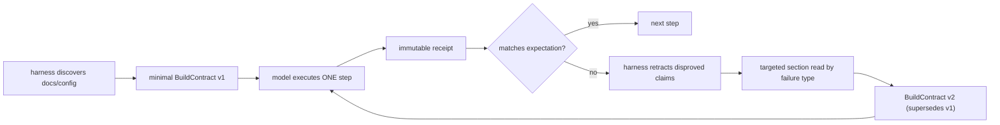

# Build Contract Loop — SAG v2 Plan 6 Design

**Date:** 2026-07-26
**Status:** awaiting review
**Author:** Chenhao (design), formalized against the Plan 5 codebase
**Supersedes nothing; absorbs:** P1-C (policy survey with provenance) and the
deferred P0-D typed native affordance from
`reports/2026-07-26-three-project-harness-ground-truth-review.md`.

## 1. Problem

Two extremes both fail a weak model:

- **On-demand-only reading:** the model does not know what to look for, nor
  which document a failure relates to.
- **Read-everything-then-plan:** early misreadings anchor a long natural-
  language plan; the run keeps patching a wrong plan instead of retracting
  it (the exact Gen-1 failure mode, one layer up).

## 2. Principle

> **广泛发现、有限阅读、生成最小合同;逐步执行、用物理证据推翻合同。**
> The harness discovers on demand; the model acts on demand; receipts — not
> model self-reflection — do the error correction.



## 3. Components

### C1 — Document map (deterministic discovery, no model reading)

At survey time the harness enumerates, hashes, and indexes — without feeding
content to the model:

- README / INSTALL / BUILDING / CONTRIBUTING;
- module docs for each build domain;
- CI workflows; Docker / install scripts;
- Maven / Gradle / CMake / Python metadata;
- target SHA + per-file hashes (staleness detection).

The map stores **section-level indexes** (headings + line ranges), not prose.
Every entry carries a provenance tier, and tiers never escalate on their own:

| Tier | Example | May justify |
|---|---|---|
| doc claim | "README says USE_LLVM=ON" | a contract step, with source |
| physical fact | `libtvm.so exists` | state, gate input |
| receipt-proven | LLVM smoke passed | capability, verdict input |

A document claim can propose; only a receipt can prove.

### C2 — BuildContract (minimal, per-domain, versioned)

No revival of the old multi-step `execution_plan`. Exactly one contract per
build domain per revision:

```text
BuildContract:
  domain            # root, from Stage C build_domains
  goal
  preconditions     # facts + unresolved conflicts it depends on
  action            # ONE exact tool call (argv-level)
  required_environment
  expected          # artifacts / capabilities / report deltas
  success_criteria
  provenance        # doc-map entries (section refs) backing each field
  open_conflicts
  contract_revision # v1, v2, ...
  supersedes        # previous revision id, when any
```

v1 is generated from facts the survey already owns today (documented
lifecycle args, domain edges, verb contracts) — typed and versioned, not
newly invented. The phase objective the model sees is **rendered from the
contract**: current goal, the one recommended call, why (provenance), what
should appear on success, and the one or two probes permitted on failure.

**Constraint strength (decided): graded.** The contract is the default
recommendation; the model may deviate WITH a stated reason, and the
deviation is recorded in the invocation receipt as `semantic_delta`
(requested vs contract action). The mechanical gates are NOT deviatable and
stay exactly as shipped: bounded smoke before any full collect, no receipt
from an all-skipped smoke, full-collect unlock only via a positive receipt,
pairing/closure invariants.

### C3 — Falsification loop (harness-owned error correction)

After every invocation the harness compares:

```text
contract.expected  →  actual argv → exit status → artifact delta → capability delta
```

On mismatch, the harness (never the model):

1. marks the contract claims involved `disproved` or `unknown`;
2. walks the **claim dependency edges** and invalidates every downstream
   conclusion that rested on them (new machinery: today conflicts exist,
   dependency edges between derived claims do not);
3. retrieves the doc-map sections indexed under the failure signature
   (harness-side retrieval — the weak model is never asked to guess which
   document is relevant);
4. emits contract v2 with explicit `supersedes`, carrying the new sections'
   claims WITH provenance.

The weak model is never required to notice "the whole plan was wrong" —
retraction is a harness responsibility.

### C4 — Retry law

An identical retry of a recorded failure is refused at the facade: the next
call for the same failure signature must carry a recordable
`semantic_delta` (different argv, different environment, or a contract
revision). LoopMemory already detects recurrence; this turns detection into
a precondition.

### C5 — Native repair rides the contract (deferred P0-D lands here)

The typed `build(action='native', features=[...], definitions={...},
provenance=[...])` affordance ships as a **contract-generated** action only:
a capability-absent receipt (e.g. TVM's `need llvm` skip facts) triggers C3,
which retrieves the CI/docs sections carrying `CMAKE_ARGS` / dependency
pins, and contract v2 proposes the native call with those sections as
provenance. No provenance, no proposal — the harness reports unknown
instead of inventing flags (review's hard rule).

## 4. Anti-lock-in constraints (all four, mapped)

1. **Persist facts, sources, conflicts, receipts — never prose plans.**
   Already the facts-only handoff doctrine; contracts are typed objects in
   the same store, and superseded revisions are retained as history, not
   carried as truth.
2. **Every derived conclusion has dependency edges; upstream falsified ⇒
   downstream auto-invalidated.** New machinery (C3.2), the core build of
   this plan.
3. **Phase handoff carries stable facts + open conflicts only** — never a
   previous phase's plan conclusions. Already shipped; contracts do not
   ride handoffs, they are re-derived per domain from surviving facts.
4. **No identical retries** (C4).

## 5. Expected behavior on the three anchor projects

- **commons-cli:** POM + README + JDK requirement close the contract at v1;
  no further reading ever triggers.
- **Bigtop:** v1 contracts preserve the README's exact lifecycle args
  (`-DskipTests -DskipITs -DperformRelease` with provenance) and the
  producer/consumer edges; directory layout alone can never re-assert
  independence.
- **TVM:** the map discovers native CMake, Python binding, install docs,
  CI `CMAKE_ARGS`, Docker NumPy pin at survey time — but the model first
  sees only the one native build call. When the receipt shows LLVM
  capability absent, C3 reads the LLVM sections and v2 proposes the
  documented repair — reaching the ground-truth `1 passed / 2
  project-defined skips` smoke, the last unclosed anchor.

## 6. Acceptance additions (machine-asserted, negative-controlled first)

| Case | Assertion |
|---|---|
| Contract chain | every executed build step maps to a contract revision; revisions form a supersedes-chain with no orphans |
| Disproved claim | a mismatch receipt flips the claim to `disproved` and every dependent conclusion is invalidated in the same event window |
| Targeted reading | doc sections read after a failure are indexed under that failure's signature; no full-repo re-read events |
| Retry law | no two invocations share a failure signature without a recorded `semantic_delta` between them |
| TVM repair | same-pin run reaches `1 passed / 2 skipped` smoke with the native action's provenance pointing at project-owned CI/docs sections |
| Regressions | cli 921/0/0 digit-identical; bigtop primary exactly 50/50; all Plan 5 anchors keep passing |

## 7. Relationship to the P1 backlog

Plan 6 **absorbs** P1-C and the deferred native affordance. P1-A
(structured runner evidence), P1-B (verdict axes), P1-D (provisioning scope
/ artifact inventory), P1-E (advisor corrective format + efficacy ablation)
and P2 remain independent, unblocked items.

## 8. Staging sketch (implementation plan follows approval)

- **Stage A** — C1 document map + section index + provenance tiers.
- **Stage B** — C2 contract schema, v1 generation from existing survey
  facts, objective rendered from the contract, graded-constraint plumbing
  (deviation → `semantic_delta`).
- **Stage C** — C3 falsification loop + claim dependency edges + targeted
  retrieval; C4 retry law.
- **Stage D** — C5 native affordance on contracts; TVM documented-repair
  battery + full regression battery.
