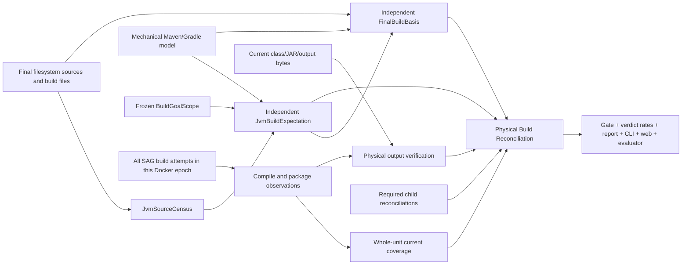

# Filesystem-first JVM Build Validation — source obligations, compile coverage, and physical reconciliation

**Date:** 2026-08-11

**Status:** approved for implementation; Tasks 1–2 complete and frozen; Task 3 not started

**Owner decisions:** one newly created Docker container is one SAG evidence
epoch; every SAG build attempt in that epoch may contribute to the final
buildable state; the final filesystem is the ground truth; output declarations
must never define their own completeness denominator; every Java source must be
mechanically classified; a Java source count is never an expected class count.

**Compatibility:** preserves the independent Physical Validator role from
`2026-07-26-build-contract-loop-design.md`, the no-upward-refinement and typed
absence laws from `2026-07-29-evidence-lifecycle-design.md`, and the independent
grain presentation from `2026-08-10-rate-banded-verdict-design.md`.

**Supersedes:** §2.1 and the `rates.build.classes` example in
`2026-08-10-rate-banded-verdict-design.md`; every live decision path in
`PhysicalValidator` that treats Java source count as expected class count,
arbitrary class/JAR existence as build completion, or a Maven status path's
mere existence as a complete build fingerprint.

## 1. Problem

The current banner can render:

```text
Build: modules 38/52 (half) · classes 8655/2489 (fully)
```

The fraction mixes two different units:

- `8655` is the number of `.class` files found on disk;
- `2489` is a Java source-file census used as a minimum class expectation.

That fraction cannot mean “86xx of 24xx classes were built.” One Java
compilation unit may produce zero, one, or many class files. Member, local and
anonymous classes add files; annotation processors add sources and outputs;
`package-info.java` and unusual compilation units may produce none; Kotlin,
Scala and Groovy have different output rules. The class/source fraction can
exceed 100% while saying nothing about whether one required Java source was
silently omitted.

The deeper defect is not presentation. The current build validator also uses
the same false cardinality as a decision input:

1. count Java sources under guessed source roots;
2. require at least that many class files under guessed output roots;
3. allow arbitrary classes, JARs, Maven status paths, or a percentage threshold
   to refine the build toward complete.

This can both overclaim and underclaim:

- a partial compiler may leave thousands of class files and still omit one
  required source;
- one source may legitimately produce many files, inflating the numerator;
- a source explicitly excluded by the build may legitimately produce none;
- generated sources are absent during the initial repository survey;
- a successful incremental or cached task may rewrite no class files;
- a nonstandard source set may be invisible to the guessed `src/main/java`
  walk.

### 1.1 Fresh-container clarification

SAG does **not** need to attribute every valid output to the final invocation.
The product objective is the final buildable state inside a newly created
Docker container. If attempt one builds module A and attempt two builds module
B, both may contribute to success.

The distinction is:

- **authorship scope:** the whole Docker evidence epoch;
- **validity scope:** the final source, build configuration, dependency and
  toolchain state.

An earlier SAG output remains usable while its compile-unit identity remains
current. If SAG later edits the source, changes the active profile, changes a
compiler option, replaces a dependency or damages the output, the earlier
proof becomes stale even though SAG originally produced it.

### 1.2 The self-declared-denominator trap

A compiler-produced output list is useful, but it cannot answer “what should
have been built.” If a task omits nine Java files and records only the outputs
it did create, every recorded output may still verify even though the source
scope is incomplete.

Therefore this design separates three questions:

1. Which Java sources exist and how is each one classified?
2. Which source-to-compile-unit obligations are required by the final build
   configuration?
3. Which required obligations are covered by successful/current compile tasks,
   and do their physical outputs still exist?

No producer is allowed to answer all three with the same self-authored set.
In particular, `JvmBuildExpectationV1` is resolved from the effective module,
source-root, include/exclude, profile/variant and lifecycle model and then
enumerated from the filesystem. It is not copied from the compile task's
reported inputs. The two views are sealed separately and reconciled.

## 2. Principles

### P1 — The filesystem is the final judge

Runner output such as `BUILD SUCCESS`, exit code zero, reactor text, task
outcomes and cache labels can identify a candidate proof. They do not replace
post-hoc verification of the current files. The Physical Validator remains
independent, read-only and non-prescriptive.

### P2 — Container-wide credit, content-addressed validity

All SAG attempts in one immutable Docker evidence epoch may contribute. A
proof is reusable only when its source/config/dependency/toolchain identity
still matches the final state. “Produced earlier” is allowed; “produced for
different inputs” is not.

### P3 — Expected work and observed output are independent

The expected source set comes from the final filesystem plus mechanically
resolved build configuration. Compile observations and output witnesses may
satisfy that set; they may never define or shrink it.

### P4 — Every Java source is classified

Every checkout-contained Java candidate, plus every generator-declared Java
source consumed by a compile task, must be either:

- attached to one or more required compile units; or
- assigned an explicit, mechanically evidenced out-of-scope classification.

An unclassified source is uncertainty and caps the build below complete. It is
never silently dropped from the denominator.

### P5 — Source coverage is not source-to-class cardinality

The validator proves that a source was covered by a successful/current compile
unit. It does not require one same-named class, one output per source, or any
fixed number of outputs per source.

### P6 — A physical output witness is an integrity check, not a scope check

Harness-captured outputs answer whether the compile unit's physical output
roots still match their sealed tree witnesses. Even a fully verified witness
cannot refine a build above the independently computed source and compile-unit
coverage. Class-file count remains an absolute observation, never an output
completion fraction.

### P7 — No basis is not success, and removing evidence never improves truth

Unreadable census, incomplete observation ledger, unknown source
classification, damaged manifest, conflicting duplicate or unavailable output
scan is typed `UNVERIFIABLE`. A complete ledger that proves no matching
observation exists is known `MISSING_OR_INVALID`, not uncertainty. Neither case
becomes an empty set, a default `1.0`, a narrowed denominator or a green
fallback.

### P8 — One reconciliation decides and displays

Each phase gate consumes its sealed reconciliation revision. Verdict finalizer,
report, CLI, web projection and evaluator consume the same final evidence-close
`BuildReconciliation`. None may recompute source or module coverage
independently. The implementation performs one shared bounded census and
physical verification pass per reconciliation revision; `module_coverage` and
all public grains become projections, not second filesystem scans.

## 3. Model

### 3.1 Set definitions

For the final state of one Docker evidence epoch:

```text
C = all checkout-contained Java candidates from a bounded project census,
    plus Java candidates in active generated roots
Q = required (source identity, compile-unit identity) obligation edges
X = Java candidates with a mechanically evidenced out-of-scope classification
D = Java candidates delegated to a required child build scope
U = Java candidates with neither a required edge, child scope nor out-of-scope basis
K = required compile units with one whole-unit current observation
A = all required edges belonging to units in K
O = physical output roots verified against sealed tree witnesses
S_Q = unique source identities represented in Q
S_A = sources for which every required edge is in A
```

Source classification is complete when:

```text
U = empty
and every candidate in C is represented by Q, X or D
```

Java compile coverage is complete when:

```text
Q is a subset of A
```

`K` is deliberately selected before `A`. A positive observation for a compile
unit is eligible only when its complete source-entry set exactly equals that
unit's final expected source-entry set. Two observations that each cover half
of one compile unit cannot be merged edge by edge. Compatible observations may
be combined only across distinct compile units.

Within one scope, Java-source coverage is `|S_A| / |S_Q|`, so it counts unique
Java files. The project-level public rate recursively unions local and required
child sources under namespaced `(scope_id, source_id)` identities. Edge coverage
remains available in detail. When one source is intentionally required by two
selected variants, it counts current only after both required edges are current.

Build output integrity is complete when every required compile/package unit has
an accepted physical observation and every required output entry is present
with the expected content hash.

Build completion requires all three plus current required generator/package units,
required child scopes and every active language unit. An active source-bearing
language without a supported validator makes the containing module
unverifiable. No class-count threshold appears in the equation.

### 3.2 Why obligations are edges, not just source paths

One source path may legitimately participate in more than one variant or
source set. A shared Java source directory may feed two Gradle compile tasks;
a profile may select one of several Maven executions. The proof unit is
therefore `(source_id, compile_unit_id)`, not only `source_id`.

For the selected action/profile/variant, every required edge must be current.
Overlapping obligations are legal only when the build configuration states
them explicitly. Accidental duplicate ownership is a conflict.

### 3.3 Evidence flow



## 4. Evidence objects

All live evidence objects use canonical JSON, closed schemas, bounded counts
and byte sizes, duplicate-key rejection, normalized contained paths, host
publication authority and exact Docker evidence-store binding. Container files
are the evidence bytes; the host publication stream authorizes which bytes may
influence live truth.

Every object is wrapped by `SealedBuildEvidenceV1` with `record_kind`,
`record_id`, `schema_version`, `evidence_epoch_id`, `content_sha256`,
`byte_count`, `producer_role` and `created_at`. Immutable record IDs are derived
from a versioned identity projection; the content hash seals the entire body.
Mutable logical artifacts also carry a stable `logical_artifact_id`, monotonic
`revision` and `predecessor_content_sha256`; only the host-published latest head
is live. Same-ID different-content publication is a conflict.
For a mutable body, the envelope revision must equal that body's typed revision
field. Revision 1 uses the fixed genesis predecessor; every later revision names
the exact prior envelope content hash. Immutable envelopes carry none of the
logical-artifact, revision, or predecessor fields.

Every top-level evidence body's primary ID is validated from its documented
versioned identity projection; immutable envelope `record_id` equals that body
ID. Nested build-model IDs are mechanically assigned by their adapter schema
and are validated for safe form, uniqueness and exact cross-links rather than
being content hashes. Mutable heads use their stable logical artifact ID as the
envelope record ID and validate the body revision/predecessor tuple separately.
Arbitrary safe-looking top-level evidence IDs are not accepted, and same body
ID with different canonical content is a seal conflict rather than a second
valid record.

Primary-ID projections are fixed as follows:

| body | ID kind | versioned identity projection |
|---|---|---|
| `ContainerEvidenceEpochV1` | immutable | immutable container ID + canonical project root |
| `BuildGoalScopeV1` | mutable logical | epoch ID + initial authority reference; revisions do not change the logical ID |
| `JvmSourceCensusV1` | mutable logical | epoch ID + canonical project root |
| `EvaluatedBuildModelV1` | mutable logical | epoch ID + scope ID + canonical project root |
| `JvmBuildExpectationV1` | immutable | complete semantic body excluding `expectation_id` and diagnostic conflicts |
| `CurrentPhysicalBasisSnapshotV1` | immutable | complete semantic body excluding `physical_basis_snapshot_id` and diagnostic conflicts |
| `FinalBuildBasisV1` | mutable logical | epoch ID + immutable expectation ID |
| generator/compile/package observations | immutable | epoch ID + run/receipt/contract IDs + unit ID |
| `PhysicalOutputWitnessV1` | immutable | epoch ID + producer observation kind/ID |
| `BuildEvidenceSetSnapshotV1` | immutable | complete semantic body excluding `snapshot_id` and diagnostic conflicts |
| `BuildReconciliationV1` | immutable | epoch ID + `input_set_digest` |

Only these primary fields are recomputed by this schema layer. Nested unit,
root, member, artifact, run, receipt, contract and child-scope IDs are owned by
their defining typed record and are validated through uniqueness and exact
cross-links here; this layer does not pretend they are content hashes.

Publication follows the dependency DAG, not one global “all bases first” rule.
The scope/model/expectation revision and task-time environment specification
must predate a dependent task observation; its witness then names that
already-published observation. Upstream output witnesses may be produced before
a downstream task runs. At close, the mutable final-basis head is derived from
the independent specs plus current upstream/output bytes, and reconciliation is
published last. An observation never names a future witness, so identities do
not cycle.

### 4.1 `ContainerEvidenceEpochV1` and `BuildGoalScopeV1`

The host mints an epoch only when it creates a new immutable container store.
Later SAG processes attaching to that same container recover the same epoch
from the host stream; a new container ID requires a new epoch. `run_id` is only
attempt provenance. All host-published records for the epoch form the complete
candidate set, even when they came from different runs.

```text
ContainerEvidenceEpochV1:
  evidence_epoch_id
  immutable_container_id
  project_root
  created_at
  initial_source_state_fingerprint
  baseline_output_root_digests

BuildGoalScopeV1:
  scope_id
  evidence_epoch_id
  authority_ref                  # initial user/request authority
  scope_revision
  predecessor_scope_hash
  validation_target              # project | domain | explicitly scoped modules
  requested_action
  requested_lifecycle
  requested_modules_or_domains
  requested_profiles_or_variants
  source_set_roles               # production, test, generated, custom
  scope_fingerprint
```

The epoch answers who may contribute. The goal scope answers what completion
means. Only a new user-authorized scope revision may supersede it. An invocation
receipt, cwd, `-pl`/task selector or output tree cannot shrink the goal.
Observations are reusable across goal scopes in the same epoch when the current
goal's required compile-unit identity matches; goal scopes themselves are
never unioned.

Required child scopes are derived later from this authorized boundary plus the
evaluated build model. A child inherits the parent authority; discovering it
does not request a broader goal, and an execution result cannot drop it.

### 4.2 `JvmSourceCensusV1`

This mutable latest-head is derived independently from the final filesystem.
The census walks the bounded checkout rather than only conventional source
roots, then independently scans active generated roots declared by the build
model. Task observations never add census members. Repository control
directories, output trees and unreadable/escaped paths receive typed
classification or conflict records; they do not silently disappear.

```text
JvmSourceCensusV1:
  census_id
  evidence_epoch_id
  project_root
  census_revision
  source_state_fingerprint
  sources[]                     # Java plus bounded JVM-language candidates
  unreadable_roots[]
  conflicts[]

JvmSourceCandidate:
  source_id                     # canonical path + content hash
  path
  sha256
  language                      # java | kotlin | scala | groovy | aspectj | other
  origin                        # repository | generated
  role_hint                     # production | test | custom | unknown
  discovered_root
  symlink_status
```

The bounded extension inventory includes at least `.java`, `.kt`, `.scala`,
`.groovy` and `.aj`, with build-model extension points for other JVM languages.
Every candidate must map to a supported required unit, an explicit
`unsupported_active` unit, or a mechanically proven out-of-scope
classification. A custom Kotlin/Scala/Groovy root omitted by the build-model
adapter therefore remains unclassified and makes the module unverifiable. The
same shared census pass provides the filtered Java view used by the public Java
rate; there is no second consumer scan.

### 4.3 `EvaluatedBuildModelV1`

This mutable latest-head is a mechanically resolved, config-derived build
model, separate from the census and all task observations:

```text
EvaluatedBuildModelV1:
  model_id
  evidence_epoch_id
  scope_id
  goal_scope_revision
  goal_scope_fingerprint
  project_root
  model_revision
  build_config_fingerprint
  build_config_members[]
  active_profiles_or_variants[]
  modules[]
  generator_units[]
  compile_units[]
  package_units[]
  compile_dependency_edges[]
  generated_root_contracts[]
  child_build_scopes[]
  conflicts[]

EvaluatedModuleV1:
  module_id
  domain_id
  build_system
  module_coordinate
  project_path
  role
  model_provenance

BuildPathBasis:
  member_id
  member_role
  path
  path_kind                     # file | tree
  resolution_provenance

ResolvedMemberSpec:
  member_id
  member_role
  path_kind                     # file | tree
  path                          # direct path, or resolved absolute path for coordinate
  coordinate                    # when present, resolved path is also required
  upstream_unit_id
  upstream_root_id
  resolution_provenance

SourcePatternRuleV1:
  rule_id
  compile_unit_id
  dialect                       # exactly posix_glob_v1
  pattern                       # source-root-relative, case-sensitive POSIX glob
  model_provenance

OutputRootSpec:
  member_id                     # joins the physical requested-member partition
  root_id
  path                          # project-root-relative
  verification_mode             # exclusive_tree | shared_owned_entries
  output_requirement            # nonempty | empty_permitted

CompileDependencyEdge:
  upstream_compile_unit_id
  upstream_output_root_id
  downstream_compile_unit_id
  dependency_basis

CompileUnitExpectation:
  compile_unit_id
  domain_id
  build_system                  # maven | gradle
  module_coordinate
  source_set                    # main | test | generated | custom
  language                      # java | kotlin | scala | groovy | other
  adapter_status                # supported | unsupported_active
  task_or_execution
  role                          # required | optional | out_of_scope
  scope_disposition             # active | inactive_profile
                                # | out_of_lifecycle_scope | vendor
                                # | explicit_scope_exclusion
  source_roots[]
  include_rules[]               # typed SourcePatternRuleV1
  exclude_rules[]               # typed SourcePatternRuleV1
  compiler_environment_spec:
    executable_path_basis
    compiler_version             # resolved mechanically before task outcome
    compiler_args[]
    classpath_members[]          # path/coordinate or upstream unit+root ID
    toolchain_path_basis
    resolution_provenance
  output_roots[]                # root_id, path, exclusive_tree | shared_owned_entries
  output_requirement            # nonempty | empty_permitted | none
  output_requirement_basis
  requested_lifecycle_basis
  model_provenance

GeneratorUnitExpectation:
  generator_unit_id
  module_coordinate
  task_or_execution
  role
  input_roots[]                 # typed ResolvedMemberSpec schema/IDL/template roots
  generator_environment_spec:
    executable_path_basis
    tool_or_plugin_members[]
    dependency_members[]
    generator_args[]
    toolchain_path_basis
  generated_root_ids[]
  model_provenance

PackageUnitExpectation:
  package_unit_id
  module_coordinate
  task_or_execution
  role
  input_compile_unit_ids[]
  resource_roots[]              # typed ResolvedMemberSpec resource roots
  manifest_or_packaging_config[]
  packaging_environment_spec:
    executable_path_basis
    plugin_or_tool_members[]     # path/coordinate + resolution provenance
    external_dependency_members[]
    packaging_args[]
    toolchain_path_basis
  output_roots[]                # typed OutputRootSpec ownership roots
  requested_artifacts[]         # artifact ID + owning root ID + path/kind
  model_provenance

GeneratedRootContract:
  generated_root_id
  output_root                   # typed OutputRootSpec; root ID must match
  producer_unit_kind            # compile | generator
  producer_unit_id
  consumer_unit_ids[]
  mode                          # same_round_intermediate | later_compile_input
  active_profile_or_variant
  model_provenance

ChildScopeExpectation:
  child_scope_id
  parent_scope_id
  child_project_root
  build_system
  ownership_basis
```

An active unsupported language unit is explicit model data. It caps its module
to unverifiable; an empty Java denominator cannot make a Kotlin/Scala/Groovy
module vacuously complete.

`scope_id` and `model_id` are stable mutable-head identifiers, so ID equality
alone is never currentness. The evaluated model seals the exact goal-scope
revision and fingerprint it resolved, and the immutable expectation repeats
that scope fingerprint. Reconciliation rejects an older model revision even
when all three stable logical IDs still match.

Compiler executable/arguments, classpath membership and toolchain membership
are resolved by the controlled Maven/Gradle configuration adapter, before task
outcomes are considered. The final basis may rehash those members but may not
invent, drop or replace them. If the adapter cannot produce a complete
membership set with versioned provenance, that unit is unverifiable.

Maven and Gradle source patterns are normalized by their adapters into one
closed `posix_glob_v1` dialect before the model is published: `/` is the only
separator; matching is relative to each source root and case-sensitive; `**`
crosses directories; an empty include set means include all; and excludes run
after includes. Each rule has a content-addressed ID and names its owning
compile unit. A unit outside the active scope carries an exact typed
`scope_disposition`; free-form prose cannot choose an exclusion category.

`build_config_members` is the complete typed POM/settings/Gradle script,
profile/property and controlled init/plugin configuration membership used for
`build_config_fingerprint`. Close-time reconciliation rehashes those members;
the aggregate fingerprint alone is never accepted as physical proof.
All derived fingerprints in this design use domain-separated canonical JSON:
`sha256({schema_version: 1, fingerprint_kind, payload})`. The payload preserves
the order of order-sensitive members and sorts only declared set-like members.

`build_config_fingerprint` has one exact projection. Its
`fingerprint_kind` is `jvm-build-config-members`; its payload is the complete
tuple of current `ResolvedDigestEntry` records corresponding one-for-one, and
in the same order, to `EvaluatedBuildModelV1.build_config_members`. Each entry
therefore commits the member ID, role, file-or-tree kind, resolved absolute
path, byte count and current content/tree hash. A missing configuration member
is known absence: every affected final unit basis is omitted, without turning
absence into an integrity conflict. An unreadable or rebound member, an extra
or incomplete physical partition, or a recomputed aggregate that differs from
the model and expectation fingerprint is an integrity conflict; no final unit
basis may reuse the stale aggregate.

Package tool/plugin membership, external dependency inputs, arguments and
toolchain membership follow the same rule. Shade/assembly/WAR or another
packaging plugin cannot be represented only by compile outputs and a final JAR
path.

Generated-root classification comes only from `GeneratedRootContract`, not
from an observation. `same_round_intermediate` requires the producer and
consumer to be the same supported compiler unit. `later_compile_input` requires
a current generator/producer unit with a verified output witness; its root is
then census input for every named later consumer. A generated file's current
hash must match both the producer witness and the consuming compile unit.
Each generator root independently fixes its member ID, root ID, path,
verification mode and `nonempty|empty_permitted` requirement before execution.

Every physical `member_id` has one semantic descriptor across the whole model.
Reusing an ID for a different role, path, kind, coordinate, upstream binding or
output-root descriptor is a conflict. Compile roots, generated roots and
package roots also occupy one globally unique root-ID namespace. Each compile
dependency edge has exactly one matching downstream upstream-classpath member,
and every such member has exactly one edge.

Root IDs are unit-owned logical identities; two logical roots may describe the
same physical directory only when both use `shared_owned_entries`. For nested
root paths, the outer root must be shared; an exclusive outer root would claim
its nested owner's bytes. Reconciliation rejects two selected witnesses that
claim the same absolute output entry. Diagnostic class counts likewise
deduplicate by canonical absolute entry path, not by `(root_id, relative_path)`.

Collections whose order affects resolution are bounded, duplicate-free
sequences—not sets. Compiler classpath members, generator tool/dependency
members, package compile inputs, resources, packaging tools/plugins and
external dependencies preserve the adapter-resolved order in both final bases
and unit identity hashes. Reversing one of those sequences changes identity.
Only genuinely set-like collections (for example source obligations and
record-set IDs) are canonically sorted.

### 4.4 `JvmBuildExpectationV1`

This is the independent JVM scope expectation. Its Java edges define the Java
denominator; its non-Java classifications prevent an empty Java set from
proving an entire JVM module. It is a pure projection:

```text
derive_expectation(
  census: JvmSourceCensusV1,
  goal_scope: BuildGoalScopeV1,
  build_model: EvaluatedBuildModelV1,
) -> JvmBuildExpectationV1
```

Receipts, task outcomes, class files, observed artifact roots/bytes and output
witnesses are forbidden inputs. Configured output roots remain part of the
independent model because they describe where a unit is expected to
materialize; they do not say that it succeeded.

```text
JvmBuildExpectationV1:
  expectation_id
  evidence_epoch_id
  census_id
  scope_id
  scope_fingerprint
  model_id
  source_state_fingerprint
  build_config_fingerprint
  required_java_edges[]
  source_classifications[]
  unclassified_source_ids[]
  required_generator_unit_ids[]
  required_compile_unit_ids[]
  required_package_unit_ids[]
  unsupported_active_unit_ids[]
  required_child_scope_ids[]
  delegation_edges[]
  conflicts[]

RequiredSourceEdge:
  source_id
  compile_unit_id

DelegationEdge:
  parent_source_id
  child_scope_id
  expected_child_path
  expected_child_sha256

SourceClassification:
  source_id
  language
  source_kind                   # main | test | generated | custom
  classification               # required | explicitly_excluded | inactive_profile
                               # | out_of_lifecycle_scope | delegated_child_scope
                               # | vendor | compiler_intermediate | unsupported_active
  classification_basis         # typed ClassificationBasisV1 reference
  expected_compile_unit_ids[]
  child_scope_id                # required only for delegated_child_scope

ClassificationBasisV1:
  basis_kind                    # model_rule | explicit_scope | generated_contract
                                # | child_scope | unsupported_adapter
  model_id
  basis_ref                     # typed rule/profile/unit/contract ID
```

`classification_basis` is typed build-model evidence. `.gitignore`, directory
convention and model prose are not valid bases. A separate build island under a
project goal becomes a required child scope; it is out of scope only when the
initial goal authority explicitly excludes it. `unsupported_active` and
unclassified sources block completion.

`required_java_edges` contains every active Java obligation even when its
compiler adapter is `unsupported_active`; unsupported status caps completion
but cannot erase the Java denominator. Required or unsupported non-Java
sources retain their expected compile-unit IDs for whole-unit/language
accounting and never create Java edges.
If one source is shared by supported and unsupported active compile units, its
expected-unit and Java-edge sets contain their union; the source classification
is `required` when any supported owner exists and `unsupported_active` only
when all active owners are unsupported. Unit-level adapter status still caps
the overall build.

Delegation is a conservation contract. Every parent candidate classified
`delegated_child_scope` has exactly one `DelegationEdge`, and the named child
census must contain the same canonical path and content hash under its root.
The child then classifies that source normally. Missing, duplicated or
overlapping ownership is a conflict. Child scopes form a strict DAG: no self
edge, ancestor cycle, multiple parents, or overlapping roots without a
mechanically disjoint ownership partition.

### 4.5 `FinalBuildBasisV1`

This mutable latest-head is the independent close-time comparison target for
observations. The normative derivation is:

```text
derive_final_basis(
  census: JvmSourceCensusV1,
  expectation: JvmBuildExpectationV1,
  build_model: EvaluatedBuildModelV1,
  physical: CurrentPhysicalBasisSnapshotV1,
  *,
  basis_revision: int,           # allocated by the host mutable-head writer
) -> FinalBuildBasisV1
```

`CurrentPhysicalBasisSnapshotV1` contains clean-read path, byte/tree hash and
missing/conflict records for exactly the source/config/generator/compiler/
toolchain/classpath/resource/output and packaging-tool/plugin/external-
dependency members requested by the build model. It cannot add or remove
members. Neither function reads task outcomes or observations.
`basis_revision` is explicit because revision ordering is host publication
state, not something that source/config/output bytes can infer. Holding all
four inputs constant yields byte-identical basis bytes; changing the allocated
revision yields the next candidate head without letting task evidence define
any semantic member.

The snapshot is a typed completeness boundary rather than an unstructured map:

```text
CurrentPhysicalBasisSnapshotV1:
  physical_basis_snapshot_id
  evidence_epoch_id
  expectation_id
  build_model_id
  requested_member_ids[]
  current_members[]             # typed file/tree path + byte count + SHA-256
  current_output_roots[]
  current_output_entries[]      # exact root-relative path + byte count + SHA-256
  missing_members[]             # typed requested member ID + expected path
  unreadable_members[]          # typed requested member ID + path + reason
  conflicts[]

CurrentPhysicalMemberV1:
  member_id
  member_role                   # source | config | compiler | toolchain
                                # | classpath | resource | packaging_input | other
  path_kind                    # file | tree
  path
  byte_count
  sha256                        # file bytes or canonical tree digest by path_kind

CurrentOutputRootV1:
  member_id                     # participates in the requested-member partition
  root_id
  path
  verification_mode
  tree_or_owned_entries_sha256
  entry_count
  scan_complete

CurrentOutputEntryV1:
  root_id
  relative_path
  kind
  byte_count
  sha256

MissingPhysicalMemberV1:
  member_id
  path

UnreadablePhysicalMemberV1:
  member_id
  path
  reason
```

Every model-requested member appears exactly once across current, missing or
unreadable. An omitted requested member, an extra self-declared member or an
incomplete output scan is a conflict. This snapshot is the only filesystem-
fact input accepted by the pure final-basis and witness-reconciliation code.
All resolved digest entries used by generator/compiler/package bases likewise
carry an independent member role and `path_kind=file|tree`; a JAR file and a
classpath directory cannot share an untyped hash domain.

A typed `missing_members` row is known physical absence, not an integrity
conflict: derivation omits the affected unit basis and reconciliation classifies
it `MISSING_OR_INVALID`. An unreadable member, a requested-set mismatch, an
extra/rebound descriptor, an incomplete scan or contradictory hash remains
`UNVERIFIABLE`. No function turns either case into a fabricated empty basis.

The join is closed and observation-independent. Required source members use
the census `source_id`, and their physical path/hash must exactly reproduce the
census candidate under `project_root`. `BuildPathBasis`, `ResolvedMemberSpec`
and `OutputRootSpec` carry their physical member IDs explicitly. A coordinate
member also carries the adapter-resolved absolute path; an upstream member is
resolved only through its typed unit/root edge. Generator input and package
resource roots are typed members, not bare directory strings. The set of all
such model members plus required source IDs must equal the physical snapshot's
`requested_member_ids`; path-based guessing or an extra self-declared member is
a conflict.

```text
FinalBuildBasisV1:
  basis_id
  evidence_epoch_id
  basis_revision
  expectation_id
  physical_basis_snapshot_id
  source_state_fingerprint
  build_config_fingerprint
  generator_unit_bases[]
  compile_unit_bases[]
  package_unit_bases[]
  conflicts[]

FinalGeneratorUnitBasis:
  generator_unit_id
  build_config_fingerprint
  input_entries[]               # schema/IDL/template/config path + hash
  generator_executable_path
  generator_executable_sha256
  generator_tool_entries[]
  generator_dependency_entries[]
  generator_args_fingerprint
  generator_toolchain_fingerprint
  generated_output_roots[]       # path/mode/requirement from model contracts
  generator_unit_identity_hash

FinalCompileUnitBasis:
  compile_unit_id
  build_config_fingerprint
  required_source_entries[]     # exact complete set from expectation
  source_set_fingerprint
  compiler_executable_path
  compiler_executable_sha256
  compiler_version
  compiler_args_fingerprint
  classpath_entries[]            # normalized path + current content/tree hash
  dependency_unit_identity_hashes[]
  toolchain_fingerprint
  output_roots[]
  compile_unit_identity_hash

FinalPackageUnitBasis:
  package_unit_id
  build_config_fingerprint
  input_compile_unit_identity_hashes[]
  input_compile_output_digests[]  # unit/root ID + current byte/tree digest
  resource_entries[]
  packaging_executable_path
  packaging_executable_sha256
  packaging_tool_entries[]        # plugin/tool/dependency path + current hash
  external_dependency_entries[]
  packaging_args_fingerprint
  packaging_toolchain_fingerprint
  packaging_config_fingerprint
  requested_artifacts[]
  output_roots[]
  package_unit_identity_hash
```

This prevents self-matching observations. If module A was compiled against
module B version 1 and only B is later rebuilt to version 2, A's observation no
longer matches the final dependency identity. If compile output bytes change
without rerunning packaging, the final package basis changes even when source
and compile-unit identity hashes do not.

### 4.6 Generator, compile and package observations

One immutable observation records every terminal unit outcome, positive or
negative:

```text
GeneratorUnitObservationV1:
  observation_id
  evidence_epoch_id
  run_id
  receipt_id
  contract_id
  generator_unit_id
  generator_unit_identity_hash
  input_entries[]
  generator_executable_path
  generator_executable_sha256
  generator_tool_entries[]
  generator_dependency_entries[]
  generator_args_fingerprint
  generator_toolchain_fingerprint
  generated_root_ids[]
  outcome                        # executed_success | current_noop | up_to_date
                                 # | from_cache | skipped | failed
  actual_invocation_scope
  conflicts[]

CompileUnitObservationV1:
  observation_id
  evidence_epoch_id
  run_id                         # provenance only
  receipt_id
  contract_id
  compile_unit_id
  compile_unit_identity_hash
  source_entries[]               # exact complete unit input set
  source_set_fingerprint
  compiler_executable_path
  compiler_executable_sha256
  compiler_version
  compiler_args_fingerprint
  classpath_entries[]
  dependency_unit_identity_hashes[]
  toolchain_fingerprint
  observed_output_roots[]
  outcome                        # executed_success | current_noop | up_to_date
                                 # | from_cache | no_source | skipped | failed
  actual_invocation_scope        # typed ActualInvocationScopeV1
  generated_during_compile[]
  conflicts[]

PackageUnitObservationV1:
  observation_id
  evidence_epoch_id
  run_id
  receipt_id
  contract_id
  package_unit_id
  package_unit_identity_hash
  input_compile_unit_identity_hashes[]
  input_compile_output_digests[]
  resource_entries[]
  packaging_executable_path
  packaging_executable_sha256
  packaging_tool_entries[]
  external_dependency_entries[]
  packaging_args_fingerprint
  packaging_toolchain_fingerprint
  packaging_config_fingerprint
  requested_artifacts[]
  observed_artifact_paths[]
  outcome                        # executed_success | current_noop | up_to_date
                                 # | from_cache | skipped | failed
  actual_invocation_scope        # typed ActualInvocationScopeV1
  conflicts[]
```

`GeneratorUnitObservationV1.actual_invocation_scope` uses the same typed
record:

```text
ActualInvocationScopeV1:
  build_system
  selected_modules_or_tasks[]
  lifecycle_or_tasks[]
  profiles_or_variants[]
  resume_from
  also_make
  selector_fingerprint
```

This scope is diagnostic coverage evidence and may limit what an observation
can satisfy; it never shrinks the independently frozen goal scope.

The Task 2 kernel can mechanically gate normalized Maven module/lifecycle
coverage and exact Gradle task coverage. `resume_from` remains diagnostic until
the adapter publishes either the effective executed reactor-module set or a
sealed reactor order from which the resumed suffix can be derived. The kernel
must not guess that suffix from a module coordinate, because accepting only the
anchor would reject valid later modules while accepting every module would
overclaim earlier ones.

Positive eligibility is derived by the validator, never trusted as a producer
boolean. For a compile unit, the outcome must be one of the four positive forms,
the identity must equal the final basis, and `source_entries` must exactly equal
the complete final expected source set. `NO-SOURCE`, skipped and failed remain
history but never enter `K`.

The validator recomputes each observation identity hash from these task-time
fields before comparing it with the independently derived final basis; a
producer-supplied hash cannot self-authorize.

A generator observation is eligible under the same rule as a compile unit:
positive outcome, recomputed identity equal to the final generator basis, exact
input bytes/tool environment, and a verified witness over every generated root.
A `later_compile_input` consumer cannot be current unless its producer is
current and the consumed source hashes match that witness.

A package observation is eligible under the same rule: positive outcome,
recomputed identity equal to the final package basis, exact input compile-unit
identities/resources/config, and a separately verified artifact witness.

The source set means all current inputs of the unit, not merely files javac
reread incrementally. `generated_during_compile` may corroborate—but never
create—the build model's `same_round_intermediate` contract. Only that
independent contract permits `compiler_intermediate` classification. Generated
Java materialized by one task and consumed by a later compile task is
independently found by the close-time census and becomes a normal required edge.

### 4.7 `PhysicalOutputWitnessV1`

The harness publishes an observation first, then one immutable bounded witness
that points to it:

```text
PhysicalOutputWitnessV1:
  witness_id
  evidence_epoch_id
  producer_observation_kind     # generator | compile | package
  producer_observation_id
  producer_unit_id
  producer_unit_identity_hash
  roots[]
  entries[]
  aggregate_sha256

OutputRootWitness:
  root_id
  path
  verification_mode             # exclusive_tree | shared_owned_entries
  tree_or_owned_entries_sha256
  entry_count

PhysicalOutputEntry:
  root_id
  relative_path
  kind                           # class | jar | war | resource | other
  byte_count
  sha256
```

For `exclusive_tree`, the final tree must equal the sealed tree. For
`shared_owned_entries`, every unit-owned entry must remain exact but additional
entries from other current units are allowed. Shared-root ownership must come
from a supported adapter; if complete ownership cannot be established, the
unit is unverifiable. This permits multiple current compile units to append to
one `target/classes` without invalidating each other while still detecting a
deleted or changed owned file.

The witness cannot add source obligations or change `Q`. An empty output tree
is legal only when the independent build model records `empty_permitted` or
`none` with a supported mechanical basis. A normal source-bearing Java compile
unit is `nonempty`; a hollow no-op task therefore cannot pass with zero output.
This is a unit-level existence rule, not a Java-source/class cardinality rule.
Exceeding witness bounds is unverifiable, never a sampled positive proof.

### 4.8 `BuildReconciliationV1`

Each immutable reconciliation is a projection of one exact input set:

```text
BuildEvidenceSetSnapshotV1:
  snapshot_id
  evidence_epoch_id
  admitted_run_ids[]            # exact grow-only epoch-index projection
  record_sets[]                 # one status for every required record kind
  generator_observations[]
  compile_observations[]
  package_observations[]
  output_witnesses[]
  child_censuses[]
  child_expectations[]
  child_reconciliations[]
  conflicts[]

EvidenceRecordSetCompletenessV1:
  record_kind
  expected_record_ids[]
  observed_record_ids[]
  observed_record_hashes[]      # exact record ID + host-authorized raw SHA-256
  status                        # complete | unavailable | set_mismatch
                                # | tombstoned | conflict
  tombstoned_record_ids[]
  conflicts[]
```

Every completion-critical record kind has exactly one completeness row. A
known-empty ledger is represented by `status=complete` with both ID sets empty;
an absent row or a bare empty list is never interpreted as known empty. The
observed objects must match the complete observed-ID sets exactly. A tombstone,
set mismatch, unavailable read or conflict makes the snapshot unusable for a
positive reconciliation even when the remaining lists are well formed.
The hash rows must contain exactly the observed IDs once each; reconciliation
input identity uses these host-authorized raw hashes, not only reserialized
model values.
Every generator, compile, and package observation's `run_id` must appear in the
snapshot's canonically ordered, duplicate-free `admitted_run_ids`. A copied
observation from an unadmitted or foreign run is inert and makes the snapshot
unusable rather than silently expanding the epoch.

The required record-kind rows are exactly `generator_observation`,
`compile_observation`, `package_observation`, `output_witness`, `child_census`,
`child_expectation`, and `child_reconciliation`. Unknown, duplicate or missing
kinds fail closed. For each required child, the snapshot carries its sealed
census, expectation and reconciliation. Their IDs must match the child
reconciliation cross-links, and the parent verifies each delegation edge
against the child census's canonical source path and content hash. A child
status/count projection without those two independently authorized inputs is
insufficient to prove handoff conservation.

The Task 2 parent replay independently re-derives every child axis available
from the sealed child census and expectation: source classification, Java
sources/edges, required generator/compile/package/language units, delegation
handoffs, nested-child links, selected-proof IDs, and the deterministic status
fold. The current three-record child projection does not carry the child's
evaluated build model, final basis, or evidence set, so a parent cannot
independently recompute child module ownership or physical-witness obligation
counts. Those non-derivable axes remain part of the host-authored sealed child
reconciliation attestation. A later schema may add the full child closure; the
current reader must never invent those counts or accept a child status/count
record without the independently authorized census and expectation.

The pure reconciler accepts this snapshot, not independent bare observation or
witness lists. This preserves the distinction between known absence
(`MISSING_OR_INVALID`/`absent`) and incomplete authority
(`UNVERIFIABLE`/`unverifiable`).

```text
BuildReconciliationV1:
  reconciliation_id
  evidence_epoch_id
  source_census_id
  goal_scope_id
  build_model_id
  expectation_id
  final_basis_id
  input_set_digest
  requested_action
  status                         # complete | partial | absent | unverifiable

  source_census:
    total_candidates
    classified
    unclassified
    delegated
    out_of_scope_by_reason

  java_sources:                 # unique namespaced source identities
    local_expected
    local_current
    delegated_expected
    delegated_current
    project_expected            # local + recursively required children
    project_current
    project_missing
    project_stale

  java_edges:                   # detailed source-to-unit obligations
    expected
    current
    missing
    stale

  generator_units:
    expected
    current
    missing_or_invalid
    unverifiable

  compile_units:
    expected
    coverage_current
    coverage_missing_or_invalid
    coverage_unverifiable

physical_outputs:
    observed_class_count
    witnesses_expected
    witnesses_verified
    sealed_entries
    verified_entries
    missing_entries
  mismatched_entries

  package_units:
    expected
    current
    missing_or_invalid
    unverifiable

  active_language_units:
    expected
    supported_current
    unsupported_or_unverifiable

  child_scopes:
    expected
    complete
    incomplete_or_unverifiable

  modules:
    expected
    built
    partial
    unverifiable

  selected_generator_proofs[]   # unit -> observation + witness + final basis
  selected_compile_proofs[]
  selected_package_proofs[]
  selected_child_reconciliations[]
  conflicts[]
  evidence_refs[]
```

The selected assignments are closed typed records rather than dictionaries:

```text
SelectedGeneratorProof:
  generator_unit_id
  generator_unit_identity_hash
  observation_id
  witness_id

SelectedCompileProof:
  compile_unit_id
  compile_unit_identity_hash
  observation_id
  witness_id                       # nullable only when coverage is current but
                                   # physical output is missing/invalid

SelectedPackageProof:
  package_unit_id
  package_unit_identity_hash
  observation_id
  witness_id

SelectedChildReconciliation:
  child_scope_id
  child_census_id
  child_expectation_id
  reconciliation_id
```

Coverage and physical integrity are separate axes. A selected compile proof
always identifies the whole-unit observation that grants source coverage, but
its `witness_id` is null when no matching physical witness verifies. Deleting
an output may therefore leave Java source coverage current while making
physical output integrity—and thus the build—partial. Generator and package
proofs still require a witness before those units are current. Every count
projects verified lists; consumers never infer missing entries by subtracting
unrelated counts, and `complete` requires every expected witness to verify.
`witnesses_expected` counts only required units whose independent output-root
contract requires a witness. A compile unit with `output_requirement=none` has
output state `NOT_REQUIRED`, selects its coverage observation with a null
`witness_id`, and contributes zero to both witness counts. An
`empty_permitted` root still requires a verified zero-entry witness.

`input_set_digest` covers every mutable head, the complete immutable record-ID
sets and raw hashes, all selected proof assignments, child reconciliation IDs,
and the final physical source/config/toolchain/classpath/output hashes. It is
the only basis for reusing a reconciliation at a later close point.

## 5. Source census and build scope

### 5.1 “Total Java” and “should build” are separate numbers

The report exposes both questions:

```text
Java source census: 3000/3000 classified · 0 unclassified
Required Java:      2589/2589 project sources current
  Local scope:      2489/2489 current
  Child scopes:      100/100 current
Compile edges:      2510/2510 current
```

`3000` is the bounded parent census. `2489` is the local required Java set and
`100` is the recursively required child set, producing a `2589` project-level
rate. `2510` illustrates local detailed source-to-compile-unit edges; edge
counts may be larger when one source belongs to multiple selected units. A
source enters the numerator only when all required edges are current. Explicit
exclude/inactive/out-of-lifecycle/vendor entries do not enter the denominator.
A child island is delegated, not excluded, and its namespaced sources enter the
project headline.

### 5.2 Main and test sources

The census always classifies both when present. Required edges are selected by
the effective action:

- production `compile` requires main/generated-main compile units;
- an action that requires `testCompile` adds test/generated-test compile units;
- a skipped test execution does not silently remove a required test-compile
  unit when the selected lifecycle still requires it;
- production build and test compilation remain separately reported, so red
  tests cannot contaminate production source coverage.

### 5.3 Validation target does not come from the attempted command

The validation target is frozen from the user's requested project/domain scope,
effective lifecycle and mechanically resolved build configuration before a
runner may narrow it. An invocation such as `mvn -pl core compile` proves only
the `core` obligations it covered. It does not redefine a full-project target
as core-only merely because that was what ran.

A deliberately scoped initial target (for example, the user asks to validate
only `core`) may have a core-only denominator. The distinction comes from the
frozen validation target, never from the observation that happens to make a
result look complete.

### 5.4 Generated sources

Generated Java cannot be fully enumerated before generator tasks run. The build
model declares generated roots; at close, the census independently scans those
roots and records content hashes and generation provenance. The task-entry
source set belongs only to the observation and cannot define the census.

If a compile observation claims a generated source that cannot be recovered or
content-bound at close, the associated unit is `UNVERIFIABLE`; it is not
silently omitted.

Java emitted and consumed inside one annotation-processing compiler round is a
typed `compiler_intermediate` only when an independent
`GeneratedRootContract(mode=same_round_intermediate)` establishes it. If it
survives as an input to a later compile unit, the contract must use
`later_compile_input`; the close-time census then makes it an ordinary required
source.

### 5.5 Unknown Java files

A Java file under the checkout that belongs to no known active source root is
not automatically “not part of the build.” The validator attempts a mechanical
classification against:

- active and inactive build domains;
- Maven profiles/modules and compiler includes/excludes;
- Gradle projects/source sets/variants;
- detected separate build islands and their required child scopes;
- bounded generated and vendor roots.

If none applies, the entry remains `unclassified`. This may make complex
repositories `unverifiable`, but it prevents a forgotten source tree from
improving the build by disappearing from the denominator.

## 6. Multi-attempt Docker-epoch semantics

### 6.1 Evidence accumulates across SAG attempts

The reconciler considers every host-authorized compile/package observation
from the same immutable container evidence epoch, including observations from
different `run_id` values and later SAG processes attached to the same immutable
container. It may select different observations for different units. A single
root invocation is not required when the final dependency closure is current.

Observations from incompatible profiles, variants, compiler arguments,
classpath or toolchain identities cannot be combined into a Frankenstein
success. Goal scopes themselves are not merged, but a compile proof produced
under an earlier scoped goal may satisfy the matching unit inside a later
broader goal. The broader goal still supplies all additional obligations.
Foreign-epoch records remain inert even when `run_id` and bytes are copied.

### 6.2 Currentness is keyed to final state

An observation contributes only when its unit identity exactly matches the
independently derived `FinalBuildBasisV1`:

- exact source path and hash for every covered edge;
- compile-unit build configuration fingerprint;
- selected profile/variant and action;
- toolchain fingerprint;
- normalized dependency/classpath fingerprint with typed, versioned adapter
  provenance; if the adapter cannot materialize it, the unit is
  `UNVERIFIABLE` rather than implicitly current;
- configured output roots; physical output validity is checked separately by
  the matching witness.

Git `target_sha` alone is insufficient because SAG may repair an uncommitted
working tree. The source census and build configuration hashes are mandatory.

### 6.3 Later failures do not erase valid success automatically

A failed root attempt remains visible but does not erase successful compile
units that it did not contradict—for example, a later test failure or a reactor
failure after an upstream module compiled successfully. A failed compile
observation for the same final compile-unit identity is always a conflict.
Changed final inputs or damaged/mismatched outputs always make the older proof
stale or invalid. There is no producer-authored “did not challenge currentness”
escape hatch.

A downstream red test does not invalidate a current production compile unit.
A compile failure against changed final inputs means the older proof is stale
and cannot satisfy the new obligation.

### 6.4 Initial-container baseline

A fresh container defines the evidence epoch but may mount Maven/Gradle caches,
and its checkout may contain tracked or vendored artifacts. A pre-dispatch
baseline records existing output roots. Baseline or cache-restored files do not
become build proof merely by existing. They count only after a current
build-system observation vouches for their exact final unit identity and the
Physical Validator verifies their bytes.

## 7. Build-system adapters

Adapters only materialize typed expectations and observations. They do not
decide the verdict.

### 7.1 Maven

The Maven adapter must cover every active reactor module and every relevant
compiler execution, not only `compile/default-compile`.

Expectation inputs:

- effective reactor membership and selected profiles;
- compile/testCompile executions required by the effective action;
- project/effective-model source roots;
- compiler includes/excludes;
- generated source roots registered before compile;
- custom output directories;
- the frozen module/lifecycle goal scope; `-pl`-style narrowing contributes
  only when it was part of that goal, never merely because an attempt used it.

Observation inputs:

- terminal Maven/compile outcome and reactor outcome;
- actual invocation selectors such as `-pl`, `-am`, resume and lifecycle;
- all matching `inputFiles.lst` files as compiler-status enrichment;
- all matching `createdFiles.lst` files as output-path enrichment;
- harness-captured complete source entries and output bytes;
- typed package observations for requested JAR/WAR tasks and artifacts.

`inputFiles.lst` is never the repository/source denominator by itself.
`createdFiles.lst` is never a complete-build declaration by itself. They are
incremental compiler status artifacts whose completeness depends on execution
mode and plugin behavior. If the adapter cannot establish their semantics for
the observed execution, it records them as auxiliary and relies on the
harness-captured task/source/output witness; otherwise the unit is
`UNVERIFIABLE`.

“Nothing to compile” may be current only when the complete source/config/
dependency identity is proven and the expected output witness verifies.

### 7.2 Gradle

Console text alone is insufficient. A controlled init script records, for each
supported Java compile task:

- a build-model view of resolved SourceSet roots/patterns for expectation
  derivation, kept separate from task input observations;
- project/task path and selected variant/source set;
- source roots and exact source entries at task entry;
- resolved task output roots (scope metadata, not a completeness declaration);
- task outcome (`EXECUTED`, `UP-TO-DATE`, `FROM-CACHE`, `NO-SOURCE`, failed,
  skipped);
- a post-task physical output witness published after the observation;
- task input/currentness identity available through supported Gradle APIs.

The adapter does not parse `.gradle/executionHistory/*.bin` or any other
version-private cache format.

For a source-bearing required compile unit:

- `EXECUTED`, `UP-TO-DATE`, or `FROM-CACHE` may become a positive observation
  after physical verification;
- `NO-SOURCE`, skipped or failed cannot;
- an unknown/custom compiler task without a supported source/output adapter is
  `UNVERIFIABLE`, never green by artifact count.

### 7.3 Mixed-language JVM modules

This iteration makes Java accounting exact. A module with Kotlin, Scala,
Groovy, AspectJ or another source-bearing compiler requires a language/task
adapter before the module can be called fully built from compile-unit evidence.

Java proof remains visible, but every active non-Java source-bearing unit is
represented in the build model. An unsupported unit makes the containing
module `unverifiable`; Java class files must not stand in for that pipeline.

## 8. Physical reconciliation algorithm

The Physical Validator uses the same bounded algorithm at phase close and at
evidence close:

1. Read the host-owned container epoch and frozen goal scope; assert the
   current immutable container/store identity.
2. Read complete host-authorized sets/heads for the census, build model,
   expectation, final build basis, observations, witnesses and child scopes;
   verify their seals, schemas, IDs, revision chains and exact cross-links.
3. Re-run the pure expectation derivation and require exact equality with the
   published expectation bytes.
4. Re-derive the final build basis and physically rehash sources, build config,
   generator/compiler/package tools and plugins, toolchains, classpath/external
   dependency entries and upstream unit outputs.
5. Reject duplicate, overlapping-without-basis, outside-root, symlink-escaped,
   malformed, unclassified or unsupported-active records.
6. Select one whole current proof/witness for every required generator unit.
   Every `later_compile_input` generated root must match a current producer
   witness before it can satisfy a consuming source edge.
7. For each required compile unit, select at most one positive observation whose
   identity equals the final basis and whose complete source-entry set exactly
   equals the unit's expected set. Never assemble one unit edge by edge from
   several partial observations. A failed compiler observation against that
   same final basis is always a conflict.
8. Derive unit coverage and then derive Java edge/source coverage from the
   selected whole units.
9. Select the witness that points to each chosen observation and verify every
   current path, byte count and hash using its exclusive/shared-root mode.
10. Apply the same identity, outcome and witness checks to every required package
   unit and requested JAR/WAR artifact.
11. Require each active language unit and required child build scope to have a
    current supported proof/reconciliation, and verify the child-scope DAG plus
    every parent-to-child source handoff bijection.
12. Aggregate the independent coverage and output axes into module and project
   state; include exact selected-proof assignments and an `input_set_digest`.
13. Publish the immutable reconciliation.

The validator does not run Maven, Gradle, javac or a project interpreter while
judging. It reads and hashes files only.

Phase close may publish reconciliation `Rn` for its gate. After all detached
jobs settle, evidence close re-reads the latest filesystem/evidence heads and
runs the algorithm again. It may reuse `Rn` byte-for-byte only when the complete
input-set digest and all physical hashes are unchanged. Any source, config,
dependency, toolchain or output mutation forces a new reconciliation.

### 8.1 Internal states

Coverage and physical output resolve independently:

| coverage state | meaning |
|---|---|
| `CURRENT` | one whole-unit positive observation exactly matches the final basis and complete expected source set |
| `MISSING_OR_INVALID` | the complete ledger proves no matching current observation, or only stale/failed/skipped/`NO-SOURCE` observations exist |
| `UNVERIFIABLE` | ledger/set completeness, basis, schema, identity or required adapter cannot be established |
| `OUT_OF_SCOPE` | mechanically excluded from the effective action; never enters a required denominator |

| output state | meaning |
|---|---|
| `VERIFIED` | the selected observation's required exclusive tree or owned entries match current bytes |
| `MISSING_OR_INVALID` | the complete witness identifies a missing or mismatched required output/artifact |
| `UNVERIFIABLE` | witness ledger, ownership, bounds, transport or identity cannot be established |
| `NOT_REQUIRED` | the independently resolved unit legitimately requires no physical output |

Known absence in a complete ledger is not uncertainty. Conversely, an
unreadable/incomplete ledger is never treated as known empty.

### 8.2 Public build states

| reconciliation state | rule |
|---|---|
| `complete` | census classified; every required Java edge/source, generator/compile/package/language unit, child scope, module, witness and requested artifact is current/verified; no blocking conflict exists |
| `partial` | no completion-critical item is unverifiable; at least one obligation is current and at least one is known missing/invalid |
| `absent` | no completion obligation is current and the complete evidence set proves required work/output missing or invalid |
| `unverifiable` | any completion-critical input, unit, witness, child scope or adapter is unreadable, unsupported, conflicting or otherwise unknown |

No percentage threshold converts partial into success. Named rate bands remain
a display aid; exact completion is 100% of required obligations.

These are evidence states, not controller refusal codes. `complete` is eligible
for build success, `partial`/`absent` are known incomplete, and `unverifiable`
creates an integrity conflict cap. The existing control-layer meaning of
`blocked` remains reserved for an external prerequisite/control barrier.

## 9. Verdict and presentation contract

### 9.1 Verdict schema

Current writers move to verdict schema v5. Historical v4 snapshots remain
readable and are never rewritten.

The current build rates become:

```json
"build": {
  "modules": {
    "rate": 73.1,
    "band": "half",
    "numerator": 38,
    "denominator": 52
  },
  "java_sources": {
    "rate": 100.0,
    "band": "fully",
    "numerator": 2589,
    "denominator": 2589
  }
}
```

`rates.build.classes` is not written by v5. V4 readers may display it as a
labelled historical metric (`legacy class/source ratio`), but it cannot enter
live validation or be reinterpreted as source coverage.

Physical class count remains an absolute diagnostic on build evidence:

```json
"compiled_class_artifacts": 8655
```

Output verification is a detail projection from the reconciliation:

```json
"physical_outputs": {
  "class_artifacts_observed": 8655,
  "output_roots_expected": 52,
  "output_roots_verified": 52,
  "missing_roots": 0,
  "mismatched_roots": 0
}
```

This output fraction may expose tampering or missing files. It never defines
the Java-source denominator and cannot refine the build above
`java_sources`/module coverage.

### 9.2 Human-facing lines

Headline:

```text
Build: modules 38/52 (half) · Java inputs 2589/2589 (fully)
```

Details:

```text
Java source census: 3000/3000 classified · 0 unclassified
Production Java:    2000/2000 current
Test Java:           489/489 current
Delegated Java:      100/100 current across 2 child build scopes
Class artifacts:    8655 observed across 52 verified output roots
Out of scope:        411 (300 test-only for this action, 80 inactive profile,
                         31 explicit exclude)
```

The UI/report must make clear that `Java inputs` means all local and recursively
required child sources for the effective project action, not every Java file in
the repository.

When no Java obligation exists, `java_sources` is an explicit
`not_applicable` grain with reason `no required Java inputs`. This is an
available typed state—not an unavailable error, never `0/0 fully`, and never a
JVM-build failure by itself.

### 9.3 Legacy verdict word

The mechanically derived legacy word continues to use build-module and
test-case grains as defined by the rate-banded verdict design. The new Java
source grain supplies evidence and conflict detail; it does not introduce a
new hidden threshold or cause red tests to reject closure.

A module cannot count as built when its required Java compile units are not
current. Therefore exact source reconciliation changes the module numerator at
its source rather than applying an unrelated post-hoc minimum.

`BuildReconciliation.status != complete`, any unclassified Java, or any
completion-critical evidence conflict caps the mechanically derived verdict
below success even if visible rate bands say `fully`. Red test outcomes still
do not reject evidence close; build-integrity uncertainty does.

## 10. Interaction with existing architecture

### 10.1 Build Contract Loop

- The action model still proposes only the public build action.
- The facade still freezes the invocation contract and effective tool.
- Receipts still record what physically ran.
- Compile observations are typed producer evidence attached to accepted
  receipts/settled obligations.
- Receipt assessments may classify an attempt, but do not decide final
  filesystem completeness.
- The Physical Validator independently reconciles all current epoch evidence.

### 10.2 Detached jobs

An unsettled detached build cannot contribute a positive compile observation.
After settlement, its ordinary receipt and compile/output manifests enter the
same epoch-wide candidate set as synchronous attempts. There is no second
detached validation path.

### 10.3 Evidence-store boundary and replay

The live reader requires exact host publication membership, revision heads and
complete expected sets for scopes, census/model/basis, observations, witnesses,
child reconciliations and final reconciliation.
Container-mirror-only, deleted, rolled-back, foreign-epoch, malformed,
duplicate-key, future-schema or hash-mismatched records are inert and produce
typed `UNVERIFIABLE` conflicts.

The current per-run publication stream must gain a host-owned epoch index. The
index lists every run partition admitted for the immutable container and is
itself revisioned/sealed; live readers take the complete union through that
index. They never discover earlier runs by scanning container files.

The epoch index is grow-only: every revision's admitted-run set must be an
identical set or a strict superset of its predecessor. A run partition or record
may be tombstoned for integrity reasons, but its identity remains permanently
expected and the tombstone caps reconciliation to unverifiable. No revision may
remove prior failure/conflict evidence or improve truth by shrinking membership.

Offline replay and Category-3 evaluators consume archived host-authorized
artifacts and run the same strict validators. Raw target/build directories may
be shown for forensics but cannot create a positive result without the sealed
reconciliation chain.

### 10.4 Non-JVM projects

Python, native, Node and other physical validators are unchanged by this
iteration. Shared abstractions may be extracted later, but Java/JVM semantics
must not be weakened to fit a generic artifact counter.

## 11. Migration

Each stage lands tests first. The approved implementation plan is
`docs/superpowers/plans/2026-08-11-filesystem-build-validation.md`.

### Stage 1 — stop the false claim

- remove `compiled_classes/source_files` from live decisions and the headline;
- keep absolute class count as diagnostic;
- remove class/source thresholds from build-complete decisions;
- while v4 is still the current writer, serialize its legacy class grain as
  unavailable/non-authoritative rather than manufacturing a fraction; v4 does
  not become read-only until the atomic v5 cutover.

### Stage 2 — census and reconciliation in shadow mode

- introduce strict schemas and host publication kinds;
- freeze `BuildGoalScopeV1`, then generate `JvmSourceCensusV1`,
  `EvaluatedBuildModelV1`, the pure `JvmBuildExpectationV1` and independent
  `FinalBuildBasisV1`;
- publish compile/package observations and output witnesses, then derive a
  shadow `BuildReconciliationV1`;
- compare shadow results to current production outcomes without changing gates;
- surface unclassified source reasons in developer diagnostics.

### Stage 3 — Maven authority

- support active reactor modules, profiles, all compile executions, generated
  roots and custom source/output directories;
- publish compile/package observations and output witnesses;
- cut Maven module build status over to source/unit reconciliation after live
  acceptance projects pass.

### Stage 4 — Gradle authority

- inject the controlled task-observation init script;
- support Java source sets/variants and executed/up-to-date/from-cache outcomes;
- cut Gradle module status over after equivalent live acceptance.

### Stage 5 — verdict v5 and all consumers

- atomically switch current writes to v5 and make v4 read-only historical;
- write `rates.build.java_sources` and absolute class artifacts;
- migrate report, CLI, web, evaluator and replay projection without local math;
- assert byte-identical `BuildReconciliation` interpretation across consumers.

### Stage 6 — retire legacy JVM decision paths

- remove arbitrary class/JAR/fingerprint success fallbacks;
- remove newest-class mtime authority;
- remove same-name source-to-class guessing;
- keep bounded artifact samples and counts as diagnostics only.

## 12. Acceptance matrix

Every acceptance test must fail when the behavior it pins is removed.

| case | required result |
|---|---|
| one Java source produces many nested/anonymous class files | source coverage `1/1`; class count is absolute; no >100% rate |
| legal source produces no same-named class | covered by successful/current compile unit; not marked missing by filename guess |
| two packages contain different `Foo.java` paths | canonical path+hash identities remain distinct; basename cannot merge them |
| compiler runs with `-g:none` and class files omit `SourceFile` | source coverage still comes from whole-unit input proof, not class metadata |
| annotation processor emits Java inside one compiler round | recorded as compiler intermediate/output of that unit; it cannot self-create a denominator edge |
| generator task emits Java consumed by a later compile unit | close census independently discovers it and the later unit must cover it |
| schema/IDL changes after generation, then stale generated Java is compiled without rerunning generator | generator basis is stale; consuming compile proof cannot make project complete |
| stale generated Java remains from an inactive profile | classified stale/inactive; does not inflate the current profile denominator |
| compile task silently omits one required Java file while all observed outputs verify | source coverage short; never success |
| one unit expects A+B; attempt one observes only A and attempt two only B | neither observation is whole-unit eligible; edge-level Frankenstein merge is forbidden |
| mechanically recognized empty compilation unit legitimately emits zero class files | source obligation may be current only with `empty_permitted` basis; zero is not a universal JVM failure |
| ordinary source-bearing Java task claims success with an empty output tree | output integrity is missing/invalid; hollow task cannot pass |
| Java file explicitly excluded by active compiler config | census classified out of scope; does not enter denominator |
| Java file is only ignored by `.gitignore` or directory convention | not an exclude basis; it remains required or unclassified |
| Java file under inactive Maven profile | classified inactive with profile basis |
| dynamic Maven profile/Gradle source-set state cannot be resolved | unverifiable; never assumed inactive or reduced to default roots |
| Java file belongs to a separate detected build island under a project goal | delegated child sources enter the project Java rate; project cannot complete until child reconciliation completes |
| delegated source is absent from child, delegated to two children, or child graph contains A→B→A | handoff/DAG conflict; parent reconciliation is unverifiable |
| Java file has no mechanical classification | `unverifiable`, with path named; never silently excluded or left under a success verdict |
| full-project goal followed by `mvn -pl core compile` | core may become current; omitted project modules remain required and prevent success |
| goal was explicitly frozen as core-only | the same `-pl core` invocation may complete that bounded goal |
| custom Maven source root | included in expected source census and matching execution |
| multiple Maven compiler executions | each required execution represented; fixed `default-compile` path is insufficient |
| `compile` versus `testCompile` lifecycle | main/test denominators follow the frozen lifecycle; runtime red tests do not erase compile coverage |
| Gradle Java task executes successfully | exact task source obligations current; outputs physically verified |
| Gradle task is `UP-TO-DATE` or `FROM-CACHE` | may be current only with matching final identity and verified outputs |
| source-bearing Gradle task reports `NO-SOURCE` | missing/invalid; never green |
| unsupported custom Gradle compiler task | unverifiable; artifact count cannot promote it |
| attempt one builds module A and attempt two builds B in same container | epoch-wide reconciliation may report both current |
| A and B are built under different run IDs/processes attached to one container epoch | both may contribute; the recovered host stream retains one epoch-complete set |
| identical records are copied to a new/foreign container epoch | inert; run ID or byte equality cannot replace epoch/store identity |
| reactor build compiles A and fails at B, then a later retry compiles B | current A and B proofs may combine when final identities and outputs match |
| two mutually exclusive profiles each build half the sources | incompatible identities cannot be combined into a fictional complete result |
| A compiled against B-v1, then only B is rebuilt as B-v2 | A is stale until rebuilt against the final dependency identity |
| clean container builds B, then dependent A, then package | per-unit causal publication yields current B→A→package without requiring a future final basis before execution |
| Java file changes after an earlier successful build | old observation stale for that edge until rebuilt/current proof exists |
| Java content hash changes while mtime is forged unchanged | old proof is stale; timestamps have no authority |
| build config/profile/toolchain/dependency identity changes | affected compile-unit observations stale |
| later root invocation fails in tests or a downstream module while an upstream compile proof remains exact | failure visible; unaffected compile proof remains current |
| same final compile unit has both successful and failed compiler observations | typed conflict/unverifiable; producer prose cannot preserve the older success |
| partial compiler emits many classes then fails | outputs visible as diagnostics; failed unit contributes no positive coverage |
| two current units add owned entries to one shared output root | both witnesses remain valid; later legitimate extras do not invalidate the earlier unit |
| output file deleted or content changed after successful compile | Java source coverage may remain full, but output integrity fails and build cannot remain complete |
| checkout starts with tracked class/JAR artifacts | baseline artifact existence alone gives no SAG build proof |
| only `buildSrc`/build-logic classes exist while application Java is uncovered | application build is missing/invalid; unrelated classes give no credit |
| raw log says `BUILD SUCCESS` without sealed whole-unit observation/basis | no positive coverage; result is missing or unverifiable according to ledger completeness |
| mixed Java/Kotlin module without Kotlin adapter | Java coverage visible; containing module not fully verified |
| Kotlin-only module with no required Java input | Java grain is `not_applicable`; without a Kotlin adapter the module is unverifiable, never `0/0 fully` |
| `src/custom/kotlin` contains sources but the model omits its unit/root | JVM census leaves candidates unclassified; module is unverifiable even when Java is full |
| `compile` goal has no JAR/WAR | may succeed when compile obligations are current; package output is not invented as a requirement |
| `package` goal has current Java inputs but package task/JAR witness is missing | Java coverage may be full; build is partial, not complete |
| pre-existing JAR exists but no current package observation/basis | artifact existence alone does not satisfy package |
| compile output bytes change after the last package task without source/config identity change | compile may be current, but package basis is stale until repackaged |
| runtime-only dependency or shade/war/assembly plugin/tool bytes change without repackaging | package basis is stale/unverifiable; old JAR witness cannot remain current |
| census/manifest directory read fails | typed unverifiable/cap; never empty-success or smaller denominator |
| build model or expectation read fails or cannot be reproduced | typed unverifiable; observations cannot define a replacement denominator |
| candidate or configured source root escapes the checkout through a symlink | typed conflict; never silently classified out of scope |
| host-published failed observation is deleted | expected-set mismatch; verdict cannot improve |
| epoch-index revision drops a previously admitted failed run partition | revision rejected or permanently unverifiable; latest-head shrink cannot improve verdict |
| phase reconciliation is followed by source/config/output mutation | evidence close recomputes; the stale phase result cannot drive final verdict/report |
| unclassified Java or unreadable build basis with otherwise full visible rates | reconciliation caps the verdict below success |
| v4 historical verdict replay | loads and displays labelled legacy metric without changing archived truth |
| v5 report/CLI/web/evaluator projection | same modules/source fractions and conflicts; zero local aggregation math |

### 12.1 Metamorphic invariants

The suite also locks direction, not only fixtures:

1. Adding one active, uncovered Java source increases the expected denominator
   and can only preserve or lower the result.
2. Adding any number of class files does not change Java source coverage.
3. Deleting or changing any sealed output witness can only preserve or lower
   the result.
4. Replacing an executed task with an exact-identity `UP-TO-DATE` or
   `FROM-CACHE` proof leaves the result unchanged.
5. Splitting a project build by whole compile/package units across compatible
   attempts in the same container epoch leaves the result unchanged; splitting
   one unit's source set across observations never creates an eligible unit.
6. Changing receipt/run ordering inside one epoch leaves the result unchanged;
   changing the container epoch cannot improve it.
7. Activating a profile that adds source obligations cannot improve the result
   until those obligations are current. Only a mechanically evidenced exclude
   may remove an edge.
8. Turning any census/model/observation/witness read from readable into
   unreadable can never improve the public state or shrink its denominator.
9. Adding another current unit's owned entries to a shared output root leaves
   existing witnesses valid; deleting/changing any owned entry lowers output
   integrity.
10. Changing an upstream dependency output changes the downstream final basis;
    the downstream proof cannot remain current by source hash alone.
11. Mutating any completion input after a phase reconciliation cannot leave the
    final evidence-close reconciliation byte-identical or improve its state.

### 12.2 Live acceptance

Use at least:

1. one conventional multi-module Maven project;
2. one Maven project with generated sources or custom compiler execution;
3. one multi-project Gradle Java project with executed and up-to-date/cache
   tasks;
4. one mixed-language Gradle project proving unsupported-language caps;
5. one repair sequence where two SAG attempts together complete the final
   container state;
6. one negative mutation that edits a final Java source after success and
   proves the earlier observation no longer closes the build;
7. one cross-process, cross-`run_id` replay against the same container epoch,
   paired with a foreign-container negative control;
8. one project where two units share an output root and a package task produces
   the requested artifact.

For each project, retain the exact census, selected compile observations,
output witness, reconciliation, verdict rates and rendered three-line
surface. The live proof is invalid if only the final prose report remains.

## 13. Risks and answers

- **The census flags examples/vendor code and produces too many unclassified entries.**
  Build better mechanical classifications; never solve it by silently ignoring
  those Java paths.
- **Build-tool introspection changes the project.** Use controlled Maven/Gradle
  adapters and init scripts that observe; do not write project build files.
- **Output witnesses are large.** Store full entries in bounded hashed
  sidecars; receipts and verdicts carry IDs, counts and aggregate hashes.
- **Incremental builds compile only changed sources.** Coverage means the task
  vouches currentness for its complete source set, not “javac re-read this file
  during this attempt.”
- **Multiple attempts create contradictory observations.** Select only
  observations matching the final compile-unit identity; preserve failures and
  conflicts as history; conflicting current positives fail closed.
- **Generated sources appear after the initial survey.** Declare generated
  roots in the build model, independently census their final bytes at close,
  and keep mid-round compiler intermediates distinct; absence is unverifiable,
  not zero.
- **A project-specific compiler evades the adapters.** Report unsupported
  compile units explicitly. Do not fall back to class counts.
- **A physical output witness verifies the build by itself.** It cannot: the
  independent census and obligation graph set scope, while the Physical
  Validator rehashes actual bytes. Output verification alone never raises
  status.

## 14. Out of scope

- Predicting the exact number or names of class files before compilation.
- Requiring a one-to-one Java-source/class-file map.
- Treating test pass/fail content as build-source completeness.
- Repairing project bugs solely to make all tests green.
- Generalizing the schema to every language in this iteration.
- Parsing private Maven/Gradle binary caches.
- Replacing the independent Physical Validator with runner self-report.
- A detailed file-by-file implementation plan before design approval.

## 15. Locked design decisions

1. A newly created immutable container defines attribution epoch even when
   caches are mounted; final content identity defines validity.
2. Every Java source is mechanically classified; unclassified never disappears.
3. Required source obligations are independent of observed outputs.
4. One compile unit requires one whole-unit current observation; per-edge
   observations cannot be Frankenstein-combined.
5. Final compiler, toolchain, classpath, dependency and package identities have
   independent, physically revalidated bases.
6. Coverage and output integrity remain separate axes and both must close.
7. Required child build scopes and active unsupported languages cap the parent.
8. Evidence close recomputes against the latest filesystem after settlement.
9. Completion is exact; rates describe partial coverage but no threshold makes
   it success.
10. Class artifacts are an absolute physical diagnostic, not a source-rate
   numerator.
11. Maven/Gradle adapters provide typed evidence; the Physical Validator alone
   reconciles final truth.
12. Current writes use verdict v5; v4 remains read-only historical truth.
13. All consumers use the same sealed reconciliation and perform no local
   build-coverage math.
